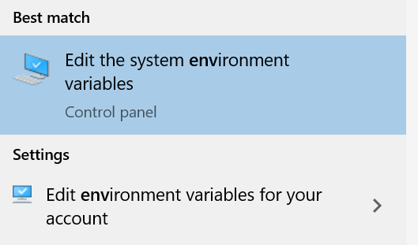
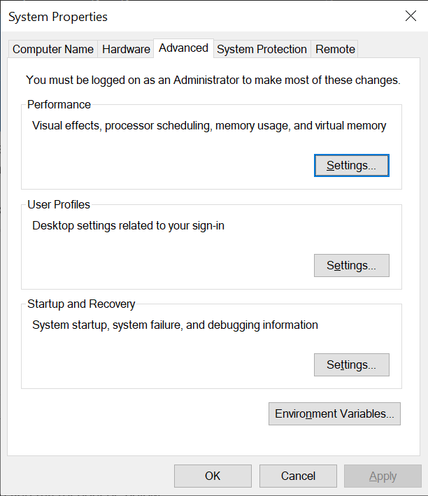
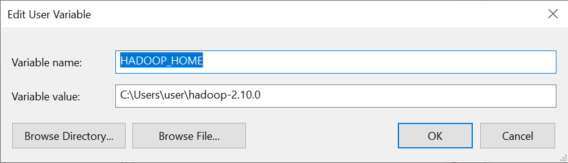
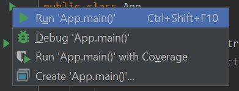
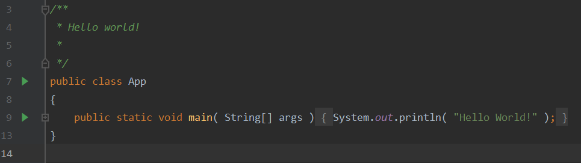
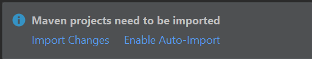

# Lab 1

## Objectives
-   Set up the development environment for Java.
-   Run a test program on Hadoop within the IDE.
-   Package the source code of your project in a compressed form.
-   Write a script that compiles, tests, and runs your project.

## Prerequisites
-   JDK 8 (1.8)
    - Windows: Download and install **Windows x86/x64 Installer** from [https://www.oracle.com/java/technologies/javase/javase8u211-later-archive-downloads.html](https://www.oracle.com/java/technologies/javase/javase8u211-later-archive-downloads.html)   
    - MacOS: Download and install **macOS x64 DMG Installer** from [https://www.oracle.com/java/technologies/javase/javase8u211-later-archive-downloads.html](https://www.oracle.com/java/technologies/javase/javase8u211-later-archive-downloads.html)
    - Linux: Run the following command
        - Ubuntu/Debian: `sudo apt-get update; sudo apt-get install -y openjdk-8-jdk`
        - Readhat/CentOS/Fedora: `sudo yum install java-1.8.0-openjdk` or `sudo dnf install java-1.8.0-openjdk-devel`
-   Download IntelliJ IDEA Community Edition  
    [https://www.jetbrains.com/idea/download/index.html](https://www.jetbrains.com/idea/download/index.html)
    - Ubuntu: install from Software Center, or `sudo snap install intellij-idea-community --classic`
-   Download Maven binaries (Cross platform)  
    [http://maven.apache.org/download.cgi](http://maven.apache.org/download.cgi)
    - Ubuntu: `sudo apt-get install -y maven`
-   Download Hadoop binaries v3.2.3  
    [https://hadoop.apache.org/releases.html](https://hadoop.apache.org/releases.html)
-   (Optional) If you run on Windows 10, you can install Ubuntu from Microsoft Store  
    [https://www.microsoft.com/en-us/p/ubuntu/9nblggh4msv6](https://www.microsoft.com/en-us/p/ubuntu/9nblggh4msv6)

## Lab Work
Follow the instructions below to complete this lab. If you have any questions, please contact the TA in your lab. Make sure to answer any questions marked by the (Q) sign and submit the deliverables marked by the (S) sign.

### Install Required Software
Install the aforementioned software via installer, archive file, or command line.
For archive file, unarchive them to your preferred location. Try to **avoid spaces** in file path on any system (Windows in particular).

### Set Environment Variables
#### Linux and MacOS
1. In command line, run `echo $SHELL`
    - If it prints ***/bin/bash***, then the profile file can be ***~/.bash_rc*** or ***~/.bash_profile***
    - If it prints ***/bin/zsh***, then the profile file can be ***~/.zsh_rc*** or ***~/.zprofile***
2. Find where JDK 8, Maven and Hadoop are installed/unarchived
3. Edit the profile file in step 1 with the following lines (replace the paths accordingly)
    ```bash
    export JAVA_HOME="/Library/Java/JavaVirtualMachines/jdk1.8.0_311.jdk/Contents/Home"
    export MAVEN_HOME="/opt/apache-maven-3.8.5"
    export HADOOP_HOME="/opt/hadoop-3.2.3"
    
    PATH=$JAVA_HOME/bin:$MAVEN_HOME/bin:$HADOOP_HOME/bin:$PATH
    ```
4. Load the environment `source ~/.bash_rc` (replace the filename)
5. Verify \*\_HOME, they should print the correct values you just set
    ```bash
    echo $JAVA_HOME
    echo $MAVEN_HOME
    echo $HADOOP_HOME
    ```
6. Verify software, they should print the version numbers
    ```bash
    javac -version
    mvn -version
    hadoop version
    ```

#### Windows
1. Open the start menu and start typing “Environment Variables” and the option “Edit the system environment variables” should appear.

    

2. From there, click on “Environment Variables” 

    

3. And then, press “New” and enter your environment variable as shown below.

        
    
4. Set `JAVA_HOME`, `MAVEN_HOME` and `HADOOP_HOME` to the corresponding locations.

5. Edit `Path` variable, append `%JAVA_HOME%\bin`, `%MAVEN_HOME%\bin` and `%HADOOP_HOME%\bin`.

#### Hadoop
* (Windows) If you run on Windows, download Hadoop.dll and winutils.exe and place them in $HADOOP_HOME/bin directory. https://github.com/steveloughran/winutils

#### Create an Empty Java Project from Command Line
* Create a new directory $HOME/workspace to place all your projects.
* Inside $HOME/workspace, run the following command
```console
mvn archetype:generate -DgroupId=edu.ucr.cs.cs167.<UCRNetID> -DartifactId=<UCRNetID>_lab1 -DarchetypeArtifactId=maven-archetype-quickstart -DinteractiveMode=false
```
Replace `<UCRNetID>` with your UCR Net ID (not student ID).

##### Alternative Method
1. Open Intellij
2. Select "New Project"
3. Make sure "Project SDK" is showing **1.8** in the right panel.
4. Select "Maven" in the left panel, check "Create from archetype" in the right panel, then select `org.apache.maven.archetypes:maven-archetype-quickstart`. Click "Next".
5. Expand "Artifact Coordinates"
6. Change "GroupId" to `edu.ucr.cs.cs167.<UCRNetID>`
7. Change "ArticifactId" to `<UCRNetID>_lab1`
8. Change "Version" to `1.0`
9. Modify "Location" if necessary.
10. "Next" and then "Finish".


(Q1) What is the name of the created directory?
* Change into the project directory and type mvn package
This command compiles your project and produces a JAR file with your compiled classes under the target directory.
* To run your newly created program, type `java -cp target/<JARFile> edu.ucr.cs.cs167.<UCRNetID>.App` 
Replace `<JARFile>` and `<UCRNetID>` with the correct names.

(Q2) What do you see at the console output?

#### Import Your Project into InelliJ IDEA
* Open IntelliJ IDEA and choose "New Project from Existing Sources".
* Choose the directory of your new Maven project.
* Choose "Maven" as the module.
* Press Finish.
* Open the file "App.java" and click the small green arrow to run the main class.




#### Configure for Hadoop
* Edit your pom.xml file and add the following code. This adds Hadoop libraries to your dependencies so that you an access Hadoop API.
```xml
<properties>
  <hadoop.version>3.2.3</hadoop.version>
</properties>
```
```xml
<dependencies>
  <!-- https://mvnrepository.com/artifact/org.apache.hadoop/hadoop-common -->
  <dependency>
    <groupId>org.apache.hadoop</groupId>
    <artifactId>hadoop-common</artifactId>
    <version>${hadoop.version}</version>
  </dependency>

  <!-- https://mvnrepository.com/artifact/org.apache.hadoop/hadoop-hdfs -->
  <dependency>
    <groupId>org.apache.hadoop</groupId>
    <artifactId>hadoop-hdfs</artifactId>
    <version>${hadoop.version}</version>
  </dependency>

  <dependency>
    <groupId>org.apache.hadoop</groupId>
    <artifactId>hadoop-mapreduce-client-common</artifactId>
    <version>${hadoop.version}</version>
  </dependency>
<dependency>
    <groupId>org.apache.hadoop</groupId>
    <artifactId>hadoop-mapreduce-client-core</artifactId>
    <version>${hadoop.version}</version>
  </dependency>
</dependencies>
```

Notice: If you pom.xml file already has a dependencies section, merge it with the one above.
* If the IDE asks for importing the changes in your pom.xml file, press "Import Changes" to accept the changes.



#### Create WordCount Example
* Replace the code in your App.java file with the following code but leave the package line as-is.

```java
import java.io.IOException;
import java.util.StringTokenizer;
import org.apache.hadoop.conf.Configuration;
import org.apache.hadoop.fs.Path;
import org.apache.hadoop.io.IntWritable;
import org.apache.hadoop.io.Text;
import org.apache.hadoop.mapreduce.Job;
import org.apache.hadoop.mapreduce.Mapper;
import org.apache.hadoop.mapreduce.Reducer;
import org.apache.hadoop.mapreduce.lib.input.FileInputFormat;
import org.apache.hadoop.mapreduce.lib.output.FileOutputFormat;
```

```java
/**
 * Word Count MapReduce Example.
 *
 */
public class App
{
    public static class TokenizerMapper extends Mapper<Object, Text, Text, IntWritable>
    {
        private final static IntWritable one = new IntWritable(1);
        private Text word = new Text();

        public void map(Object key, Text value, Context context
        ) throws IOException, InterruptedException {
            StringTokenizer itr = new StringTokenizer(value.toString());
            while (itr.hasMoreTokens()) {
                word.set(itr.nextToken());
                context.write(word, one);
            }
        }
    }

    public static class IntSumReducer
        extends Reducer<Text,IntWritable,Text,IntWritable> 
    {
        private IntWritable result = new IntWritable();

        public void reduce(Text key, Iterable<IntWritable> values,
                           Context context
        ) throws IOException, InterruptedException {
            int sum = 0;
            for (IntWritable val : values) {
                sum += val.get();
            }
            result.set(sum);
            context.write(key, result);
        }
    }

    public static void main(String[] args) throws Exception 
    {
        Configuration conf = new Configuration();
        Job job = Job.getInstance(conf, "word count");
        job.setJarByClass(App.class);
        job.setMapperClass(TokenizerMapper.class);
        job.setCombinerClass(IntSumReducer.class);
        job.setReducerClass(IntSumReducer.class);
        job.setOutputKeyClass(Text.class);
        job.setOutputValueClass(IntWritable.class);
        FileInputFormat.addInputPath(job, new Path(args[0]));
        FileOutputFormat.setOutputPath(job, new Path(args[1]));
        System.exit(job.waitForCompletion(true) ? 0 : 1);
    }
}
```

* Run the updated App class. 

(Q3) What do you see at the output?

* Create a new text file named "input.txt" and add the following sample content to it.
```text
if you cannot fly, then run
if you cannot run, then walk
if you cannot walk, then crawl
but whatever you do you have to keep moving forward
```

* Now specify "input.txt" and "output.txt" as the input and output files to your program as follows.


Then


(Q4) What is the output that you see at the console?

Note: We will later cover how MapReduce programs are executed in more details. This lab just ensures that you have the development environment setup.

#### Run the WordCount example from Command Line
* At the command line, type:
```console
mvn package 
```
* Try to run your program as we did earlier.

(Q5) Does it run? Why or why not?
* Try to run the program using the following command: 
```console
hadoop jar target/<JARFile> edu.ucr.cs.cs167.<UCRNetId>.App input.txt output.txt
```

#### Prepare Your Submission
* To avoid entering the full class name when you run your program, configure the main class in the pom.xml file as follows.
```xml
<build>
  <plugins>
    <plugin>
      <groupId>org.apache.maven.plugins</groupId>
      <artifactId>maven-jar-plugin</artifactId>
      <configuration>
        <archive>
          <manifest>
            <mainClass>edu.ucr.cs.cs167.[UCRNetID].App</mainClass>
          </manifest>
        </archive>
      </configuration>
    </plugin>
  </plugins>
</build>
```

* Now, you can run your program using the following command.
```console
hadoop jar target/<JARFile> input.txt output.txt
```
* Add a README.md file to your project home directory. In this file, write down your name, email, UCR Net ID, and Student ID.
* Answer all the questions above in the README file. For each question, copy/paste the question first and then enter your answer in a new line.
* Add any additional information that you think are important.
* Feel free to style your README file according to the Markdown markup language
https://github.com/adam-p/markdown-here/wiki/Markdown-Cheatsheet
You can also refer to our template at [HERE](CS167-Lab1-README.md).
* Add a script file "run.sh" that will compile and run your program. Find a sample below.
```shell script
#!/usr/bin/env sh
mvn clean package
hadoop jar target/<JARFile> input.txt output.txt
```

If you run on Windows, you can create the following Powershell script, instead in a file named `run.ps1`.
```shell script
mvn clean package
hadoop jar target\<JARFile> input.txt output.txt
```

* Package the source files into a compressed file. Only the following files and directories should be included in your submission.
```text
src/
pom.xml
README.md
run.sh
```

Note: Do not include the sample file or the target directory. E.g.,
```console
tar -c src pom.xml README.md run.sh -f <UCRNetID>-Lab1.tar.gz
```

* (S) Submit your compressed file as the lab deliverable.

#### Notes
* Make sure to follow the naming conventions that are mentioned in this lab.
* We will follow similar naming conventions for future labs with the necessary changes for the lab name.
* Failure to follow these instructions and conventions might result in losing some points. This includes, for example, adding unnecessary files in your compressed file, using different package names, using a different name for the compressed file, not including a runnable script, and not including a README file.
