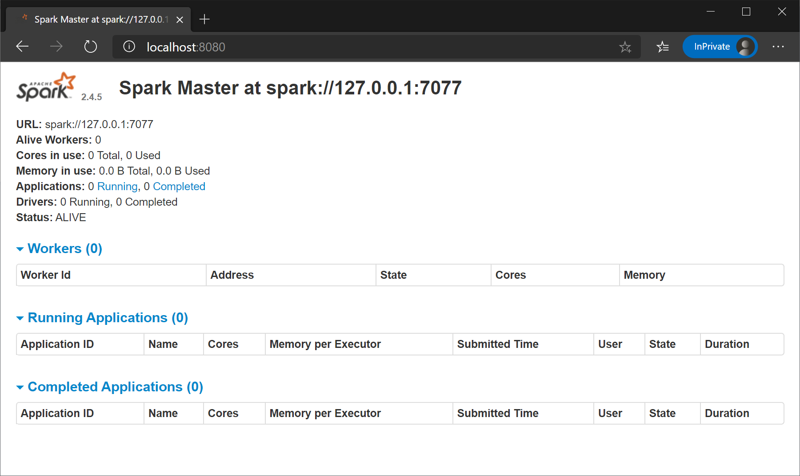
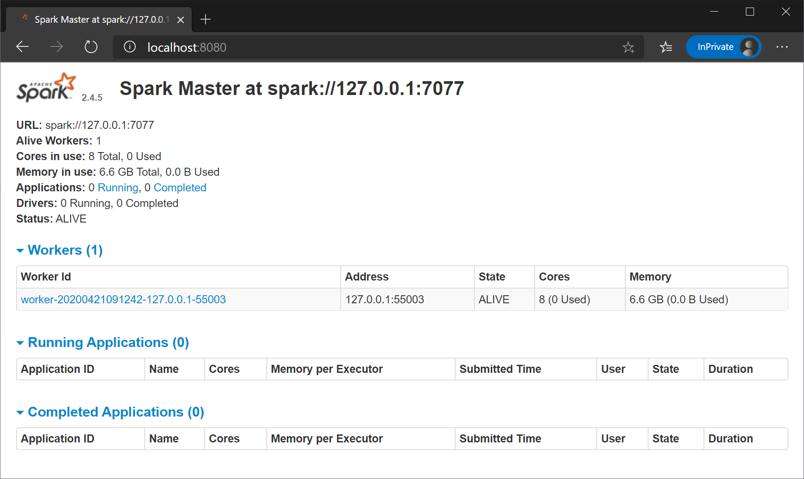

# Lab 4

## Objectives

* Write a Spark program using the Resilient Distributed Dataset API (RDD).
* Run a Spark program from the IDE.
* Run a Spark program from command line in local and cluster modes.

## Prerequisites
* Setup the development environment as explained in [Lab 1](../Lab1/lab1.md).
* Download [Apache Spark 2.4.5](https://spark.apache.org/downloads.html). Choose the package type *Pre-built for Apache Hadoop 2.7*.
* Download these two sample files [sample file 1](../Lab3/nasa_19950801.tsv), [sample file 2](https://drive.google.com/open?id=1pDNwfsx5jrAqaSy8AKEZyfubCE358L2p). Decompress the second file after download. These are the same files we used in [Lab 3](../Lab3/CS167_Lab3.md).
* For Windows users, install the Ubuntu app from Microsoft Store and set it up.

## Lab Work

### I. Install Apache Spark (10 minutes)
Note: We recommend that you use the standard Apache Spark 2.4.5 in this lab. Other versions might come with different default configuration that make it hard to debug the problems that you might face.

1. Expand the downloaded Apache Spark to your home directory.
2. Set the environment variable `SPARK_HOME` to the expanded Spark directory. Add `$SPARK_HOME/bin` to the `PATH` environment variable. See [Lab 1](../Lab1/lab1.md) for details on how to do it.
3. Make a copy of the file `$SPARK_HOME/conf/spark-defaults.conf.template` to `$SPARK_HOME/conf/spark-defaults.conf`.
4. (On Windows) In `$SPARK_HOME/conf/spark-defaults.conf`, add the line `spark.driver.host  127.0.0.1`.
5. To test that Spark is running correctly, run the command `spark-submit` from the command line to see Spark usage. Then use the following command to run one of the Spark examples.

    spark-submit run-example org.apache.spark.examples.SparkPi

This command estimates PI by generating random points in a unit square and computing the fraction the fills in a unit circle. In the output, you should see a line similar to the following one.

    Pi is roughly 3.144355721778609

### II. Project Setup (10 minutes)
1. Create a new empty project using Maven for Lab 4. See [Lab 1](../Lab1/lab1.md) for more details.
2. Import your project into IntelliJ IDEA.
3. Copy the file `$SPARK_HOME/conf/log4j.properties.template` to your project directory under `src/main/resources/log4j.properties`. This allows you to see internal Spark log messages when you run in IntelliJ IDEA.
4. Place the two sample files in your project home directory.
5. In `pom.xml` add the following configuration.

```xml
<properties>
  <maven.compiler.source>1.8</maven.compiler.source>
  <maven.compiler.target>1.8</maven.compiler.target>
  <spark.version>2.4.5</spark.version>
</properties>

<dependencies>
  <dependency>
    <groupId>org.apache.spark</groupId>
    <artifactId>spark-core_2.11</artifactId>
    <version>${spark.version}</version>
    <scope>compile</scope>
  </dependency>
</dependencies>
```

### III. Sample Spark Code (20 minutes)
1. Edit the `App` class and add the following sample code.

```java
import org.apache.spark.api.java.JavaRDD;
import org.apache.spark.api.java.JavaSparkContext;

public class App {
  public static void main( String[] args ) {
    final String inputfile = args[0];
    JavaSparkContext spark = new JavaSparkContext("local[*]", "CS167-Lab4");
    try {
      JavaRDD<String> logFile = spark.textFile(inputfile);
      System.out.printf("Number of lines in the log file %d\n", logFile.count());
    } finally {
      spark.close();
    }
  }
}
```

2. Run the `main` function in IntelliJ IDEA. The command line argument should be `nasa_19950801.tsv`. You should see the following line in the output.

    Number of lines in the log file 30970

3. Switch to the command line. Compile your code using the command `mvn package`.
4. Run your program from command line using the following command. Do not forget to replace `[UCRNetID]` with the correct one.

```shell
spark-submit --class edu.ucr.cs.cs167.[UCRNetID]].App target/[UCRNetID]_lab4-1.0-SNAPSHOT.jar nasa_19950801.tsv
```

### IV. Run in Pseudo-distributed Mode (Manual Configuration) (30 minutes)

Similar to Hadoop, we will run Spark in pseudo-distributed mode to mimc the distributed execution. If you run on Windows, you will need to run these scripts from Ubuntu using Windows Subsystem for Linux (WSL).
1. Start the master node by running the command:
```text
$SPARK_HOME/sbin/start-master.sh --host 127.0.0.1
```
2. Make sure that the master is running by navigating to the [http://localhost:8080](http://localhost:8080) at your browser. You should see a page similar to the following one. Notice that there are no worker nodes since we did not start any yet.

3. Start one worker node by running the command 
```text
$SPARK_HOME/sbin/start-slave.sh --host 127.0.0.1 spark://127.0.0.1:7077 
```
Notice: you can find the correct host and bind address from the web interface.
4. Now, if you refresh the master web interface, you should be able to see one worker node.

5. Now, go back to your program and run the JAR file using the same `spark-submit` command that you had earlier. (Q1) Do you think it will use your local cluster? Why or why not?   
Hint: To find out, check the [web interface](http://localhost:8080) and observe any new applications that get listed.
6. To use the pseudo-cluster that we just started, change the following line in your code to look as follows.
```java
JavaSparkContext spark = new JavaSparkContext("spark://127.0.0.1:7077", "CS167-Lab4");
```
7. Now, compile and then run your program from command line as you did before. Make sure to run it from WSL (Windows users). (Q2) Does the application use the cluster that you started? How did you find out?

### V. Make the Application Portable (15 minutes)
We do not want to change the code every time we switch between local and cluster mode.
1. To automatically set an appropriate master, change your code to look as follows.

```java
SparkConf conf = new SparkConf();
if (!conf.contains("spark.master"))
  conf.setMaster("local[*]");
System.out.printf("Using Spark master '%s'\n", conf.get("spark.master"));
conf.setAppName("lab4");
JavaSparkContext spark = new JavaSparkContext(conf);
```

This code first creates a `SparkConf` instances using the default configuration. If Spark master is already configured, it will use the default configuraiton. If not, it will use the local mode.

2. Run the code from IntelliJ IDEA. (Q3) What is the Spark master printed on the standard output on IntelliJ IDEA?
3. Compile the code from command line and run using `spark-submit`. (Q4) What is the Spark master printed on the standard output on the terminal?
4. You can manually override the master on the `spark-submit` command. Try the following line and observe what the master is.

    spark-submit --class edu.ucr.cs.cs167.[UCRNetID].App --master local[2] target/[UCRNetID]_lab4-1.0-SNAPSHOT.jar nasa_19950801.tsv

Note: `local[2]` means that it runs on the local mode with two cores.

### VI. Filter Operation (30 minutes)
In the next part, we will extend the program to use more Spark functions. We will use the `filter` transformation to find log entries with a specific response code.

1. Make a copy of the current sample class and named it `Filter`. Place it in the same package as the App class.
2. Add the following line to take the desired code from the command line.
```java
final String desiredCode = "200";
```
3. Add the following lines to filter the lines based on the user-provided response code.
```java
JavaRDD<String> matchingLines = logFile.filter(line -> line.split("\t")[5].equals(desiredCode));
System.out.printf("The file '%s' contains %d lines with response code %s\n", inputfile, matchingLines.count(), desiredCode);
```
Note: the following expression in Java
```java
line -> line.split("\t")[5].equals(desiredCode)
```
is called lambda expression. It is a shorthand to write an anonymous inner class with one function. After compilation, it will be similar to the map function that we used to write in Hadoop which was a class with one function called `map`.

4. Run your program using the file `nasa_19950801.tsv`. The output should look similar to the following.
```text
The file 'nasa_19950801.tsv' contains 27972 lines with response code 200
```
5. (Q5) For the previous command that prints the number of matching lines, list all the processed input splits.  
Hint: Search for the patterm `HadoopRDD: Input split` in the output on the console. The input splits is printed as `path:start+length`.
6. In addition to counting the lines, let us also write the matching lines to another file. Add the following part at the beginning of the `main` function.
```java
final String inputfile = args[0];
final String outputFile = args[1];
final String desiredCode = args[2];
```
7. After the `printf` command the prints the number of matching lines, add the following line:
```java
matchingLines.saveAsTextFile(outputFile);
```
8. Run your program again with the following parameters `nasa_19950801.tsv filter_output 200`.
9. (Q6) For the previous command that counts the lines and prints the output, how many splits were generated?
(Q7) Compare this number to the one you got earlier.
(Q8) Explain why we get these numbers.
10. (Q9) What can you do to the current code to ensure that the file is read only once?  
Hint: Use the `cache` function in Spark.

### VII. Aggregation Operation (20 minutes)
In this part, we will run an aggregation function to count number of records for each response code.

1. Make a copy of the class `App` into a new class named `Aggregation`.
2. Create a `JavaPairRDD<String, Integer>` that contains key-value pairs. The key is the response code (as a string) and the value is 1. You will use the `mapToPair` transformation and the `Tuple2` class.
3. To count the number of records per response code, use the action `countByKey`.
4. Write the aggregate values to the standard output. The output should look similar to the following.
```text
Code '302' : number of entries 355
Code '404' : number of entries 221
Code 'response' : number of entries 1
Code '304' : number of entries 2421
Code '200' : number of entries 27972
```
Note: The entry with the code `response` corresponds to the header file. We can easily filter this value at the end but we will leave it like this for simplicity.

### VIII. Submission (15 minutes)
1. Add a `README` file with all your answers.
2. Add a `run` script that compiles and runs your filter operation on the input file `nasa_19950630.22-19950728.12.tsv` with response code 302. Then, it should run the aggregation method on the same input file. The output files should be named `filter_output` and `aggregation_output` accordingly. Assume that the input is in the current working directory so your `run` sccript should just use the input file name as a parameter.
