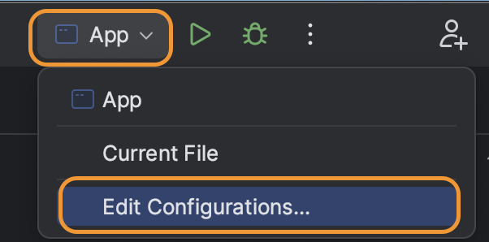

# Lab 5

## Objectives

* Write a Spark program using the Resilient Distributed Dataset API (RDD).
* Run a Spark program from the IDE.
* Run a Spark program from command line in local and cluster modes.

---

## Prerequisites

* Setup the development environment as explained in [Lab 1](../Lab1/CS167-Lab1.md).
* Download [Apache Spark 3.5.4](https://spark.apache.org/downloads.html). Choose the package type **Pre-built with user-provided Apache Hadoop**.
  * Direct link: [spark-3.5.4-bin-without-hadoop.tgz](https://dlcdn.apache.org/spark/spark-3.5.4/spark-3.5.4-bin-without-hadoop.tgz)
* Download these two sample files [sample file 1](../Lab4/nasa_19950801.tsv), [sample file 2](https://drive.google.com/open?id=1pDNwfsx5jrAqaSy8AKEZyfubCE358L2p). Decompress the second file after download. These are the same files we used in [Lab 4](../Lab4/CS167-Lab4.md).
---

## Lab Work

### I. Project Setup (20 minutes) - In home
This part will be done in your `local machine`.

1. Create a new empty project using Maven for Lab 5. See [Lab 1](../Lab1/CS167-Lab1.md) for more details.
2. Import your project into IntelliJ IDEA.
<!-- 3. Copy the file `$SPARK_HOME/conf/log4j2.properties.template` to your project directory under `src/main/resources/log4j2.properties`. This allows you to see internal Spark log messages when you run in IntelliJ IDEA. -->
  <!-- * Manually create `src/main/resources` if it does not exist. -->
3. Place the two sample files in your project home directory.
4. In `pom.xml` add the following configuration.

    ```xml
    <properties>
      <maven.compiler.source>1.8</maven.compiler.source>
      <maven.compiler.target>1.8</maven.compiler.target>
      <spark.version>3.5.4</spark.version>
    </properties>

    <dependencies>
    <!-- Add spark depnedency in <dependencies> label -->
      <dependency>
        <groupId>org.apache.spark</groupId>
        <artifactId>spark-core_2.12</artifactId>
        <version>${spark.version}</version>
        <scope>compile</scope>
      </dependency>
      
    </dependencies>
    ```
5. Synchornize your maven project in IntelliJ IDEA. You can refer to [Lab3](../Lab3/CS167-Lab3.md) for how to do this.
---

### II. Sample Spark Code (20 minutes) - In home

This part will be done on your `local machine`.

1. Edit the `App.java` class and add the following sample code.

    ```java
    import org.apache.spark.api.java.JavaRDD;
    import org.apache.spark.api.java.JavaSparkContext;

    public class App {
        public static void main(String[] args) {
            final String inputPath = args[0];
            // Replace [UCRNetID] with your own NetID
            try (JavaSparkContext spark = new JavaSparkContext("local[*]", "CS167-Lab5-App-[UCRNetID]")) {
                JavaRDD<String> logFile = spark.textFile(inputPath);
                System.out.printf("Number of lines in the log file %d\n", logFile.count());
            }
        }
    }
    ```
2. Put [`nasa_19950801.tsv`](../Lab4/nasa_19950801.tsv) to your Lab5 project directory.

3. Add VM options for your project configuration. You can refer to the `bottom of the instruction` for how to do this. 

3. 
    <!-- Replace the [UCRNetID] of ```
    JavaSparkContext spark = new JavaSparkContext("local[*]", "CS167-Lab5-App-[UCRNetID]")``` 
    with your own NetID,  -->

    Run the `main` function in IntelliJ IDEA. The command line argument should be `nasa_19950801.tsv`. You should see the following line in the output.
    ```text
    Number of lines in the log file 30970
    ```
    
---

### III. Run in Distributed Mode (30 minutes) - In-lab Part

In the followign part, we will configure Spark to run in distributed mode. Make sure that each group member has access to their CS167 machine before doing the following part.


1. On your `local machine`, edit the file `$HOME/.ssh/config` (Linux and MacOS) or `%USERPROFILE%\.ssh\config` (Windows). Add the line `LocalForward 8080 class-###:8080` and `LocalForward 4040 class-$$$:4040` under `Host cs167` in your config file. Replace `class-###` with the name of the machine you elect to be the master node (not necessarily your own machine) and `class-$$$` is your own machine. So, the file should look something like the following
    ```java
    Host cs167
        LocalForward 8080 class-###:8080 // Replace ### with your cluster master hostname
        LocalForward 4040 class-$$$:4040 // Replace $$$ with your own machine host name
        HostName class-888.cs.ucr.edu
        User cs167
        ProxyJump [UCRNetID]@bolt.cs.ucr.edu
    ```
    <!-- In this case, `class-777` is the master node and `class-888` is your own machine. -->
    *Note:* If you were already connected to your CS167 while changing the 
    configuration, you will need to close that session and start a new SSH session for the new configuration to take effect.
    
2. Then, connect to your `cs167` machine and finish the rest of this part.

3. Download and extract Spark to your `$HOME/cs167` using the command below.
    ```shell
    curl https://dlcdn.apache.org/spark/spark-3.5.4/spark-3.5.4-bin-without-hadoop.tgz | tar -xvz -C $HOME/cs167
    ```
4. Set the environment variables `$SPARK_HOME` and `$PATH` as follows:
    ```shell
    cp ~/.bashrc ~/.profile
    echo 'export SPARK_HOME=$HOME/cs167/spark-3.5.4-bin-without-hadoop' >> ~/.profile
    echo 'export PATH=$PATH:$SPARK_HOME/bin' >> ~/.profile
    source ~/.profile
    ```
    Note we also copied the content of `.bashrc` file into `.profile`. This will help avoid having to run `source ~/.bashrc` every time you login into your shell.

5. Configure Spark to use Hadoop classes that we installed in Lab 3.
    1. Go to `$SPARK_HOME/conf`, make a copy of `spark-env.sh.template` to `spark-env.sh`.
         ```shell
         cp $SPARK_HOME/conf/spark-env.sh.template $SPARK_HOME/conf/spark-env.sh
         ```
    2. Edit the file using vim
        ```shell
        vim $SPARK_HOME/conf/spark-env.sh
        ```
    3. Add the following code to the end of `spark-env.sh`:
        ```shell
        export SPARK_DIST_CLASSPATH=$(hadoop classpath)
        ```
6. Test that Spark works correctly by running the command `spark-submit --version`. The output should look something like the following.
    ```text
        Welcome to
             ____              __
            / __/__  ___ _____/ /__
            _\ \/ _ \/ _ `/ __/ '_/
        /___/ .__/\_,_/_/ /_/\_\   version 3.5.4
            /_/
                                
        Using Scala version 2.12.18, Java HotSpot(TM) 64-Bit Server VM, 17.0.12
        Branch HEAD
        Compiled by user yangjie01 on 2024-12-17T04:35:16Z
        Revision a6f220d951742f4074b37772485ee0ec7a774e7d
        Url https://github.com/apache/spark
        Type --help for more information.
    ```

The following part will be configuring a Spark cluster.

1. Among your group, elect a machine as the master. By convention, we will use the machine with the lowest number that you have access to during the lab. In the following part we will call it `class-###`.
2. Set `spark.master` in your configuration file.
    1. If you don't have a file `$SPARK_HOME/conf/spark-defaults.conf` create one by running the command:
        ```shell
        cp $SPARK_HOME/conf/spark-defaults.conf.template $SPARK_HOME/conf/spark-defaults.conf
        ```
    2. Edit the file using `vim $SPARK_HOME/conf/spark-defaults.conf`.
    3. Uncomment the line that starts with `spark.master` and change the value to `class-###:7077` where `class-###` is the name of the master node. Your `spark-defaults.conf` should look like this:
        ```bash
        spark.master            spark://class-###:7077
        ```
    4. Save the file and exit.
3. Start the master node by running the command:

    ```bash
    $SPARK_HOME/sbin/start-master.sh --host class-###
    ```
4. Make sure that the master is running by navigating to the [http://localhost:8080](http://localhost:8080) in your web browser. You should see a page similar to the following one. Notice that there are no worker nodes since we did not start any yet.
    
5. On each worker node, run the following command:

    ```bash
    $SPARK_HOME/sbin/start-worker.sh spark://class-###:7077
    ```

    Notice: you can find the correct bind address from the web interface. Replace `class-###` with the name of the master node.

6. Now, if you refresh the master web interface, you should be able to see one or more worker nodes.
    
7. Start HDFS namenode and datanodes as instructed earlier. You might want to delete the `$HOME/hadoop/dfs` directory on all machines and reformat HDFS before doing this to ensure you have a consistent state across machines, i.e. no leftover temporary files from previous lab.

8. Now, go back to your program (on your local machine), compile the JAR file and copy it to your CS167 machine.

9. Make sure you have the input file `nasa_19950801.tsv` also in your CS167 machine home directory and also put that file into HDFS (using `hdfs dfs -put nasa_19950801.tsv`) before running the `spark-submit` command.

10. Run your program in your CS167 machine using the following command. Do not forget to replace `[UCRNetID]` with the correct one. 
    ```shell
    spark-submit --class edu.ucr.cs.cs167.[UCRNetID].App [UCRNetID]_lab5-1.0-SNAPSHOT.jar nasa_19950801.tsv
    ```
    

***(Q1) Do you think it will use your cluster? Why or why not?***

Hint: To find out, check the [web interface](http://localhost:8080) and observe any new applications that get listed.

10. Now, you need to go back to your `local machine` to make some modifications. To use the cluster that we just started, change the following code from

    ```java
    JavaSparkContext spark = new JavaSparkContext("local[*]", "CS167-Lab5-App-[UCRNetID]")
    ```

    to

    ```java
    JavaSparkContext spark = new JavaSparkContext("spark://class-###:7077", "CS167-Lab5-App-[UCRNetID]");
    ```
* Note: class-### is the hostname of the master node. 
11. Now, save the file and compile it with `mvn clean package`. Run your program in cs167 machine as you did before. (*Note*: This updated code will not run on your local machine, so you just need to build the jar, send the jar to cs167 machine, and run the jar there using `spark-submit` command.)

    ***(Q2) Does the application use the cluster that you started? How did you find out?***

---

### IV. Make the Application Portable (15 minutes)

We do not want to change the code every time we switch between local and cluster mode.

1. To automatically set an appropriate master, change your code to look as follows.

    ```java
    import org.apache.spark.SparkConf;
    import org.apache.spark.api.java.JavaRDD;
    import org.apache.spark.api.java.JavaSparkContext;

    public class App {
        public static void main(String[] args) {
            final String inputPath = args[0];
            SparkConf conf = new SparkConf();
            if (!conf.contains("spark.master"))
                conf.setMaster("local[*]");
            System.out.printf("Using Spark master '%s'\n", conf.get("spark.master"));
            conf.setAppName("CS167-Lab5");
            try (JavaSparkContext spark = new JavaSparkContext(conf)) {
                JavaRDD<String> logFile = spark.textFile(inputPath);
                System.out.printf("Number of lines in the log file %d\n", logFile.count());
            }
        }
    }
    ```

    This code first creates a [SparkConf](https://spark.apache.org/docs/latest/api/java/org/apache/spark/SparkConf.html) instance using the default configuration. If Spark master is already configured, it will use the default configuraiton. If not, it will use the local mode.


3. Run the code from IntelliJ IDEA.

    ***(Q3) What is the Spark master printed on the standard output on IntelliJ IDEA?***

4. Compile the code from command line using `mvn clean package` and then run the jar in your cs167 machine using `spark-submit`.

    ```bash
    spark-submit --class edu.ucr.cs.cs167.[UCRNetID].App [UCRNetID]_lab5-1.0-SNAPSHOT.jar nasa_19950801.tsv
    ```
* Note: if you get file not found exception and you are sure the file is uploaded to HDFS, try using the full path like `hdfs://class-###:9000/user/cs167/nasa_19950801.tsv`, where `class-###` is your name node.

    ***(Q4) What is the Spark master printed on the standard output on the terminal?***

5. You can manually override the master on the `spark-submit` command. Try the following line and observe what the master is.

    ```bash
    spark-submit --class edu.ucr.cs.cs167.[UCRNetID].App --master local[2] [UCRNetID]_lab5-1.0-SNAPSHOT.jar nasa_19950801.tsv
    ```

    Note: `local[2]` means that it runs on the local mode with two cores.

---

### V. Filter Operation (30 minutes)

In the next part, we will extend the program to use more Spark functions. We will use the [filter](https://spark.apache.org/docs/latest/api/java/org/apache/spark/rdd/RDD.html#filter-scala.Function1-) transformation to find log entries with a specific response code.

1. Make a copy of the current sample class and named it `Filter`. Place it in the same package as the `App` class.
2. Add the following line to set the desired code to the value `200`.

    ```java
    final String desiredCode = "200";
    ```

3. Add the following lines to filter the lines based on the user-provided response code.

    ```java
    JavaRDD<String> matchingLines = logFile.filter(line -> line.split("\t")[5].equals(desiredCode));
    System.out.printf("The file '%s' contains %d lines with response code %s\n", inputPath, matchingLines.count(), desiredCode);
    ```

    Note: the following expression in Java

    ```java
    line -> line.split("\t")[5].equals(desiredCode)
    ```

    is called lambda expression. It is a shorthand to write an anonymous inner class with one function, which we have experience with from Lab 1. After compilation, it will be similar to the map function that we used to write in Hadoop which was a class with one function called `map`.

4. You can run it locally first in IntelliJ to test the logic. Once you're satisfied with the result, recompile into a new JAR file, copy it to your CS167 machine, and run your program in your CS167 machine using the file `nasa_19950801.tsv`. The output should look similar to the following.

    ```text
    The file 'nasa_19950801.tsv' contains 27972 lines with response code 200
    ```

    Hint: You may use the following command to only print the needed line.

    ```bash
    spark-submit --class edu.ucr.cs.cs167.[UCRNetID].Filter [UCRNetID]_lab5-1.0-SNAPSHOT.jar nasa_19950801.tsv
    ```

   Now, we want to know the number of tasks created for the input file and how much time it took to process each task.
   To do that, we need to look at the printed logs from Spark. We add the option `--conf spark-log.level=INFO` to the command, and we search for the phrase `TaskSetManager - Finished`. The number of tasks printed at each stage is the same as the number of outputs. 
   Our command looks like this:

   ```bash
   spark-submit --conf spark.log.level=INFO  --class edu.ucr.cs.cs167.[UCRNetID].Filter [UCRNetID]_lab5-1.0-SNAPSHOT.jar nasa_19950801.tsv | grep "TaskSetManager - Finished"
   ```
   Based on the output of the previous command, answer the following question:
   
   ***(Q5) For the previous command that prints the number of matching lines, how many tasks were created, and how much time it took to process each task.***

   *Note:* You can count the total number of unique TIDs from the output log to get the total number of tasks. 

6. In addition to counting the lines, let us also write the matching lines to another file. Add the following part at the beginning of the `main` function.

    ```java
    final String inputPath = args[0];
    final String outputPath = args[1];
    final String desiredCode = args[2];
    ```

7. After the `printf` command the prints the number of matching lines, add the following line:

    ```java
    matchingLines.saveAsTextFile(outputPath);
    ```

8. Run your program again in your CS167 machine with the following parameters `nasa_19950801.tsv filter_output 200`.

    ```bash
    spark-submit --class edu.ucr.cs.cs167.[UCRNetID].Filter [UCRNetID]_lab5-1.0-SNAPSHOT.jar nasa_19950801.tsv spark_filter_output_[UCRNetID] 200
    ```

    * Note: Replcae [UCRNetID] with your own NetID. We are not writing the full path here and the default directory is `hdfs://class-###:9000/user/cs167/`.

    You can use the following command to count the total number of lines in the output files.

    ```bash
    hdfs dfs -cat filter_output_[UCRNetID]/* | wc -l
    ```

    ***(Q6) For the previous command that counts the lines and saves the output, how many tasks in total were generated?***
   
   Hint: you can modify your command similar to how you did to get the answer for Q5, and count the total number of unique TID. Note that: You need to delete the generated output directory from HDFS using the command ```hdfs dfs -rm -r filter_output_[UCRNetID]``` before running the following ```spark-submit``` command each time.

   ```bash
    spark-submit --conf spark.log.level=INFO  --class edu.ucr.cs.cs167.[UCRNetID].Filter [UCRNetID]_lab5-1.0-SNAPSHOT.jar nasa_19950801.tsv filter_output_[UCRNetID] 200 | grep "TaskSetManager - Finished"
   ```


    ***(Q7) Compare this number to the one you got earlier.***

    ***(Q8) Explain why we get these numbers.***

    ***(Q9) What can you do to the current code to ensure that the file is read only once?***

    Hint: Use the [cache](https://spark.apache.org/docs/latest/api/java/org/apache/spark/api/java/JavaRDD.html#cache--) function in Spark.

---

### VII. Aggregation Operation (20 minutes)

In this part, we will run an aggregation function to count number of records for each response code.

1. Use the template code below to create a new class `Aggregation`.

    ```java
    import org.apache.spark.SparkConf;
    import org.apache.spark.api.java.JavaPairRDD;
    import org.apache.spark.api.java.JavaRDD;
    import org.apache.spark.api.java.JavaSparkContext;
    import scala.Tuple2;
    import java.io.IOException;
    import java.util.Map;

    public class Aggregation {
        public static void main(String[] args) throws IOException {
            final String inputPath = args[0];
            SparkConf conf = new SparkConf();
            if (!conf.contains("spark.master"))
                conf.setMaster("local[*]");
            System.out.printf("Using Spark master '%s'\n", conf.get("spark.master"));
            conf.setAppName("CS167-Lab5");
            try (JavaSparkContext spark = new JavaSparkContext(conf)) {
                JavaRDD<String> logFile = spark.textFile(inputPath);
                JavaPairRDD<String, Integer> codes = // To do 1: transform via `mapToPair`, return `Tuple2`
                Map<String, Long> counts = // To do 2: `countByKey`
                for (Map.Entry<String, Long> entry : counts.entrySet()) {
                    System.out.printf("Code '%s' : number of entries %d\n", entry.getKey(), entry.getValue());
                }
                System.in.read(); // the program will keep running until you input something
            }
        }
    }
    ```

2. Create a [JavaPairRDD<String, Integer>](https://spark.apache.org/docs/latest/api/java/index.html?org/apache/spark/api/java/JavaPairRDD.html) that contains key-value pairs. The key is the response code (as a string) and the value is 1. You will use the [mapToPair](https://spark.apache.org/docs/latest/api/java/org/apache/spark/api/java/JavaRDDLike.html#mapToPair-org.apache.spark.api.java.function.PairFunction-) transformation and the [Tuple2](https://www.scala-lang.org/api/current/scala/Tuple2.html) class (Complete `// To do 1`).
3. To count the number of records per response code, use the action [countByKey](https://spark.apache.org/docs/latest/api/java/org/apache/spark/api/java/JavaPairRDD.html#countByKey--) (Complete `// To do 2`).
4. Write the aggregate values to the standard output. The output should look similar to the following:

    ```text
    Code '302' : number of entries 355
    Code '404' : number of entries 221
    Code 'response' : number of entries 1
    Code '304' : number of entries 2421
    Code '200' : number of entries 27972
    ```
    Note 1: The entry with the code `response` corresponds to the header file. We can easily filter this value at the end but we will leave it like this for simplicity.
    Note 2: You can run it locally first in IntelliJ to test the logic. Once you're satisfied with the result, recompile into a new JAR file, copy it to your CS167 machine.
   
   You can run your code using this command in your CS167 machine:

    ```bash
    spark-submit --class edu.ucr.cs.cs167.[UCRNetID].Aggregation [UCRNetID]_lab5-1.0-SNAPSHOT.jar nasa_19950801.tsv
    ```

    To print the desired output only:

    ```bash
    spark-submit --class edu.ucr.cs.cs167.[UCRNetID].Aggregation [UCRNetID]_lab5-1.0-SNAPSHOT.jar nasa_19950801.tsv 2>/dev/null
    ```
 5. While your program runs, keep the window open and visit `http://localhost:4040`
 6. On that page, click on the name of your job, like the following screenshot:
    
 7. On the next page, the expand the `Dag Visualization` section. You will see a graph visualizing the stages and all the steps off your Spark job.
    Based on this DAG, answer the following questions:
    
    ***(Q10) How many stages does your program have, and what are the steps in each stage?***
    
    ***(Q11) Why does your program have two stages?***
    


---

### VIII. Submission (15 minutes)

1. Add a `README` file with all your answers. Use this [template](https://raw.githubusercontent.com/aseldawy/CS167/master/Labs/Lab5/CS167-Lab5-README.md).
2. Add a `run` script that compiles and runs your filter operation on the input file `nasa_19950630.22-19950728.12.tsv` with response code 302. Then, it should run the aggregation method on the same input file. Assume that the input is in the current working directory so your `run` script should just use the input file name as a parameter and not an absolute path.

* Note 1: Don't forget to include your information in the README file.
* Note 2: Don't forget to remove any unnecessary test or binary files.

Submission file format:

```console
[UCRNetID]_lab5.{tar.gz | zip}
  - src/
  - pom.xml
  - README.md
  - run.sh
```

Requirements:

* The archive file must be either `.tar.gz` or `.zip` format.
* The archive file name must be all lower case letters. It must contain underscore '\_', not hyphen '-'.
* The folder `src` and three files `pom.xml`, `README.md` and `run.sh` must be the exact names.
* The folder `src` and three files `pom.xml`, `README.md` and `run.sh` must be directly in the root of the archive, do not put them inside any folder.
* Do not include any other files/folders, otherwise points will be deducted.

See how to create the archive file for submission at [here](../MakeArchive.md).

---

### Rubric
- Q1-Q11: +11 points (+1 point for each questions)
- Code: +3 points
   - +1 filter class
   - +2 aggregation class
- Following submission instructions: +1 point
### IX. Cleanup

Do not forget to stop Spark master and worker using the following commands.

```bash
$SPARK_HOME/sbin/stop-worker.sh
$SPARK_HOME/sbin/stop-master.sh
# Also stop hdfs datanode and namenode
```


## Common Issues

- *Problem*: When I run my program in IntelliJ, I get the following error:
```
Exception in thread "main" java. lang.IllegalAccessError Create breakpoint: class org.apache.spark.torage.StorageUtils$
```

- *Solution*: Edit your run configuration and add the following to VM Options:
```text
--add-opens java.base/java.nio=ALL-UNNAMED
--add-opens java.base/java.util=ALL-UNNAMED
--add-opens java.base/java.lang=ALL-UNNAMED
--add-opens java.base/sun.nio.ch=ALL-UNNAMED
--add-opens java.base/java.lang.invoke=ALL-UNNAMED
```

Below is how to add VM options to run configuration.




After that, you should be able to add VM options at the line before command line arguments.
