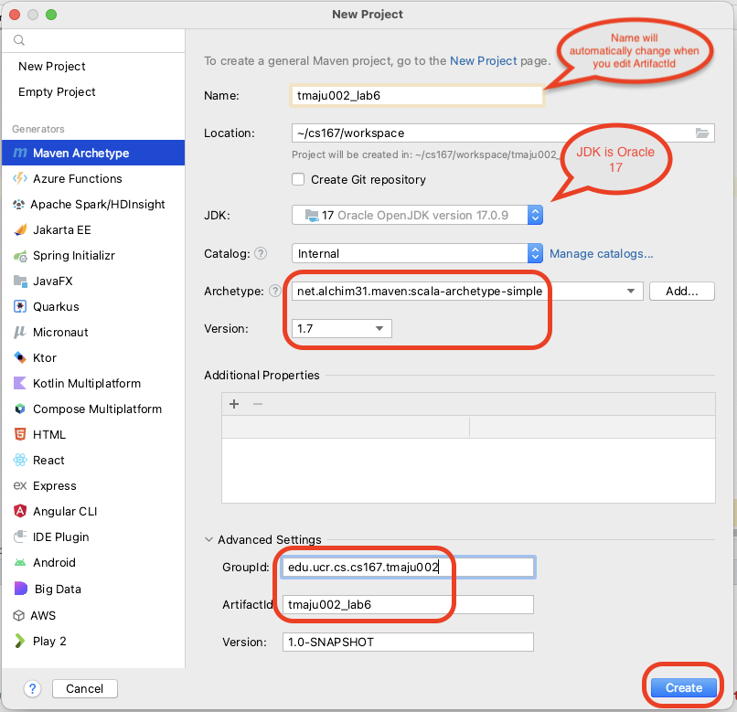

# Lab 6

## Objectives

* Getting started with using Scala to access Spark RDD and Spark SQL.
* Use the Dataframe (SparkSQL) API to process semi-structured data.
* Use SQL queries to process CSV files.

---

## Prerequisites

* Setup the development environment as explained in [Lab 1](../Lab1/CS167-Lab1.md).
* Same as [Lab 5](../Lab5/CS167-Lab5.md).
  * Download these two sample files [sample file 1](../Lab4/nasa_19950801.tsv), [sample file 2](https://drive.google.com/open?id=1pDNwfsx5jrAqaSy8AKEZyfubCE358L2p). Decompress the second file after download. These are the same files we used in previous labs.
    * Depending on how you extract the second file, it could be named either `nasa_19950630.22-19950728.12.tsv` or `19950630.23-19950801.00.tsv`. In this lab, we will use these two names interchangeably.
* To add Scala language support to IntelliJ, you can install the [Scala plugin](https://plugins.jetbrains.com/plugin/1347-scala). Please check the [plugin management page](https://www.jetbrains.com/help/idea/managing-plugins.html) to see the details about installing and managing plugins in Intellij. Make sure you restart IntelliJ after installing the plugin.

* If you are not yet familiar with Scala, please check [this tutorial](https://docs.scala-lang.org/tutorials/scala-for-java-programmers.html) to help with the transition from Java to Scala.

---

## Overview

In this lab, we will be using mainly Scala code. While pure Scala projects are usually set up using [SBT](https://www.scala-sbt.org), we will use Maven for this project to reuse your existing development environment and avoid the complications of setting up a new development tool. According to the [official Scala documentation](https://www.scala-lang.org) 'Scala combines object-oriented and functional programming in one concise, high-level language.' Since big-data systems rely heavily on functional programming, Scala is an excellent match for big-data. This is why Spark is natively written in Scala. If you excel in Scala, you can write more concise and readable code and become more productive.

The lab has two parts. The first part implements some operations using the Scala RDD API. The second part repeats the same operations using SparkSQL. This allows you to contrast and understand the difference between them.

---

## Lab Work

## Part A. Spark RDD

### I. Project Setup (10 minutes) (In home)

We will follow a slightly modified version of the instructions on the [official Scala website](https://docs.scala-lang.org/tutorials/scala-with-maven.html). Mainly, we will avoid the interactive steps and combine all our choices in one command line.

1. To generate a new Maven project that works with Scala, use the following command:

    ```bash
    mvn archetype:generate -DarchetypeGroupId=net.alchim31.maven -DarchetypeArtifactId=scala-archetype-simple -DgroupId=edu.ucr.cs.cs167.[UCRNetID] -DartifactId=[UCRNetID]_lab6 -B
    ```

    Note: Do not forget to replace `[UCRNetID]` with your UCR Net ID.

    If you cannot run the above command, check [Create Lab 6 Project from IntelliJ](#create-lab-6-project-from-intellij).

2. Import your project into IntelliJ IDEA in the same way you did in previous labs and make sure it compiles.

3. In your `pom.xml` replace the properties, depdendencies, and build sections with the following configurations:

```xml
<properties>
  <maven.compiler.source>1.8</maven.compiler.source>
  <maven.compiler.target>1.8</maven.compiler.target>
  <encoding>UTF-8</encoding>
  <scala.version>2.12.18</scala.version>
  <spark.version>3.5.4</spark.version>
  <scala.compat.version>2.12</scala.compat.version>
  <spec2.version>4.20.5</spec2.version>
</properties>

<dependencies>
  <dependency>
    <groupId>org.apache.spark</groupId>
    <artifactId>spark-core_${scala.compat.version}</artifactId>
    <version>${spark.version}</version>
    <scope>compile</scope>
  </dependency>
  <dependency>
    <groupId>org.scala-lang</groupId>
    <artifactId>scala-library</artifactId>
    <version>${scala.version}</version>
  </dependency>
</dependencies>

<build>
  <sourceDirectory>src/main/scala</sourceDirectory>
  <plugins>
    <plugin>
      <groupId>net.alchim31.maven</groupId>
      <artifactId>scala-maven-plugin</artifactId>
      <version>3.3.2</version>
      <executions>
        <execution>
          <goals>
            <goal>compile</goal>
          </goals>
          <configuration>
            <args>
              <arg>-dependencyfile</arg>
              <arg>${project.build.directory}/.scala_dependencies</arg>
            </args>
          </configuration>
        </execution>
      </executions>
    </plugin>
    <plugin>
      <groupId>org.apache.maven.plugins</groupId>
      <artifactId>maven-surefire-plugin</artifactId>
      <version>2.21.0</version>
      <configuration>
        <skipTests>true</skipTests>
      </configuration>
    </plugin>
  </plugins>
</build>
```
    Click the floating ***m*** icon to load all dependencies.

4. Run the main function in `App` class in Intellij to make sure it works. Also, in the command line, change into the project directory and type `mvn package` once to make sure that it compiles.

5. Because this lab contains many tests with different arguments, you have two options to simplify your work:
    * Run all tests via command line, all commands can be found at [Commands](#commands).
    * Run all tests inside IntelliJ, you will need to create a configuration for each test, check [IntelliJ Configurations](#intellij-configurations) for pre-defined configurations.

---

### II. Initialize with Spark RDD (5 minutes) (In home)

In this part, you will initialize your project with Spark.

1. In `App` class, add the following stub code. (Do not remove the package line in your code)

    ```scala
    package edu.ucr.cs.cs167.<UCRNetID>

    import org.apache.spark.rdd.RDD
    import org.apache.spark.{SparkConf, SparkContext}

    import scala.collection.Map
    import scala.io.StdIn

    object App {

      def main(args: Array[String]) {
        val command: String = args(0)
        val inputfile: String = args(1)

        val conf = new SparkConf
        if (!conf.contains("spark.master"))
          conf.setMaster("local[*]")
        println(s"Using Spark master '${conf.get("spark.master")}'")
        conf.setAppName("CS167_Lab6_App")
        val sparkContext = new SparkContext(conf)
        try {
          val inputRDD: RDD[String] = sparkContext.textFile(inputfile)
          val validLines: RDD[String] = // TODO 1a: filter lines which do not start with "host\tlogname" from `inputRDD`
          val parsedLines: RDD[Array[String]] = // TODO 1b: split each line by "\t" from `validLines` via `map`
          val t1 = System.nanoTime
          var valid_command = true
          command match {
            case "count-all" =>
              // Count total number of records in the file
              val count: Long = // TODO 2: count total number of records in the file on `parsedLines`
              println(s"Total count for file '$inputfile' is $count")
            case "time-filter" =>
              // Filter by time range [from = args(2), to = args(3)], and print the total number of matching lines
              val from: Long = args(2).toLong
              val to: Long = args(3).toLong
              val filteredLines: RDD[Array[String]] = // TODO 3: `filter` on `parsedLines` by time (column 2) with `from` and `to`
              val count: Long = filteredLines.count()
              println(s"Total count for file '$inputfile' in time range [$from, $to] is $count")
            case "avg-bytes-by-code" =>
              // Group the liens by response code and calculate the average bytes per group
              val loglinesByCode: RDD[(String, Long)] = // TODO 4a: `map` on `parsedLines` by response code (column 5) and bytes (column 6)
              val sums: RDD[(String, Long)] = // TODO 4b: `reduceByKey` on `loglinesByCode`
              val counts: Map[String, Long] = // TODO 4c: `countByKey` on `loglinesByCode`
              println(s"Average bytes per code for the file '$inputfile'")
              println("Code,Avg(bytes)")
              sums.sortByKey().collect().foreach(pair => {
                val code = pair._1
                val sum = pair._2
                val count = counts(code)
                println(s"$code,${sum.toDouble / count}")
              })
            case _ => valid_command = false
          }
          val t2 = System.nanoTime
          if (valid_command) {
            println(s"Command '$command' on file '$inputfile' finished in ${(t2 - t1) * 1E-9} seconds")
            if(!sparkContext.master.startsWith("local")) {
              println("Press Enter to exit (you can access http://localhost:4040 while this is running)...")
              StdIn.readLine()
            }
          }
          else
            Console.err.println(s"Invalid command '$command'")
        } finally {
          sparkContext.stop
        }
      }
    }
    ```

    Note: Unlike the switch statement in C and Java, the [match statement](https://docs.scala-lang.org/tour/pattern-matching.html) in Scala does not require a break at the end of each case.

2. Take a few minutes to check the stub code and understand what it does. It has two required command-line arguments.
    * ***(Q1) What are these two arguments?***

---

### III. Read and parse the input file (Part A) (10 minutes) (In home)

Since most of the commands will need to split the input line and skip the first line, let us do this first.

1. Use a filter transformation to skip the first line. For simplicity, we will detect the first line as the line that starts with `"host\tlogname"`
    * Complete `TODO 1a`
2. Use a map transformation to split each line using the tab character `"\t"` as a separator.
    * Complete `TODO 1b`

Note that since the filter and map operations are transformations, not actions, none of them will be executed until you use them.

A few commands in the next sections may require more than 2 arguments.

---

### IV. `count-all` (10 minutes)

1. The `count-all` command should use the method [`RDD#count`](https://spark.apache.org/docs/latest/api/scala/org/apache/spark/rdd/RDD.html#count():Long) which is an action to count the total number of records in the input file.
    * Complete `TODO 2`

    Below is the expected output for the two sample files.

    ```text
    Total count for file 'nasa_19950801.tsv' is 30969
    ```

    ```text
    Total count for file '19950630.23-19950801.00.tsv' is 1891709
    ```

---

### V. `time-filter` (10 minutes)

1. In this part, we need to count the number of lines that have a timestmap in a given range `[start, end]`.
    * Complete `TODO 3`
2. The interval is given as two additional arguments as integers.
3. Do not forget to use the method [`String#toLong`](https://www.scala-lang.org/api/2.13.6/scala/collection/StringOps.html#toLong:Long) in Scala to convert the String argument to a long integer to enable numeric comparison.
4. You will need a filter followed by count to complete this part. The filter will be:

    ```scala
    val time = line(2).toLong
    time >= from && time <= to
    ```
    * Note: In Scala, the keyword `val` declares a constant while the keyword `var` declares a variable.

5. Two sample outputs are given below.

    ```text
    Total count for file 'nasa_19950801.tsv' in time range [807274014, 807283738] is 6389
    ```

    ```text
    Total count for file '19950630.23-19950801.00.tsv' in time range [804955673, 805590159] is 554919
    ```

    Hint: You can use the following print command:

      ```scala
      println(s"Total count for file '$inputfile' in time range [$from, $to] is $count")
      ```

---


### VI. `avg-bytes-by-code` (15 minutes)

1. This method will calculate the average bytes for each response code.
2. To do that, you can first use the [`map`](https://spark.apache.org/docs/latest/api/scala/org/apache/spark/rdd/RDD.html#map[U](f:T=>U)(implicitevidence$3:scala.reflect.ClassTag[U]):org.apache.spark.rdd.RDD[U]) function to produce only the `code` and the `bytes`.
    * Complete `TODO 4a`
3. Then, you can use the mehod [`reducyByKey`](https://spark.apache.org/docs/latest/api/scala/org/apache/spark/rdd/PairRDDFunctions.html#reduceByKey(func:(V,V)=>V):org.apache.spark.rdd.RDD[(K,V)]) to compute the summation. The reduce method is Spark is different than the reduce method in Hadoop. Instead of taking all the values, it only takes two values at a time. To compute the summation, your reduce function should return the sum of the two values given to it. You can find a helpful hint from this [stack overflow question](https://stackoverflow.com/questions/36965338/spark-scala-understanding-reducebykey).
    * Complete `TODO 4b`

4. Since reduceByKey is a transformation, we need to use the [`collect`](https://spark.apache.org/docs/latest/api/scala/org/apache/spark/rdd/RDD.html#collect():Array[T]) action to get the results back.

5. Since we need to compute the average, a simple reduce function cannot be used to compute the average since the average function is not associative. However, it can be computed using a combination of sum and count.

6. The easiest way to compute the average is to combine the output of the two steps. The average is simply the sum divided by count.

[OPTIONAL] The drawback of the above method is that it will need to scan the input twice to count each function, sum and count. It is possible to compute both functions in one scan over the input and without caching any intermediate RDDs. Hint, check the [aggregateByKey](https://spark.apache.org/docs/latest/api/scala/org/apache/spark/rdd/PairRDDFunctions.html#aggregateByKey[U](zeroValue:U)(seqOp:(U,V)=>U,combOp:(U,U)=>U)(implicitevidence$3:scala.reflect.ClassTag[U]):org.apache.spark.rdd.RDD[(K,U)]) function. This [stack overflow question](https://stackoverflow.com/questions/40087483/spark-average-of-values-instead-of-sum-in-reducebykey-using-scala) may also be helpful.

    The following template may be used

    ```scala
    val averages: RDD[(String, (Long, Long))] = //TODO 7d: `aggregateByKey` on `loglinesByCode`
    println(s"Average bytes per code for the file '$inputfile'")
    println("Code,Avg(bytes)")
    averages.collect().sorted.foreach(pair => println(s"${pair._1},${pair._2._1.toDouble/pair._2._2}"))
    ```

7. A sample output is given below.

    ```text
    Average bytes per code for the file 'nasa_19950801.tsv'
    Code,Avg(bytes)
    200,17230.604247104246
    302,73.25352112676056
    304,0.0
    404,0.0
    ```

    ```text
    Average bytes per code for the file '19950630.23-19950801.00.tsv'
    Code,Avg(bytes)
    200,22739.652244386536
    302,79.0597341807485
    304,0.0
    403,0.0
    404,0.0
    500,0.0
    501,0.0
    ```

---


## Part B. Spark SQL

In this part, we will repeat the same work done above using SparkSQL to see the difference. If you are not familiar with SQL, check this [SQL Tutorial](https://www.w3schools.com/sql/).

### I. Project Setup (1 minute) (In home)

1. In the `pom.xml` file, add the following dependency.

    ```xml
    <dependency>
      <groupId>org.apache.spark</groupId>
      <artifactId>spark-sql_${scala.compat.version}</artifactId>
      <version>${spark.version}</version>
    </dependency>
    ```

### II. Initialize a SparkSession (5 minutes) (In home)

Create a new Scala class of type **Object** named `AppSQL`. Add the following stub code to it.

```scala
package edu.ucr.cs.cs167.<UCRNetID>

import org.apache.spark.SparkConf
import org.apache.spark.sql.{DataFrame, Row, SparkSession}
import scala.io.StdIn

object AppSQL {

  def main(args: Array[String]) {
    val conf = new SparkConf
    if (!conf.contains("spark.master"))
      conf.setMaster("local[*]")
    println(s"Using Spark master '${conf.get("spark.master")}'")

    val spark = SparkSession
      .builder()
      .appName("CS167_Lab6_AppSQL")
      .config(conf)
      .getOrCreate()

    val command: String = args(0)
    val inputfile: String = args(1)
    try {
      val input = // TODO 5.a -- read input file as a Spark DataFrame
      // TODO 5.b -- show sample records from the dataframe
      // TODO 6 -- print input file schema
      // TODO 7 -- create dataframe view
      val t1 = System.nanoTime
      var valid_command = true
      command match {
        case "count-all" =>
          // Count total number of records in the file
          val query: String = "" // TODO 8 -- SQL count number of records in input
          val count: Long = spark.sql(query).first().getAs[Long](0)
          println(s"Total count for file '$inputfile' is $count")
        case "time-filter" =>
          // Filter by time range [from = args(2), to = args(3)], and print the total number of matching lines
          val from: Long = args(2).toLong
          val to: Long = args(3).toLong
          val query: String = "" // TODO 9 --  SQL to filter and count number of records
          val count: Long = spark.sql(query).first().getAs[Long](0)
          println(s"Total count for file '$inputfile' in time range [$from, $to] is $count")
        case "avg-bytes-by-code" =>
          // Group the liens by response code and calculate the average bytes per group
          println(s"Average bytes per code for the file '$inputfile'")
          println("Code,Avg(bytes)")
          val query: String = "" // TODO 10 -- SQL to get average bytes by response code
          spark.sql(query).collect().foreach(row => println(s"${row.get(0)},${row.get(1)}"))
        case _ => valid_command = false
      }
      val t2 = System.nanoTime
      if (valid_command) {
        println(s"Command '$command' on file '$inputfile' finished in ${(t2 - t1) * 1E-9} seconds")
        if (!spark.sparkContext.master.startsWith("local")) {
          println("Press Enter to exit (you can access http://localhost:4040 while this is running)...")
          StdIn.readLine()
        }
      }
      else
        Console.err.println(s"Invalid command '$command'")
    } finally {
      spark.stop
    }
  }
}
```

Note: To create a new Scala object, check the following instructions.

  1. Right click your package name in the project browser. Select `New`, then select `Scala Class`.

      

  2. In the popped up `Create New Scala Class` dialog, type `AppSQL`, then select `Object`.

      

Note: A Scala object is a Singleton class with one object instantiated automatically. All methods inside the object are treated as static methods.

To test your program at this stage, you can comment the parts that are still not implemented, which are inside the `try{ }` clause.

### III. Read and parse the input file (Part B) (10 minutes) (In home)

Spark SQL is equipped with a CSV parser that can read semi-structured CSV files.

1. Use the following code to open the sample file and print the first few lines.
  * Complete `TODO 5`
    ```scala
    val input = spark.read.format("csv")
      .option("sep", "\t")
      .option("inferSchema", "true")
      .option("header", "true")
      .load("nasa_19950801.tsv") // TODO 5.a
    input.show() // TODO 5.b
    ```

    The output should look similar to the following:

    ```text
    +--------------------+-------+---------+------+--------------------+--------+------+-------+---------+
    |                host|logname|     time|method|                 url|response| bytes|referer|useragent|
    +--------------------+-------+---------+------+--------------------+--------+------+-------+---------+
    |pppa006.compuserv...|      -|807256800|   GET|/images/launch-lo...|     200|  1713|   null|     null|
    |  vcc7.langara.bc.ca|      -|807256804|   GET|/shuttle/missions...|     200|  8677|   null|     null|
    |pppa006.compuserv...|      -|807256806|   GET|/history/apollo/i...|     200|  1173|   null|     null|
    |thing1.cchem.berk...|      -|807256870|   GET|/shuttle/missions...|     200|  4705|   null|     null|
    |       202.236.34.35|      -|807256881|   GET|     /whats-new.html|     200| 18936|   null|     null|
    |bettong.client.uq...|      -|807256884|   GET|/history/skylab/s...|     200|  1687|   null|     null|
    |       202.236.34.35|      -|807256884|   GET|/images/whatsnew.gif|     200|   651|   null|     null|
    |       202.236.34.35|      -|807256885|   GET|/images/KSC-logos...|     200|  1204|   null|     null|
    |bettong.client.uq...|      -|807256900|   GET|/history/skylab/s...|     304|     0|   null|     null|
    |bettong.client.uq...|      -|807256913|   GET|/images/ksclogosm...|     304|     0|   null|     null|
    |bettong.client.uq...|      -|807256913|   GET|/history/apollo/i...|     200|  3047|   null|     null|
    |        hella.stm.it|      -|807256914|   GET|/shuttle/missions...|     200|513911|   null|     null|
    |mtv-pm0-ip4.halcy...|      -|807256916|   GET| /shuttle/countdown/|     200|  4324|   null|     null|
    |   ednet1.osl.or.gov|      -|807256924|   GET|                   /|     200|  7280|   null|     null|
    |mtv-pm0-ip4.halcy...|      -|807256942|   GET|/shuttle/countdow...|     200| 46573|   null|     null|
    |dd10-046.compuser...|      -|807256943|   GET|/shuttle/missions...|     200| 10566|   null|     null|
    |ad11-013.compuser...|      -|807256944|   GET|/history/history....|     200|  1602|   null|     null|
    |dd10-046.compuser...|      -|807256946|   GET|/shuttle/missions...|     200|  8083|   null|     null|
    |dd10-046.compuser...|      -|807256954|   GET|/images/KSC-logos...|     200|  1204|   null|     null|
    |dd10-046.compuser...|      -|807256954|   GET|/history/apollo/i...|     200|  1173|   null|     null|
    +--------------------+-------+---------+------+--------------------+--------+------+-------+---------+
    only showing top 20 rows
    ```

2. The `option("sep", "\t")` configures the reader with the tab separator so there is no need to manually split each line.
3. The `option("header", "true")` will do two things. First, it will skip the first line in the file so that you do not have to manually remove it. Second, it will use the column names in that line to access the attribute so you do not need to access them by number.
4. The `option("inferSchema", "true")` tells Spark to infer the schema based on the values in the file. For example, the time will be parsed as an integer number which allows the use of range comparison.
5. To check the inferred schema, add the following statement.
* Complete `TODO 6`

    ```scala
    input.printSchema()
    ```

    The output should look similar to the following:

    ```text
    root
    |-- host: string (nullable = true)
    |-- logname: string (nullable = true)
    |-- time: integer (nullable = true)
    |-- method: string (nullable = true)
    |-- url: string (nullable = true)
    |-- response: integer (nullable = true)
    |-- bytes: integer (nullable = true)
    |-- referer: string (nullable = true)
    |-- useragent: string (nullable = true)
    ```

One main difference between the Spark RDD and SparkSQL is that SparkSQL requires dataframes to have a known strucutre (a schema) that is used to optimize how it answers your query.

6. Comment the line `option("inferSchema", "true")` and run your program again.
    * ***(Q2) What is the type of the attributes `time` and `bytes` this time? Why?***

7. To use SQL queries, you should add the following line to create a view named `log_lines` that points to your input.
  * Complete `TODO 7`
    ```scala
    input.createOrReplaceTempView("log_lines")
    ```

This makes your table viewable by Spark SQL so you can run SQL queries on it.

### IV. Query the Dataframe using Dataframe Operators (45 minutes)

In this part, we will run some relational operators through the Dataframe/SparkSQL API. The logic of these queries is similar to what we did in part A. This will allow you to compare and contrast the two APIs.

Note: For each of the following, you are free to use SQL queries directly or build the query using the Dataframe API. Instructions for both are given for each command.

1. The command `count-all` is implemented using the `count` function.
    * Complete `TODO 8`

    The output should be the same as in [IV. `count-all`](#iv-count-all-and-code-filter-10-minutes).

    You can also run this logic using the following SQL function:

    ```SQL
    SELECT count(*) FROM log_lines;
    ```

    The following code snippet shows how to run this SQL query in your code.

    ```scala
    val count = spark.sql(
      """SELECT count(*)
        FROM log_lines""")
      .first()
      .getAs[Long](0)
    ```

    Notice that the return value of any SQL query is always a Dataframe even if it contains a single row or a single value.

    Note: An alternative way to call functions in Scala is using spaces instead of dot and parantheses. The following syntax is valid.

    ```scala
    val queryResult = spark sql "SELECT count(*) FROM log_lines" first
    val count = queryResult.getAs[Long](0)
    ```

    You can use this alternative syntax wisely to make your code more readable without being too complex to follow.

2. The command `time-filter` should count all the records that happened in a time interval `[from, to]`. The two parameters are provided as the third and forth command line arguments. You will use the `filter` function but this time with the `between` expression. Again, you can just provide the filter predicate as a string, i.e., `"time BETWEEN 807274014 AND 807283738"`, or as a Scala expression, i.e., `$"time".between(807274014, 807283738)`. This will be followed by `count` to count the records.
    * Complete `TODO 9`

    The output should be the same as in [V. `time-filter`](#v-time-filter-10-minutes).

    You can also use the following SQL query.

    ```SQL
    SELECT count(*)
    FROM log_lines
    WHERE time BETWEEN <from> AND <to>;
    ```

    You should replace `<from>` and `<to>` with the correct parameters passed through command line. You can use the [string interpolation](https://docs.scala-lang.org/overviews/scala-book/two-notes-about-strings.html) feature in Scala to keep your code readable.

3. To implement the command `avg-bytes-by-code` you will first need to group records by response code using the `groupBy` function, i.e., `groupBy("response")` or `groupBy($"response")`. On the result, you should call the correct aggregate function, i.e., `count`, `sum`, or `avg`. The last two functions take a parameter which is the column name to aggregate, e.g., `sum("bytes")`. You can finally print the result using the `show()` command.
    * Complete `TODO 10`

    The output should be the same as in [VII. `avg-bytes-by-code`](#vii-sum-bytes-by-code-and-avg-bytes-by-code-15-minutes).

    Here is one SQL query that you can further customize for the three commands.

    ```SQL
    SELECT response, AVG(bytes)
    FROM log_lines
    GROUP BY response
    ORDER BY response;
    ```


---

## Part C. Running in Distributed Mode (Group Activity)

In this part, we will run the part the computes the `avg-bytes-by-code` using both implementations on the cluster. We will learn some differences about how Spark processes them.

### I. Start an HDFS and Spark Clusters (5 minutes)

1. Start an HDFS cluster with your group, refer to [Lab 3](../Lab1/CS167-Lab3.md). for instructions.

2. Start a Spark cluster with your group, refer to [Lab 5](../Lab1/CS167-Lab5.md). for instructions.

3. Make the user folder in HDFS is initialized and contains the file `nasa_19950630.22-19950728.12_[UCRNet_ID].tsv`

You can verify that with `hdfs dfs -ls`. The upload command is `hdfs dfs -put nasa_19950630.22-19950728.12_[UCRNet_ID].tsv`

### II. Run Your Program in Distributed Mode

1. Run the part based on the RDD implementation first:
```bash
spark-submit --class edu.ucr.cs.cs167.[UCRNetID].App --master spark://class-###:7077 [UCRNetID]_lab6-1.0-SNAPSHOT.jar avg-bytes-by-code nasa_19950630.22-19950728.12_[UCRNetID].tsv
```

Note, you can add ` 2>/dev/null` at the end of your command to get clean output without any logs.

2. While the program is still running, visit [http://localhost:4040](http://localhost:4040) in your web browser and answer the following questions.


    * ***(Q3) How many jobs does your program have? List them here, and describe what each job is performing.***

    * ***(Q4) How many stages does your program have? Why does it have two stages for the countByKey job?***

    * ***(Q5) What are the longest two stages? Why do you think they are the longest?***

    * ***(Q6) Copy the output of the command including the code, and Avg(bytes) table, as well as the runtime.***

3. Run the Spark SQL version of the same program, you can use the following command:

```bash
spark-submit --class edu.ucr.cs.cs167.[UCRNetID].AppSQL --master spark://class-###:7077 [UCRNetID]_lab6-1.0-SNAPSHOT.jar avg-bytes-by-code nasa_19950630.22-19950728.12_[UCRNetID].tsv
```

The only difference between this command and the previous one is that we are using the `AppSQL` class instead.


4. While the program is still running, visit [http://localhost:4040](http://localhost:4040) in your web browser and answer the following questions.

  * ***(Q7) How many jobs does your program have? List them here, and describe how they compare to the previous program***
    Note if you still have the command that shows the table and prints the schema you might see a different number. It is better to comment those lines. These lines are `input.show()` and `input.printSchema()`.
  * ***(Q8) How many stages does your program have? How did the number of stages affect the run time? Is this program slower or faster?***

  * ***(Q9) Visit this link [http://localhost:4040/SQL](http://localhost:4040/SQL), on that page click on the `collect at AppSQL`. Observe the graph which represents how your query was processed. Then, scroll to the end of bottom of the page, and click on `> Details`. You will notice two parts `+- == Final Plan ==` and `+- == Initial Plan ==`. Copy those plans here, and discuss. Which plan is longer and more complicated? Which plan do you think is more optimal? ***


This should help you get an idea about the benefits of Spark SQL compared to using the low level RDD API. With Spark SQL, the processer has information about your data like its schema, and can dynamically optimize your queries as it processes them, like detecting if your data is not distributed well across the worker nodes (skewed data). However, when using the RDD API, typically the program will follow the transformations and aggregations you provided. In our case, our implementation for computing the average was not optimal.

## Commands

You can use the following commands for testing.

```bash
# Part A
spark-submit --class edu.ucr.cs.cs167.[UCRNetID].App --master "local[*]" target/[UCRNetID]_lab6-1.0-SNAPSHOT.jar count-all nasa_19950801.tsv
spark-submit --class edu.ucr.cs.cs167.[UCRNetID].App --master "local[*]" target/[UCRNetID]_lab6-1.0-SNAPSHOT.jar time-filter nasa_19950801.tsv 807274014 807283738
spark-submit --class edu.ucr.cs.cs167.[UCRNetID].App --master "local[*]" target/[UCRNetID]_lab6-1.0-SNAPSHOT.jar avg-bytes-by-code nasa_19950801.tsv

# Part B
spark-submit --class edu.ucr.cs.cs167.[UCRNetID].AppSQL --master "local[*]" target/[UCRNetID]_lab6-1.0-SNAPSHOT.jar count-all nasa_19950801.tsv
spark-submit --class edu.ucr.cs.cs167.[UCRNetID].AppSQL --master "local[*]" target/[UCRNetID]_lab6-1.0-SNAPSHOT.jar time-filter nasa_19950801.tsv 807274014 807283738
spark-submit --class edu.ucr.cs.cs167.[UCRNetID].AppSQL --master "local[*]" target/[UCRNetID]_lab6-1.0-SNAPSHOT.jar avg-bytes-by-code nasa_19950801.tsv
```

Hint: Add `2>/dev/null` to the end of each command to hide logging information from Spark.

---

## IntelliJ Configurations

1. Download [runConfigurations.zip](./runConfigurations.zip) and unzip it.
  
   Note, if you needed to add the VM Options in your configuraiton because you encountered this exception `Exception in thread "main" java. lang.IllegalAccessError Create breakpoint: class org.apache.spark.torage.StorageUtils$` in the previous lab, you will need to download this file instead [runConfigurations_with_vmoptions.zip](./runConfigurations_with_vmoptions.zip).

4. Copy the unzipped `runConfigurations` directory. Shortcut is `Ctrl + C` on Linux and Windows, `Command + C` on macOS.

5. In your project browser in IntelliJ, right click `.idea` directory, select `Paste`. Shortcut is `Ctrl + V` on Linux and Windows, `Command + V` on macOS (Make sure you have `.idea` directory selected).
    

6. A `Copy` dialog will show, you don't need to change anything. Click `OK` to continue.
    

7. Expand `.idea` directory, then expand `runConfigurations` directory. You will find some XML files. You will need to make some simple changes to **ALL** these XML files, by replacing `<UCRNetID>` to your actual UCR Net ID.
    

8. On IntelliJ Right-CLick on the `runConfigurations` and select `Replace in Files`.
    

9. On the window that appears put `<UCRNetID>` on the first field, and your UCRNetID on the second field `msaee007` on this example, as shown on the screenshot. Then, click on `Replace All`.
   

10. This should update all the `runConfiguration` files with your UCRNetID.

11. Click the `Add Configuration...` button next to the green hammer icon.
    

12. You shall see `Application` folder in the left panel. Expand it, you shall see `App` and `AppSQL` two folders. Expand them, and you shall see all the 15 configurations.
    

13. You can now select a configuration, but be sure to click the green triangle icon to run the current selected configuration.
    [Run config](images/run-config.png)

---

## Submission (15 minutes)

1. Add a `README` file with all your answers. Use this [template](https://raw.githubusercontent.com/aseldawy/CS167/master/Labs/Lab6/CS167-Lab6-README.md).
3. Add a `run` script that compiles your code and then runs the following commands with the given parameters on the file `nasa_19950630.22-19950728.12.tsv`. Use only the file name with the assumption that the file is available in the working directory. The script should run all these command twice, once with `App` and once with `AppSQL`.

    | Command           | Parameters           |
    | ----------------- | -------------------- |
    | count-all         |                      |
    | time-filter       | 804955673  805590159 |
    | avg-bytes-by-code |                      |

4. As a test, run your script using the following command to redirect the standard output to the file `output.txt` and double check that the answers in your file are the same to the ones listed earlier in this lab for the file `nasa_19950630.22-19950728.12.tsv`.

    ```bash
    ./run.sh > output.txt
    ```

5. Similar to all labs, do not include any additional files such as the compiled code, input, or output files.

Submission file format:

```console
[UCRNetID]_lab6.{tar.gz | zip}
  - src/
  - pom.xml
  - README.md
  - run.sh
```

Requirements:

* The archive file must be either `.tar.gz` or `.zip` format.
* The archive file name must be all lower case letters. It must be underscore '\_', not hyphen '-'.
* The folder `src` and three files `pom.xml`, `README.md` and `run.sh` must be the exact names.
* The folder `src` and three files `pom.xml`, `README.md` and `run.sh` must be directly in the root of the archive, do not put them inside any folder.
* Do not include any other files/folders, otherwise points will be deducted.

See how to create the archive file for submission at [here](../MakeArchive.md).

---

## Further Readings

The following reading material could help you with your lab.

* [RDD Programming Guide](http://spark.apache.org/docs/latest/rdd-programming-guide.html)
* [RDD API Docs](http://spark.apache.org/docs/latest/api/scala/index.html#org.apache.spark.rdd.RDD)
* [Spark SQL Programming Guide](http://spark.apache.org/docs/latest/sql-getting-started.html)
* [Dataset API Docs](http://spark.apache.org/docs/latest/api/scala/index.html#org.apache.spark.sql.Dataset)
* [SQL Tutorial](https://www.w3schools.com/sql/)

---

## Create Lab 6 Project from IntelliJ

1. Create `New Project` from IntelliJ.
    

2. In the popped up `New Project` window, click `Add` for **Archetype:**.
    

3. In the popped up `Add Archetype` dialog, fill the following information and then click `Add`.
    * `GroupId` &rarr; `net.alchim31.maven`
    * `ArtifactId` &rarr; `scala-archetype-simple`
    * `Version` &rarr; `1.7`

    

4. In the `New Project` window:
    1. Chcek if `Archetype` is `net.alchim31.maven:scala-archetype-simple` and `Version` is `1.7`.
    2. Check if `JDK` is `17` and showing `Oracle`. If not, change it to Oracle JDK 17.
    3. Expand `Advanced Settings`, and fill the following information (Replace `[UCRNetID]` with your UCR Net ID):
        * `GroupId` &rarr; `edu.ucr.cs.cs167.[UCRNetID]`
        * `ArtifactId` &rarr; `[UCRNetID]_lab6`

    

---

## FAQ

* Q: My code does not compile using `mvn package`.

    A: Check your `pom.xml` file and make sure that the following sections are there in your file.

    ```xml
<properties>
  <maven.compiler.source>1.8</maven.compiler.source>
  <maven.compiler.target>1.8</maven.compiler.target>
  <encoding>UTF-8</encoding>
  <scala.version>2.12.18</scala.version>
  <spark.version>3.5.4</spark.version>
  <scala.compat.version>2.12</scala.compat.version>
  <spec2.version>4.20.5</spec2.version>
</properties>

<dependencies>
  <dependency>
    <groupId>org.apache.spark</groupId>
    <artifactId>spark-core_${scala.compat.version}</artifactId>
    <version>${spark.version}</version>
    <scope>compile</scope>
  </dependency>
  <dependency>
    <groupId>org.apache.spark</groupId>
    <artifactId>spark-sql_${scala.compat.version}</artifactId>
    <version>${spark.version}</version>
  </dependency>
  <dependency>
    <groupId>org.scala-lang</groupId>
    <artifactId>scala-library</artifactId>
    <version>${scala.version}</version>
  </dependency>
</dependencies>

<build>
  <sourceDirectory>src/main/scala</sourceDirectory>
  <plugins>
    <plugin>
      <!-- see http://davidb.github.com/scala-maven-plugin -->
      <groupId>net.alchim31.maven</groupId>
      <artifactId>scala-maven-plugin</artifactId>
      <version>3.3.2</version>
      <executions>
        <execution>
          <goals>
            <goal>compile</goal>
          </goals>
          <configuration>
            <args>
              <arg>-dependencyfile</arg>
              <arg>${project.build.directory}/.scala_dependencies</arg>
            </args>
          </configuration>
        </execution>
      </executions>
    </plugin>
    <plugin>
      <groupId>org.apache.maven.plugins</groupId>
      <artifactId>maven-surefire-plugin</artifactId>
      <version>2.21.0</version>
      <configuration>
        <!-- Tests will be run with scalatest-maven-plugin instead -->
        <skipTests>true</skipTests>
      </configuration>
    </plugin>
  </plugins>
</build>
    ```

* Q: IntelliJ IDEA does not show the green run arrow next to the `App` class.

    A: Check if there is a message at the top asking you to set up Scala SDK. Click on that button and follow the instructions to install the default SDK version 2.13.

* Q: IntelliJ IDEA does not recognize Scala code.

    A: Make sure that the Scala plugin is installed on IntelliJ IDEA.
