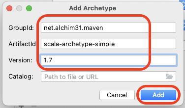

# Lab 6

## Objectives

* Getting started with using Scala to access Spark RDD and Spark SQL.
* Use the Dataframe (SparkSQL) API to process semi-structured data.
* Use SQL queries to process CSV files.

---

## Prerequisites

* Setup the development environment as explained in [Lab 1](../Lab1/CS167-Lab1.md).
* Same as [Lab 5](../Lab5/CS167-Lab5.md).
  * Download [Apache Spark 3.5.0](https://spark.apache.org/downloads.html). Choose the package type **Pre-built with user-provided Apache Hadoop**.
    * Direct link: [spark-3.5.0-bin-without-hadoop.tgz](https://dlcdn.apache.org/spark/spark-3.5.0/spark-3.5.0-bin-without-hadoop.tgz)
  * Download these two sample files [sample file 1](../Lab4/nasa_19950801.tsv), [sample file 2](https://drive.google.com/open?id=1pDNwfsx5jrAqaSy8AKEZyfubCE358L2p). Decompress the second file after download. These are the same files we used in [Lab 4](../Lab4/CS167-Lab4.md).
    * Depending on how you extract the second file, it could be named either `nasa_19950630.22-19950728.12.tsv` or `19950630.23-19950801.00.tsv`. In this lab, we will use these two names interchangeably.
* To add Scala language support to IntelliJ, you can install the [Scala plugin](https://plugins.jetbrains.com/plugin/1347-scala). Please check the [plugin management page](https://www.jetbrains.com/help/idea/managing-plugins.html) to see the details about installing and managing plugins in Intellij. Make sure you restart IntelliJ after installing the plugin.

* If you are not yet familiar with Scala, please check [this tutorial](https://docs.scala-lang.org/tutorials/scala-for-java-programmers.html) to help with the transition from Java to Scala.

---

## Overview

In this lab, we will be using mainly Scala code. While pure Scala projects are usually set up using [SBT](https://www.scala-sbt.org), we will use Maven for this project to reuse your existing development environment and avoid the complications of setting up a new development tool. According to the [official Scala documentation](https://www.scala-lang.org) 'Scala combines object-oriented and functional programming in one concise, high-level language.' Since big-data systems rely heavily on functional programming, Scala is an excellent match for big-data. This is why Spark is natively written in Scala. If you excel in Scala, you can write more concise and readable code and become more productive.

The lab has two parts. The first part implements some operations using the Scala RDD API. The second part repeats the same operations using SparkSQL. This allows you to contrast and understand the difference between them.

---

## Lab Work

## Part A. Spark RDD

### I. Project Setup (10 minutes) (In home)

We will follow a slightly modified version of the instructions on the [official Scala website](https://docs.scala-lang.org/tutorials/scala-with-maven.html). Mainly, we will avoid the interactive steps and combine all our choices in one command line.

1. To generate a new Maven project that works with Scala, use the following command:

    ```bash
    mvn archetype:generate -DarchetypeGroupId=net.alchim31.maven -DarchetypeArtifactId=scala-archetype-simple -DgroupId=edu.ucr.cs.cs167.[UCRNetID] -DartifactId=[UCRNetID]_lab6 -B
    ```

    Note: Do not forget to replace `[UCRNetID]` with your UCR Net ID.

    If you cannot run the above command, check [Create Lab 6 Project from IntelliJ](#create-lab-6-project-from-intellij).

2. Import your project into IntelliJ IDEA in the same way you did in previous labs and make sure it compiles.

3. In your `pom.xml` replace the properties and depdendencies sections with the following configurations:

```xml
  <properties>
    <spark.version>3.5.0</spark.version>
    <scala.compat.version>2.13</scala.compat.version>
    <maven.compiler.source>1.8</maven.compiler.source>
    <maven.compiler.target>1.8</maven.compiler.target>   
    <encoding>UTF-8</encoding>
    <scala.version>2.13.12</scala.version>
    <spec2.version>4.20.5</spec2.version>
  </properties>
 <dependencies>
   <dependency>
       <groupId>org.apache.spark</groupId>
       <artifactId>spark-core_${scala.compat.version}</artifactId>
       <version>${spark.version}</version>
       <scope>compile</scope>
     </dependency>
    <dependency>
      <groupId>org.scala-lang</groupId>
      <artifactId>scala-library</artifactId>
      <version>${scala.version}</version>
    </dependency>

    <!-- Test -->
    <dependency>
      <groupId>junit</groupId>
      <artifactId>junit</artifactId>
      <version>4.12</version>
      <scope>test</scope>
    </dependency>
    <dependency>
      <groupId>org.scalatest</groupId>
      <artifactId>scalatest_${scala.compat.version}</artifactId>
      <version>3.0.8</version>
      <scope>test</scope>
    </dependency>
    <dependency>
      <groupId>org.specs2</groupId>
      <artifactId>specs2-core_${scala.compat.version}</artifactId>
      <version>${spec2.version}</version>
      <scope>test</scope>
    </dependency>
    <dependency>
      <groupId>org.specs2</groupId>
      <artifactId>specs2-junit_${scala.compat.version}</artifactId>
      <version>${spec2.version}</version>
      <scope>test</scope>
    </dependency>
  </dependencies>

    ```
    Click the floating ***m*** icon to load all dependencies.

4. Run the main function in `App` class in Intellij to make sure it works. Also, in the command line, change into the project directory and type `mvn package` once to make sure that it compiles.

5. Because this lab contains many tests with different arguments, you have two options to simplify your work:
    * Run all tests via command line, all commands can be found at [Commands](#commands).
    * Run all tests inside IntelliJ, you will need to create a configuration for each test, check [IntelliJ Configurations](#intellij-configurations) for pre-defined configurations.

---

### II. Initialize with Spark RDD (5 minutes) (In home)

In this part, you will initialize your project with Spark.

1. In `App` class, add the following stub code. (Do not remove the package line in your code)

    ```scala
    import org.apache.spark.rdd.RDD
    import org.apache.spark.{SparkConf, SparkContext}

    import scala.collection.Map

    object App {

      def main(args: Array[String]) {
        val command: String = args(0)
        val inputfile: String = args(1)

        val conf = new SparkConf
        if (!conf.contains("spark.master"))
          conf.setMaster("local[*]")
        println(s"Using Spark master '${conf.get("spark.master")}'")
        conf.setAppName("CS167_Lab6_App")
        val sparkContext = new SparkContext(conf)
        try {
          val inputRDD: RDD[String] = sparkContext.textFile(inputfile)
          val validLines: RDD[String] = // TODO 1a: filter lines which do not start with "host\tlogname" from `inputRDD`
          val parsedLines: RDD[Array[String]] = // TODO 1b: split each line by "\t" from `validLines` via `map`
          val t1 = System.nanoTime
          var valid_command = true
          command match {
            case "count-all" =>
              // Count total number of records in the file
              val count: Long = // TODO 2: count total number of records in the file on `parsedLines`
              println(s"Total count for file '$inputfile' is $count")
            case "code-filter" =>
              // Filter the file by response code, args(2), and print the total number of matching lines
              val responseCode: String = args(2)
              val filteredLines: RDD[Array[String]] = // TODO 3: `filter` on `parsedLines` by `responseCode`
              val count: Long = filteredLines.count()
              println(s"Total count for file '$inputfile' with response code $responseCode is $count")
            case "time-filter" =>
              // Filter by time range [from = args(2), to = args(3)], and print the total number of matching lines
              val from: Long = args(2).toLong
              val to: Long = args(3).toLong
              val filteredLines: RDD[Array[String]] = // TODO 4: `filter` on `parsedLines` by time (column 2) with `from` and `to`
              val count: Long = filteredLines.count()
              println(s"Total count for file '$inputfile' in time range [$from, $to] is $count")
            case "count-by-code" =>
              // Group the lines by response code and count the number of records per group
              val loglinesByCode: RDD[(String, Long)] = // TODO 5a: `map` on `parsedLines` by response code (column 5)
              val counts: Map[String, Long] = // TODO 5b: `countByKey` on `loglinesByCode`
              println(s"Number of lines per code for the file '$inputfile'")
              println("Code,Count")
              counts.toSeq.sortBy(_._1).foreach(pair => println(s"${pair._1},${pair._2}"))
            case "sum-bytes-by-code" =>
              // Group the lines by response code and sum the total bytes per group
              val loglinesByCode: RDD[(String, Long)] = // TODO 6a: `map` on `parsedLines` by response code (column 5) and bytes (column 6)
              val sums: RDD[(String, Long)] = // TODO 6b: `reduceByKey` on `loglinesByCode`
              println(s"Total bytes per code for the file '$inputfile'")
              println("Code,Sum(bytes)")
              sums.sortByKey().collect().foreach(pair => println(s"${pair._1},${pair._2}"))
            case "avg-bytes-by-code" =>
              // Group the liens by response code and calculate the average bytes per group
              val loglinesByCode: RDD[(String, Long)] = // TODO 7a: `map` on `parsedLines` by response code (column 5) and bytes (column 6)
              val sums: RDD[(String, Long)] = // TODO 7b: `reduceByKey` on `loglinesByCode`
              val counts: Map[String, Long] = // TODO 7c: `countByKey` on `loglinesByCode`
              println(s"Average bytes per code for the file '$inputfile'")
              println("Code,Avg(bytes)")
              sums.sortByKey().collect().foreach(pair => {
                val code = pair._1
                val sum = pair._2
                val count = counts(code)
                println(s"$code,${sum.toDouble / count}")
              })
              // TODO 7d: replace the above codes for bonus with `aggregateByKey`
            case "top-host" =>
              // Print the host the largest number of lines and print the number of lines
              val loglinesByHost: RDD[(String, Long)] = // TODO 8a: `map` on `parsedLines` by host (column 0)
              val counts: RDD[(String, Long)] = // TODO 8b: `reduceByKey` on `loglinesByHost`
              val sorted: RDD[(String, Long)] = // TODO 8c: `sortBy` on `counts`
              val topHost: (String, Long) = // TODO 8d: `first` on `sorted`
              println(s"Top host in the file '$inputfile' by number of entries")
              println(s"Host: ${topHost._1}")
              println(s"Number of entries: ${topHost._2}")
            case _ => valid_command = false
          }
          val t2 = System.nanoTime
          if (valid_command)
            println(s"Command '$command' on file '$inputfile' finished in ${(t2 - t1) * 1E-9} seconds")
          else
            Console.err.println(s"Invalid command '$command'")
        } finally {
          sparkContext.stop
        }
      }
    }
    ```

    Note: Unlike the switch statement in C and Java, the [match statement](https://docs.scala-lang.org/tour/pattern-matching.html) in Scala does not require a break at the end of each case.

2. Take a few minutes to check the stub code and understand what it does. It has two required command-line arguments.
    * ***(Q1) What are these two arguments?***

---

### III. Read and parse the input file (Part A) (10 minutes) (In home)

Since most of the commands will need to split the input line and skip the first line, let us do this first.

1. Use a filter transformation to skip the first line. For simplicity, we will detect the first line as the line that starts with `"host\tlogname"`
    * Complete `TODO 1a`
2. Use a map transformation to split each line using the tab character `"\t"` as a separator.
    * Complete `TODO 1b`

Note that since the filter and map operations are transformations, not actions, none of them will be executed until you use them.

A few commands in the next sections may require more than 2 arguments.

---

### IV. `count-all` and `code-filter` (10 minutes)

1. The `count-all` command should use the method [`RDD#count`](https://spark.apache.org/docs/latest/api/scala/org/apache/spark/rdd/RDD.html#count():Long) which is an action to count the total number of records in the input file.
    * Complete `TODO 2`

    Below is the expected output for the two sample files.

    ```text
    Total count for file 'nasa_19950801.tsv' is 30969
    ```

    ```text
    Total count for file '19950630.23-19950801.00.tsv' is 1891709
    ```

2. The `code-filter` command should count the lines that match a desired response code. The desired code is provided as a third command line argument. This method should use the [`filter`](https://spark.apache.org/docs/latest/api/scala/org/apache/spark/rdd/RDD.html#filter(f:T=>Boolean):org.apache.spark.rdd.RDD[T]) transformation followed by the `count` action.
    * Complete `TODO 3`

    Below is the expected output for the two sample files.

    ```text
    Total count for file 'nasa_19950801.tsv' with response code 200 is 27972
    ```

    ```text
    Total count for file '19950630.23-19950801.00.tsv' with response code 302 is 46573
    ```

    Note: For all commands in this lab, make sure that you write the output to the standard output using the `println` command and that the output looks *exactly* the same to the expected output. We will use a script to automatically check your answer and it will use regular expressions to match the answer. Any minor change in this expected output might reduce your grade for this lab. For the command above, use the following print statement:

      ```scala
      println(s"Total count for file '${inputfile}' with response code ${responseCode} is ${count}")
      ```

    Hint: To make your code more readable, you can add constants for each attribute to access them by name instead of number. See the following code snippet for an example.

      ```scala
      val ResponseCode: Int = 5
      val code: String = line.split("\\t")(ResponseCode)
      ```

    * Note: In Scala, the keyword `val` declares a constant while the keyword `var` declares a variable.

---

### V. `time-filter` (10 minutes)

1. In this part, we need to count the number of lines that have a timestmap in a given range `[start, end]`.
    * Complete `TODO 4`
2. The interval is given as two additional arguments as integers.
3. Do not forget to use the method [`String#toLong`](https://www.scala-lang.org/api/2.13.6/scala/collection/StringOps.html#toLong:Long) in Scala to convert the String argument to a long integer to enable numeric comparison.
4. Similar to [`code-filter`](#iv-count-all-and-code-filter-10-minutes), you will need a filter followed by count to complete this part. The filter will be:

    ```scala
    val time = line(2).toLong
    time >= from && time <= to
    ```

5. Two sample outputs are given below.

    ```text
    Total count for file 'nasa_19950801.tsv' in time range [807274014, 807283738] is 6389
    ```

    ```text
    Total count for file '19950630.23-19950801.00.tsv' in time range [804955673, 805590159] is 554919
    ```

    Hint: You can use the following print command:

      ```scala
      println(s"Total count for file '$inputfile' in time range [$from, $to] is $count")
      ```

---

### VI. `count-by-code` (10 minutess)

1. This part requires grouping the records by response code first. In Scala, this is done using a map operation that returns a tuple `(key,value)`.
    * Complete `TODO 5a`
2. You can directly count each group using the function [`countByKey`](https://spark.apache.org/docs/latest/api/scala/org/apache/spark/rdd/PairRDDFunctions.html#countByKey():scala.collection.Map[K,Long]).
    * Complete `TODO 5b` and `TODO 7c`
3. To print the output on the resulting map, you can use the method `foreach` on that map. A sample output is given below.

    ```text
    Number of lines per code for the file 'nasa_19950801.tsv'
    Code,Count
    200,27972
    302,355
    304,2421
    404,221
    ```

    ```text
    Number of lines per code for the file '19950630.23-19950801.00.tsv'
    Code,Count
    200,1701534
    302,46573
    304,132627
    403,54
    404,10845
    500,62
    501,14
    ```

    Hint: Use the following set of commands to print the output shown above:

      ```scala
      println(s"Number of lines per code for the file '$inputfile'")
      println("Code,Count")
      counts.toSeq.sortBy(_._1).foreach(pair => println(s"${pair._1},${pair._2}"))
      ```

    Note: In Scala, the expression `(x,y)` creates a tuple with the two given values. You can similarly create tuples with more values, e.g., `(x,y,z)` for a triplet. Tuples in Scala are immutable, i.e., once created, you cannot modify them.
    * In the Scala API, there is no explicit defintion for a PairRDD. Any RDD that has a value of type Tuple2, i.e., a tuple with two values, will be automatically treated as a pair RDD.

---

### VII. `sum-bytes-by-code` and `avg-bytes-by-code` (15 minutes)

1. This method is similar to the previous one except that it will calculate the summation of bytes for each code.
2. To do that, you can first use the [`map`](https://spark.apache.org/docs/latest/api/scala/org/apache/spark/rdd/RDD.html#map[U](f:T=>U)(implicitevidence$3:scala.reflect.ClassTag[U]):org.apache.spark.rdd.RDD[U]) function to produce only the `code` and the `bytes`.
    * Complete `TODO 6a` and `TODO 7a`
3. Then, you can use the mehod [`reducyByKey`](https://spark.apache.org/docs/latest/api/scala/org/apache/spark/rdd/PairRDDFunctions.html#reduceByKey(func:(V,V)=>V):org.apache.spark.rdd.RDD[(K,V)]) to compute the summation. The reduce method is Spark is different that the reduce method in Hadoop. Instead of taking all the values, it only takes two values at a time. To compute the summation, your reduce function should return the sum of the two values given to it. You can find a helpful hint from this [stack overflow question](https://stackoverflow.com/questions/36965338/spark-scala-understanding-reducebykey).
    * Complete `TODO 6b` and `TODO 7b`

4. Since reduceByKey is a transformation, you will need to use the [`collect`](https://spark.apache.org/docs/latest/api/scala/org/apache/spark/rdd/RDD.html#collect():Array[T]) action to get the results back.

5. A sample output is given below.

    ```text
    Total bytes per code for the file 'nasa_19950801.tsv'
    Code,Sum(bytes)
    200,481974462
    302,26005
    304,0
    404,0
    ```

    ```text
    Total bytes per code for the file '19950630.23-19950801.00.tsv'
    Code,Sum(bytes)
    200,38692291442
    302,3682049
    304,0
    403,0
    404,0
    500,0
    501,0
    ```

6. For `avg-bytes-by-code` you need to compute the average, rather than the summation. A simple reduce function cannot be used to compute the average since the average function is not associative. However, it can be computed using a combination of sum and count.
7. The easiest way to compute the average is to combine the output of the two commands `count-by-code` and `sum-bytes-by-code`. The average is simply the sum divided by count.
    * Complete `TODO 7b`, it is the same as `TODO 6b`
    * Complete `TODO 7c`, it is the same as `TODO 5b`
8. Bonus (+3 points): The drawback of the above method is that it will need to scan the input twice to count each function, sum and count. It is possible to compute both functions in one scan over the input and without caching any intermediate RDDs. Complete this part to get three bonus points on this lab. Explain your method in the README file and add the code snippet that performs this task. Mark your answer with (B). Hint, check the [aggregateByKey](https://spark.apache.org/docs/latest/api/scala/org/apache/spark/rdd/PairRDDFunctions.html#aggregateByKey[U](zeroValue:U)(seqOp:(U,V)=>U,combOp:(U,U)=>U)(implicitevidence$3:scala.reflect.ClassTag[U]):org.apache.spark.rdd.RDD[(K,U)]) function. This [stack overflow question](https://stackoverflow.com/questions/40087483/spark-average-of-values-instead-of-sum-in-reducebykey-using-scala) may also be helpful.
    * *Optional*: Complete `TODO 7d`

    The following template may be used

    ```scala
    val averages: RDD[(String, (Long, Long))] = //TODO 7d: `aggregateByKey` on `loglinesByCode`
    println(s"Average bytes per code for the file '$inputfile'")
    println("Code,Avg(bytes)")
    averages.collect().sorted.foreach(pair => println(s"${pair._1},${pair._2._1.toDouble/pair._2._2}"))
    ```

9. A sample output is given below.

    ```text
    Average bytes per code for the file 'nasa_19950801.tsv'
    Code,Avg(bytes)
    200,17230.604247104246
    302,73.25352112676056
    304,0.0
    404,0.0
    ```

    ```text
    Average bytes per code for the file '19950630.23-19950801.00.tsv'
    Code,Avg(bytes)
    200,22739.652244386536
    302,79.0597341807485
    304,0.0
    403,0.0
    404,0.0
    500,0.0
    501,0.0
    ```

    ***(Q2) If you do this bonus part, copy and paste your code in the README file as an answer to this question.***

---

### VIII. `top-host` (10 minutes)

1. In this part we want to count the number of entries per host and output the one with the highest number of entries.
    * Complete `TODO 8a`
2. While we could use the function `countByKey` it could be inefficient since it returns all the values to the driver node. Unlike the response codes, there could be too many distinct values of `host` and we do not want to return all of them.
3. Instead of `countByKey` we will use the method `reduceByKey` which runs as a transformation and keeps the result in an RDD.
    * Complete `TODO 8b`
4. After that, we will use the transformation [`sortBy`](https://spark.apache.org/docs/latest/api/scala/org/apache/spark/rdd/RDD.html#sortBy[K](f:T=%3EK,ascending:Boolean,numPartitions:Int)(implicitord:Ordering[K],implicitctag:scala.reflect.ClassTag[K]):org.apache.spark.rdd.RDD[T]) to sort the results in *descending* order.
    * Complete `TODO 8c`
5. Finally, we will use the action [`first`](https://spark.apache.org/docs/latest/api/scala/org/apache/spark/rdd/RDD.html#first():T) to return only the first value.
    * Complete `TODO 8d`
6. Sample output

    ```text
    Top host in the file 'nasa_19950801.tsv' by number of entries
    Host: edams.ksc.nasa.gov
    Number of entries: 364
    ```

    ```text
    Top host in the file '19950630.23-19950801.00.tsv' by number of entries
    Host: piweba3y.prodigy.com
    Number of entries: 17572
    ```

---

## Part B. Spark SQL

In this part, we will repeat the same work done above using SparkSQL to see the difference. If you are not familiar with SQL, check this [SQL Tutorial](https://www.w3schools.com/sql/).

### I. Project Setup (1 minute) (In home)

1. In the `pom.xml` file, add the following dependency.

    ```xml
    <dependency>
      <groupId>org.apache.spark</groupId>
      <artifactId>spark-sql_${scala.compat.version}</artifactId>
      <version>${spark.version}</version>
    </dependency>
    ```

### II. Initialize a SparkSession (5 minutes) (In home)

Create a new Scala class of type **Object** named `AppSQL`. Add the following stub code to it.

```scala
import org.apache.spark.sql.SparkSession
import org.apache.spark.SparkConf

object AppSQL {

  def main(args: Array[String]) {
    val conf = new SparkConf
    if (!conf.contains("spark.master"))
      conf.setMaster("local[*]")
    println(s"Using Spark master '${conf.get("spark.master")}'")

    val spark = SparkSession
      .builder()
      .appName("CS167_Lab6_AppSQL")
      .config(conf)
      .getOrCreate()

    try {
      // Your code will go here
    } finally {
      spark.stop
    }
  }
}
```

Note: To create a new Scala object, check the following instructions.

  1. Right click your package name in the project browser. Select `New`, then select `Scala Class`.

      

  2. In the popped up `Create New Scala Class` dialog, type `AppSQL`, then select `Object`.

      

Note: A Scala object is a Singleton class with one object instantiated automatically. All methods inside the object are treated as static methods.

### III. Read and parse the input file (Part B) (10 minutes) (In home)

Spark SQL is equipped with a CSV parser that can read semi-structured CSV files.

1. Use the following code to open the sample file and print the first few lines.

    ```scala
    val input = spark.read.format("csv")
      .option("sep", "\t")
      .option("inferSchema", "true")
      .option("header", "true")
      .load("nasa_19950801.tsv")

    import spark.implicits._

    input.show()
    ```

    The output should look similar to the following:

    ```text
    +--------------------+-------+---------+------+--------------------+--------+------+-------+---------+
    |                host|logname|     time|method|                 url|response| bytes|referer|useragent|
    +--------------------+-------+---------+------+--------------------+--------+------+-------+---------+
    |pppa006.compuserv...|      -|807256800|   GET|/images/launch-lo...|     200|  1713|   null|     null|
    |  vcc7.langara.bc.ca|      -|807256804|   GET|/shuttle/missions...|     200|  8677|   null|     null|
    |pppa006.compuserv...|      -|807256806|   GET|/history/apollo/i...|     200|  1173|   null|     null|
    |thing1.cchem.berk...|      -|807256870|   GET|/shuttle/missions...|     200|  4705|   null|     null|
    |       202.236.34.35|      -|807256881|   GET|     /whats-new.html|     200| 18936|   null|     null|
    |bettong.client.uq...|      -|807256884|   GET|/history/skylab/s...|     200|  1687|   null|     null|
    |       202.236.34.35|      -|807256884|   GET|/images/whatsnew.gif|     200|   651|   null|     null|
    |       202.236.34.35|      -|807256885|   GET|/images/KSC-logos...|     200|  1204|   null|     null|
    |bettong.client.uq...|      -|807256900|   GET|/history/skylab/s...|     304|     0|   null|     null|
    |bettong.client.uq...|      -|807256913|   GET|/images/ksclogosm...|     304|     0|   null|     null|
    |bettong.client.uq...|      -|807256913|   GET|/history/apollo/i...|     200|  3047|   null|     null|
    |        hella.stm.it|      -|807256914|   GET|/shuttle/missions...|     200|513911|   null|     null|
    |mtv-pm0-ip4.halcy...|      -|807256916|   GET| /shuttle/countdown/|     200|  4324|   null|     null|
    |   ednet1.osl.or.gov|      -|807256924|   GET|                   /|     200|  7280|   null|     null|
    |mtv-pm0-ip4.halcy...|      -|807256942|   GET|/shuttle/countdow...|     200| 46573|   null|     null|
    |dd10-046.compuser...|      -|807256943|   GET|/shuttle/missions...|     200| 10566|   null|     null|
    |ad11-013.compuser...|      -|807256944|   GET|/history/history....|     200|  1602|   null|     null|
    |dd10-046.compuser...|      -|807256946|   GET|/shuttle/missions...|     200|  8083|   null|     null|
    |dd10-046.compuser...|      -|807256954|   GET|/images/KSC-logos...|     200|  1204|   null|     null|
    |dd10-046.compuser...|      -|807256954|   GET|/history/apollo/i...|     200|  1173|   null|     null|
    +--------------------+-------+---------+------+--------------------+--------+------+-------+---------+
    only showing top 20 rows
    ```

2. The `option("sep", "\t")` configures the reader with the tab separator so there is no need to manually split each line.
3. The `option("header", "true")` will do two things. First, it will skip the first line in the file so that you do not have to manually remove it. Second, it will use the column names in that line to access the attribute so you do not need to access them by number.
4. The `option("inferSchema", "true")` tells Spark to infer the schema based on the values in the file. For example, the time will be parsed as an integer number which allows the use of range comparison.
5. To check the inferred schema, add the following statement.

    ```scala
    input.printSchema()
    ```

    The output should look similar to the following:

    ```text
    root
    |-- host: string (nullable = true)
    |-- logname: string (nullable = true)
    |-- time: integer (nullable = true)
    |-- method: string (nullable = true)
    |-- url: string (nullable = true)
    |-- response: integer (nullable = true)
    |-- bytes: integer (nullable = true)
    |-- referer: string (nullable = true)
    |-- useragent: string (nullable = true)
    ```

6. Comment the line `option("inferSchema", "true")` and run your program again.
    * ***(Q3) What is the type of the attributes `time` and `bytes` this time? Why?***
7. To use SQL queries, you should add the following line to create a view named `log_lines` that points to your input.

    ```scala
    input.createOrReplaceTempView("log_lines")
    ```

### IV. Query the Dataframe using Dataframe Operators (45 minutes)

In this part, we will run some relational operators through the Dataframe/SparkSQL API. The logic of these queries is similar to what we did in part A. This will allow you to compare and contrast the two APIs.

Note: For each of the following, you are free to use SQL queries directly or build the query using the Dataframe API. Instructions for both are given for each command.

1. Replace your code with the following code template to run a user-provided operation using SQL queries.

    ```scala
    import org.apache.spark.{SparkConf, sql}
    import org.apache.spark.sql.{DataFrame, Row, SparkSession}

    object AppSQL {

      def main(args: Array[String]) {
        val conf = new SparkConf
        if (!conf.contains("spark.master"))
          conf.setMaster("local[*]")
        println(s"Using Spark master '${conf.get("spark.master")}'")

        val spark = SparkSession
          .builder()
          .appName("CS167_Lab6_AppSQL")
          .config(conf)
          .getOrCreate()

        val command: String = args(0)
        val inputfile: String = args(1)
        try {
          val input = spark.read.format("csv")
            .option("sep", "\t")
            .option("inferSchema", "true")
            .option("header", "true")
            .load(inputfile)
          import spark.implicits._
          input.createOrReplaceTempView("log_lines")
          val t1 = System.nanoTime
          var validCommand = true
          command match {
            case "count-all" =>
              // Count total number of records in the file
              val query: String = // TODO 9: write SQL query to count the total number of rows in `log_lines`
              val count: Long = spark.sql(query).first().getAs[Long](0)
              println(s"Total count for file '$inputfile' is $count")
            case "code-filter" =>
              // Filter the file by response code, args(2), and print the total number of matching lines
              val responseCode: String = args(2)
              val query: String = // TODO 10: write SQL query to filter view `log_lines` by `responseCode`
              val count: Long = spark.sql(query).first().getAs[Long](0)
              println(s"Total count for file '$inputfile' with response code $responseCode is $count")
            case "time-filter" =>
              // Filter by time range [from = args(2), to = args(3)], and print the total number of matching lines
              val from: Long = args(2).toLong
              val to: Long = args(3).toLong
              val query: String = // TODO 11: write SQL query to filter view `log_lines` by `time` between `from` and `to`
              val count: Long = spark.sql(query).first().getAs[Long](0)
              println(s"Total count for file '$inputfile' in time range [$from, $to] is $count")
            case "count-by-code" =>
              // Group the lines by response code and count the number of records per group
              println(s"Number of lines per code for the file '$inputfile'")
              println("Code,Count")
              val query: String = // TODO 12: write SQL query the get the count for each `response`, results must be ordered by `response` in ascending order
              spark.sql(query).foreach(row => println(s"${row.get(0)},${row.get(1)}"))
            case "sum-bytes-by-code" =>
              // Group the lines by response code and sum the total bytes per group
              println(s"Total bytes per code for the file '$inputfile'")
              println("Code,Sum(bytes)")
              val query: String = // TODO 13: write SQL query the get the sum of `bytes` for each `response`, results must be ordered by `response` in ascending order
              spark.sql(query).foreach(row => println(s"${row.get(0)},${row.get(1)}"))
            case "avg-bytes-by-code" =>
              // Group the liens by response code and calculate the average bytes per group
              println(s"Average bytes per code for the file '$inputfile'")
              println("Code,Avg(bytes)")
              val query: String = // TODO 14: write SQL query the get the average of `bytes` for each `response`, results must be ordered by `response` in ascending order
              spark.sql(query).foreach(row => println(s"${row.get(0)},${row.get(1)}"))
            case "top-host" =>
              // print the host the largest number of lines and print the number of lines
              println(s"Top host in the file '$inputfile' by number of entries")
              val query: String = // TODO 15: write SQL query the get the `host` with the largest count
              val topHost: Row = spark.sql(query).first()
              println(s"Host: ${topHost.get(0)}")
              println(s"Number of entries: ${topHost.get(1)}")
            case "comparison" =>
              // Given a specific time, calculate the number of lines per response code for the
              // entries that happened before that time, and once more for the lines that happened at or after
              // that time. Print them side-by-side in a tabular form.

              // TODO 16a: comment the following line
              println("Not implemented")

              // TODO 16b: uncomment the following 3 lines
              // val filterTimestamp: Long = args(2).toLong
              // println(s"Comparison of the number of lines per code before and after $filterTimestamp on file '$inputfile'")
              // println("Code,CountBefore,CountAfter")

              // TODO 16c: Uncomment the following lines and complete your function here if you prefer to use SQL queries
              // val query: String = // Write your query here. Results must be ordered by `response` in ascending order
              // spark.sql(query).foreach(row => println(s"${row.get(0)},${row.get(1)},${row.get(2)}"))

              // TODO 16d: Uncomment the following lines and complete your function here if you prefer to use DataFrame
              // val countsBefore: DataFrame = // on `input`
              // val countsAfter: DataFrame = // on `input`
              // val comparedResults: DataFrame = countsBefore.join(countsAfter, "response").orderBy("response")
              // comparedResults.foreach(row => println(s"${row.get(0)},${row.get(1)},${row.get(2)}"))              
            case _ => validCommand = false
          }
          val t2 = System.nanoTime
          if (validCommand)
            println(s"Command '$command' on file '$inputfile' finished in ${(t2 - t1) * 1E-9} seconds")
          else
            Console.err.println(s"Invalid command '$command'")
        } finally {
          spark.stop
        }
      }
    }
    ```

2. The command `count-all` is implemented using the `count` function.
    * Complete `TODO 9`

    The output should be the same as in [IV. `count-all` and `code-filter`](#iv-count-all-and-code-filter-10-minutes).

    You can also run this logic using the following SQL function:

    ```SQL
    SELECT count(*)
    FROM log_lines;
    ```

    The following code snippet shows how to run this SQL query in your code.

    ```scala
    val count = spark.sql(
      """SELECT count(*)
        FROM log_lines""")
      .first()
      .getAs[Long](0)
    ```

    Notice that the return value of any SQL query is always a Dataframe even if it contains a single row or a single value.

    Note: An alternative way to call functions in Scala is using spaces instead of dot and parantheses. The following syntax is valid.

    ```scala
    val queryResult = spark sql "SELECT count(*) FROM log_lines" first
    val count = queryResult.getAs[Long](0)
    ```

    You can use this alternative syntax wisely to make your code more readable without being too complex to follow.

3. The command `code-filter` should count the records with a give response code. To do that, you will use the `filter` method. The easiest way is to provide the test as a string, e.g., `"response=200"`. Alternatively, you can use the expression `$"response" === 200`. For the latter, make use that you ipmort the implicit coversion using the statement `import spark.implicits._` in your program.
    * Complete `TODO 10`

    The output should be the same as in [IV. `count-all` and `code-filter`](#iv-count-all-and-code-filter-10-minutes).

    The following SQL command will also return the same result.

    ```SQL
    SELECT count(*)
    FROM log_lines
    WHERE response=200;
    ```

4. The command `time-filter` should count all the records that happened in a time interval `[from, to]`. The two parameters are provided as the third and forth command line arguments. You will use the `filter` function but this time with the `between` expression. Again, you can just provide the filter predicate as a string, i.e., `"time BETWEEN 807274014 AND 807283738"`, or as a Scala expression, i.e., `$"time".between(807274014, 807283738)`. This will be followed by `count` to count the records.
    * Complete `TODO 11`

    The output should be the same as in [V. `time-filter`](#v-time-filter-10-minutes).

    You can also use the following SQL query.

    ```SQL
    SELECT count(*)
    FROM log_lines
    WHERE time BETWEEN <from> AND <to>;
    ```

    You should replace `<from>` and `<to>` with the correct parameters passed through command line. You can use the [string interpolation](https://docs.scala-lang.org/overviews/scala-book/two-notes-about-strings.html) feature in Scala to keep your code readable.

5. The commands `count-by-code`, `sum-bytes-by-code`, and `avg-bytes-by-code` will all look very similar. You first need to group records by response code using the `groupBy` function, i.e., `groupBy("response")` or `groupBy($"response")`. On the result, you should call the correct aggregate function, i.e., `count`, `sum`, or `avg`. The last two functions take a parameter which is the column name to aggregate, e.g., `sum("bytes")`. You can finally print the result using the `show()` command.
    * Complete `TODO 12`, `TODO 13` and `TODO 14`

    The output should be the same as in [VI. `count-by-code`](#vi-count-by-code-10-minutess) and [VII. `sum-bytes-by-code` and `avg-bytes-by-code`](#vii-sum-bytes-by-code-and-avg-bytes-by-code-15-minutes).

    Here is one SQL query that you can further customize for the three commands.

    ```SQL
    SELECT response, SUM(bytes)
    FROM log_lines
    GROUP BY response
    ORDER BY response;
    ```

6. The command `top-host` should group records by host, `groupBy("host")`, then count records in each group `count()`. After that, you should sort the results in descending order by count, `orderBy($"count".desc)`. Finally, return the top result using the method `first()`. The final result will be of type `Row`. To access the host and number of records for the top result, you can use one of the methods `Row#getAs(String)` and `Row#getAs(Int)` which retrieve an attribute by its name and index, respectively.
    * Complete `TODO 15`

    The output should be the same as in [VIII. `top-host`](#viii-top-host-10-minutes).

    The following SQL query will help you with this part.

    ```SQL
    SELECT host, COUNT(*) AS cnt
    FROM log_lines
    GROUP BY host
    ORDER BY cnt DESC
    LIMIT 1;
    ```

7. (Bonus +3 points) Add a new command, `comparison` that counts records by response code before and after a specific timestamp. The timstamp is given as a command-line argument.
    * *Optional*: Complete `TODO 16a`, `TODO 16b`, and `TODO 16c` or `TODO 16d`

    * Option 1: Use a SQL query to join two views.

    * OPtion 2: Create two Dataframes by filtering the input twice. For each Dataframe, you can count the records by response code as done in the operation `count-by-code`. Finally, you can join the results of the two Dataframes by code to place them side-by-side in one Dataset. The join method may look like the following line:

      ```scala
      countsBefore.join(countsAfter, "response")
      ```

      which joins two dataframes, namely, `countsBefore` and `countsAfter`, using the common key `response`.

      Hint: By default, the name of the column that results from the `count` function is named `count`. You can rename this column in each Datafame separately using the method `withColumnRenamed`, for example, for the count-before dataframe, the stament will be `withColumnRenamed("count", "count_before")`.

    A sample output is given below.
    
    ```text
    Comparison of the number of lines per code before and after 807295758 on file `nasa_19950801.tsv`
    Code,CountBefore,CountAfter
    200,22248,5724
    302,272,83
    304,1925,496
    404,199,22
    ```

    ```text
    Comparison of the number of lines per code before and after 805383872 on file '19950630.23-19950801.00.tsv'
    Code,CountBefore,CountAfter
    200,594412,1107122
    302,21057,25516
    304,38000,94627
    403,19,35
    404,3864,6981
    500,53,9
    501,2,12
    ```

    ***(Q4) If you do this bonus part, copy and paste your code in the README file as an aswer to this question.***

---

## Commands

You can use the following commands for testing.

```bash
# Part A
spark-submit --class edu.ucr.cs.cs167.[UCRNetID].App --master "local[*]" target/[UCRNetID]_lab6-1.0-SNAPSHOT.jar count-all nasa_19950801.tsv
spark-submit --class edu.ucr.cs.cs167.[UCRNetID].App --master "local[*]" target/[UCRNetID]_lab6-1.0-SNAPSHOT.jar code-filter nasa_19950801.tsv 200
spark-submit --class edu.ucr.cs.cs167.[UCRNetID].App --master "local[*]" target/[UCRNetID]_lab6-1.0-SNAPSHOT.jar time-filter nasa_19950801.tsv 807274014 807283738
spark-submit --class edu.ucr.cs.cs167.[UCRNetID].App --master "local[*]" target/[UCRNetID]_lab6-1.0-SNAPSHOT.jar count-by-code nasa_19950801.tsv
spark-submit --class edu.ucr.cs.cs167.[UCRNetID].App --master "local[*]" target/[UCRNetID]_lab6-1.0-SNAPSHOT.jar sum-bytes-by-code nasa_19950801.tsv
spark-submit --class edu.ucr.cs.cs167.[UCRNetID].App --master "local[*]" target/[UCRNetID]_lab6-1.0-SNAPSHOT.jar avg-bytes-by-code nasa_19950801.tsv
spark-submit --class edu.ucr.cs.cs167.[UCRNetID].App --master "local[*]" target/[UCRNetID]_lab6-1.0-SNAPSHOT.jar top-host nasa_19950801.tsv

# Part B
spark-submit --class edu.ucr.cs.cs167.[UCRNetID].AppSQL --master "local[*]" target/[UCRNetID]_lab6-1.0-SNAPSHOT.jar count-all nasa_19950801.tsv
spark-submit --class edu.ucr.cs.cs167.[UCRNetID].AppSQL --master "local[*]" target/[UCRNetID]_lab6-1.0-SNAPSHOT.jar code-filter nasa_19950801.tsv 200
spark-submit --class edu.ucr.cs.cs167.[UCRNetID].AppSQL --master "local[*]" target/[UCRNetID]_lab6-1.0-SNAPSHOT.jar time-filter nasa_19950801.tsv 807274014 807283738
spark-submit --class edu.ucr.cs.cs167.[UCRNetID].AppSQL --master "local[*]" target/[UCRNetID]_lab6-1.0-SNAPSHOT.jar count-by-code nasa_19950801.tsv
spark-submit --class edu.ucr.cs.cs167.[UCRNetID].AppSQL --master "local[*]" target/[UCRNetID]_lab6-1.0-SNAPSHOT.jar sum-bytes-by-code nasa_19950801.tsv
spark-submit --class edu.ucr.cs.cs167.[UCRNetID].AppSQL --master "local[*]" target/[UCRNetID]_lab6-1.0-SNAPSHOT.jar avg-bytes-by-code nasa_19950801.tsv
spark-submit --class edu.ucr.cs.cs167.[UCRNetID].AppSQL --master "local[*]" target/[UCRNetID]_lab6-1.0-SNAPSHOT.jar top-host nasa_19950801.tsv
spark-submit --class edu.ucr.cs.cs167.[UCRNetID].AppSQL --master "local[*]" target/[UCRNetID]_lab6-1.0-SNAPSHOT.jar comparison nasa_19950801.tsv 807295758
```

Hint: Add `2>/dev/null` to the end of each command to hide logging information from Spark.

---

## IntelliJ Configurations

1. Download [runConfigurations.zip](./runConfigurations.zip) and unzip it.

2. Copy the unzipped `runConfigurations` directory. Shortcut is `Ctrl + C` on Linux and Windows, `Command + C` on macOS.

3. In your project browser in IntelliJ, right click `.idea` directory, select `Paste`. Shortcut is `Ctrl + V` on Linux and Windows, `Command + V` on macOS (Make sure you have `.idea` directory selected).
    

4. A `Copy` dialog will show, you don't need to change anything. Click `OK` to continue.
    

5. Expand `.idea` directory, then expand `runConfigurations` directory. You will find some XML files. You will need to make some simple changes to **ALL** these XML files, by replacing `<UCRNetID>` to your actual UCR Net ID.
    

6. On IntelliJ Right-CLick on the `runConfigurations` and select `Replace in Files`.
    

7. On the window that appears put `<UCRNetID>` on the first field, and your UCRNetID on the second field `msaee007` on this example, as shown on the screenshot. Then, click on `Replace All`.
   

9. This should update all the `runConfiguration` files with your UCRNetID.

10. Click the `Add Configuration...` button next to the green hammer icon.
    

11. You shall see `Application` folder in the left panel. Expand it, you shall see `App` and `AppSQL` two folders. Expand them, and you shall see all the 15 configurations.
    

12. You can now select a configuration, but be sure to click the green triangle icon to run the current selected configuration.
    [Run config](images/run-config.png)

---

## Submission (15 minutes)

1. Add a `README` file with all your answers. Use this [template](https://raw.githubusercontent.com/aseldawy/CS167/master/Labs/Lab6/CS167-Lab6-README.md).
2. If you implemented the bonus tasks, add your explanation and code snippet to the `README` file.
3. Add a `run` script that compiles your code and then runs the following commands with the given parameters on the file `nasa_19950630.22-19950728.12.tsv`. Use only the file name with the assumption that the file is available in the working directory. The script should run all these command twice, once with `App` and once with `AppSQL`.

    | Command           | Parameters           |
    | ----------------- | -------------------- |
    | count-all         |                      |
    | code-filter       | 302                  |
    | time-filter       | 804955673  805590159 |
    | count-by-code     |                      |
    | sum-bytes-by-code |                      |
    | avg-bytes-by-code |                      |
    | top-host          |                      |
    | comparison (if implemented for AppSQL)        | 805383872            |

4. As a test, run your script using the following command to redirect the standard output to the file `output.txt` and double check that the answers in your file are the same to the ones listed earlier in this lab for the file `nasa_19950630.22-19950728.12.tsv`.

    ```bash
    ./run.sh > output.txt
    ```

5. Similar to all labs, do not include any additional files such as the compiled code, input, or output files.

Submission file format:

```console
[UCRNetID]_lab6.{tar.gz | zip}
  - src/
  - pom.xml
  - README.md
  - run.sh
```

Requirements:

* The archive file must be either `.tar.gz` or `.zip` format.
* The archive file name must be all lower case letters. It must be underscore '\_', not hyphen '-'.
* The folder `src` and three files `pom.xml`, `README.md` and `run.sh` must be the exact names.
* The folder `src` and three files `pom.xml`, `README.md` and `run.sh` must be directly in the root of the archive, do not put them inside any folder.
* Do not include any other files/folders, otherwise points will be deducted.

See how to create the archive file for submission at [here](../MakeArchive.md).

---

## Further Readings

The following reading material could help you with your lab.

* [RDD Programming Guide](http://spark.apache.org/docs/latest/rdd-programming-guide.html)
* [RDD API Docs](http://spark.apache.org/docs/latest/api/scala/index.html#org.apache.spark.rdd.RDD)
* [Spark SQL Programming Guide](http://spark.apache.org/docs/latest/sql-getting-started.html)
* [Dataset API Docs](http://spark.apache.org/docs/latest/api/scala/index.html#org.apache.spark.sql.Dataset)
* [SQL Tutorial](https://www.w3schools.com/sql/)

---

## Create Lab 6 Project from IntelliJ

1. Create `New Project` from IntelliJ.
    

2. In the popped up `New Project` window, click `Add` for **Archetype:**.
    

3. In the popped up `Add Archetype` dialog, fill the following information and then click `Add`.
    * `GroupId` &rarr; `net.alchim31.maven`
    * `ArtifactId` &rarr; `scala-archetype-simple`
    * `Version` &rarr; `1.7`

    

4. In the `New Project` window:
    1. Chcek if `Archetype` is `net.alchim31.maven:scala-archetype-simple` and `Version` is `1.7`.
    2. Check if `JDK` is `17` and showing `Oracle`. If not, change it to Oracle JDK 17.
    3. Expand `Advanced Settings`, and fill the following information (Replace `[UCRNetID]` with your UCR Net ID):
        * `GroupId` &rarr; `edu.ucr.cs.cs167.[UCRNetID]`
        * `ArtifactId` &rarr; `[UCRNetID]_lab6`

    

---

## FAQ

* Q: My code does not compile using `mvn package`.

    A: Check your `pom.xml` file and make sure that the following sections are there in your file.

    ```xml
      <properties>
        <maven.compiler.source>1.8</maven.compiler.source>
        <maven.compiler.target>1.8</maven.compiler.target>
        <encoding>UTF-8</encoding>
        <scala.version>2.13.8</scala.version>
        <scala.compat.version>2.13</scala.compat.version>
        <spec2.version>4.2.0</spec2.version>
        <spark.version>3.2.1</spark.version>
      </properties>


      <dependencies>
        <dependency>
          <groupId>org.scala-lang</groupId>
          <artifactId>scala-library</artifactId>
          <version>${scala.version}</version>
        </dependency>
        <dependency>
          <groupId>org.apache.spark</groupId>
          <artifactId>spark-core_${scala.compat.version}</artifactId>
          <version>${spark.version}</version>
          <scope>compile</scope>
        </dependency>
       <dependency>
          <groupId>org.apache.spark</groupId>
          <artifactId>spark-sql_${scala.compat.version}</artifactId>
          <version>${spark.version}</version>
       </dependency>

        <!-- Test -->
        <dependency>
          <groupId>junit</groupId>
          <artifactId>junit</artifactId>
          <version>4.12</version>
          <scope>test</scope>
        </dependency>
        <dependency>
          <groupId>org.scalatest</groupId>
          <artifactId>scalatest_${scala.compat.version}</artifactId>
          <version>3.0.5</version>
          <scope>test</scope>
        </dependency>
        <dependency>
          <groupId>org.specs2</groupId>
          <artifactId>specs2-core_${scala.compat.version}</artifactId>
          <version>${spec2.version}</version>
          <scope>test</scope>
        </dependency>
        <dependency>
          <groupId>org.specs2</groupId>
          <artifactId>specs2-junit_${scala.compat.version}</artifactId>
          <version>${spec2.version}</version>
          <scope>test</scope>
        </dependency>
      </dependencies>

      <build>
        <sourceDirectory>src/main/scala</sourceDirectory>
        <testSourceDirectory>src/test/scala</testSourceDirectory>
        <plugins>
          <plugin>
            <!-- see http://davidb.github.com/scala-maven-plugin -->
            <groupId>net.alchim31.maven</groupId>
            <artifactId>scala-maven-plugin</artifactId>
            <version>3.3.2</version>
            <executions>
              <execution>
                <goals>
                  <goal>compile</goal>
                  <goal>testCompile</goal>
                </goals>
                <configuration>
                  <args>
                    <arg>-dependencyfile</arg>
                    <arg>${project.build.directory}/.scala_dependencies</arg>
                  </args>
                </configuration>
              </execution>
            </executions>
          </plugin>
          <plugin>
            <groupId>org.apache.maven.plugins</groupId>
            <artifactId>maven-surefire-plugin</artifactId>
            <version>2.21.0</version>
            <configuration>
              <!-- Tests will be run with scalatest-maven-plugin instead -->
              <skipTests>true</skipTests>
            </configuration>
          </plugin>
          <plugin>
            <groupId>org.scalatest</groupId>
            <artifactId>scalatest-maven-plugin</artifactId>
            <version>2.0.0</version>
            <configuration>
              <reportsDirectory>${project.build.directory}/surefire-reports</reportsDirectory>
              <junitxml>.</junitxml>
              <filereports>TestSuiteReport.txt</filereports>
              <!-- Comma separated list of JUnit test class names to execute -->
              <jUnitClasses>samples.AppTest</jUnitClasses>
            </configuration>
            <executions>
              <execution>
                <id>test</id>
                <goals>
                  <goal>test</goal>
                </goals>
              </execution>
            </executions>
          </plugin>
        </plugins>
      </build>
    ```

* Q: IntelliJ IDEA does not show the green run arrow next to the `App` class.

    A: Check if there is a message at the top asking you to set up Scala SDK. Click on that button and follow the instructions to install the default SDK version 2.13.

* Q: IntelliJ IDEA does not recognize Scala code.

    A: Make sure that the Scala plugin is installed on IntelliJ IDEA.
