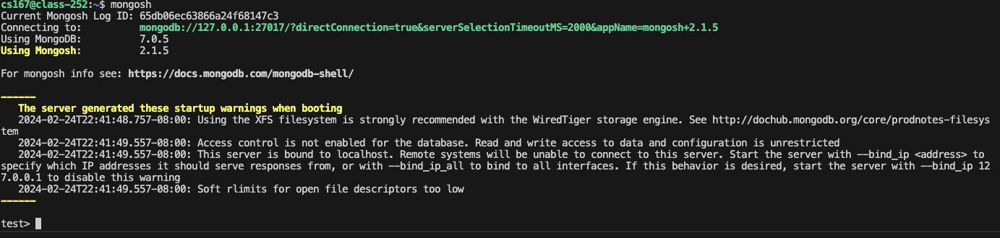

# Lab 7

## Objectives

* Understand the document database model.
* Manipulate a set of documents in a database.
* Understand how MongoDB deals with the flexibility of the document data model.

---

## Prerequisites

* Download the following sample file [tweets.json](./tweets.json).
* Access to your cs167 machine.
---

## Lab Work

### I. Setup MongoDB, Database Tools and MongoDB shell in your cs167 machine (15 minutes, In-home)
1. Login to your CS167 machine.
2. On your CS167 machine, download and extract `MongoDB Community Edition` with version `8.0.4` to your `$HOME/cs167` using the command below:
    ```shell
    curl https://fastdl.mongodb.org/linux/mongodb-linux-x86_64-ubuntu2204-8.0.4.tgz | tar -xvz -C $HOME/cs167
    ```
3. Download and extract `MongoDB Database Tools` with version `100.11.0` to your $HOME/cs167 using the command below:
    ```shell
    curl https://fastdl.mongodb.org/tools/db/mongodb-database-tools-ubuntu2204-x86_64-100.11.0.tgz | tar -xvz -C $HOME/cs167
    ```
4. Download and extract `MongoDB Shell` with version `2.3.9` to your $HOME/cs167 using the command below:
    ```shell	
    curl https://downloads.mongodb.com/compass/mongosh-2.3.9-linux-x64.tgz | tar -xvz -C $HOME/cs167
    ```

*Note:* You should see the following three folders created in your `$HOME/cs167` folder after step 4:
+ mongodb-linux-x86_64-ubuntu2204-8.0.4
+ mongodb-database-tools-ubuntu2204-x86_64-100.11.0
+ mongosh-2.3.9-linux-x64

5. Use the following command to copy all the files from the `~/cs167/mongodb-database-tools-ubuntu2204-x86_64-100.11.0/bin` directory to the `~/cs167/mongodb-linux-x86_64-ubuntu2204-8.0.4/bin` directory:
    ```shell
    cp -r $HOME/cs167/mongodb-database-tools-ubuntu2204-x86_64-100.11.0/bin/* $HOME/cs167/mongodb-linux-x86_64-ubuntu2204-8.0.4/bin/
    ```
<!-- Available files are:
    + bsondump
    + mongoexport
    + mongoimport
    + mongostat
    + mongodump
    + mongofiles
    + mongorestore
    + mongotop -->

6. Use the following command to copy all the files from  the `~/cs167/mongosh-2.3.9-linux-x64/bin` directory to the `~/cs167/mongodb-linux-x86_64-ubuntu2204-8.0.4/bin` directory. 
    ```shell
    cp -r $HOME/cs167/mongosh-2.3.9-linux-x64/bin/* $HOME/cs167/mongodb-linux-x86_64-ubuntu2204-8.0.4/bin/
    ```
<!-- Available files are:
    + mongosh 
    + mongosh_crypt_v1.so -->

7. Setup `environment variables` for MongoDB using the following command:
    ```shell
    echo 'export MONGODB_HOME=$HOME/cs167/mongodb-linux-x86_64-ubuntu2204-8.0.4' >> ~/.bashrc
    echo 'export PATH=$PATH:$MONGODB_HOME/bin' >> ~/.bashrc
    ```

8. Reload the configuration by running:
    ```shell
    source ~/.bashrc
    ```

9. Test that MongoDB works correctly by running the command:
    ```shell
    mongod -version
    ```
    The output should look something like the following:
    ```text
    db version v8.0.4
    Build Info: {
        "version": "8.0.4",
        "gitVersion": "bc35ab4305d9920d9d0491c1c9ef9b72383d31f9",
        "openSSLVersion": "OpenSSL 3.0.2 15 Mar 2022",
        "modules": [],
        "allocator": "tcmalloc-google",
        "environment": {
            "distmod": "ubuntu2204",
            "distarch": "x86_64",
            "target_arch": "x86_64"
        }
    }
    ```

10. Use the following command to create a `$MONGODB_HOME/data` directory where your data will be stored:
	```shell
    mkdir -p $MONGODB_HOME/data
    ```
11. Start the `MongoDB server` by running the following command in `screen` or `tmux`, or `keep the tab/window open` while doing this lab:
    ```shell
    mongod --dbpath $MONGODB_HOME/data
    ```
<!-- *Note*: It is recommended to run the **mongod** service in a [screen](../../remote-access.md#part-vii-run-commands-in-a-screen) so it stays running in case you lose your connection. If this is too complicated for you, just keep the window open. If you get disconnected, you will need to rerun the **mongod** service again using the command above. -->

### II. Data Understanding (15 minutes - In Home)

In this part, you will work with the [`tweets.json`](tweets.json) file to better understand it.

1. Upload [`tweets.json`](./tweets.json) to your `cs167` virtual machine home directory (you can drag the file into `vscode` if you are connecting with `cs167` by `vscode`).
2. On your `cs167 machine`, start a new `Spark shell in local mode` by running:
    ```shell
    spark-shell --master local
    ```
    
    Wait a few seconds, you should be able to see the following information:
    ```shell
    Spark context Web UI available at http://class-###.cs.ucr.edu:4040
    Spark context available as 'sc' (master = local, app id = local-1739417507414).
    Spark session available as 'spark'.
    Welcome to
        ____              __
        / __/__  ___ _____/ /__
        _\ \/ _ \/ _ `/ __/  '_/
    /___/ .__/\_,_/_/ /_/\_\   version 3.5.4
        /_/
            
    Using Scala version 2.12.18 (Java HotSpot(TM) 64-Bit Server VM, Java 17.0.12)
    Type in expressions to have them evaluated.
    Type :help for more information.

    scala> 
    ```
3. Once the Spark shell starts, run the command:
    ```shell
    spark.read.json("file:///home/cs167/tweets.json").printSchema
    ```
    *Note*: We explicitly use the local file system (`file:///`) to override your existing configuration from previous labs.

* ***(Q1) What is the schema of the file? Copy it to the README file and keep it for your reference.***  

4. Leave `spark-shell` by typing:
    ```shell
    :q
    ```
---

### III. Data Manipulation (60 minutes)

For this part, you can use `generative AI tools` to help you get familiar with `MongoDB` interfaces. Attach your conversation in your submission for grading.

1. Start a new terminal on your `cs167 machine`, import the sample file into a new collection named `tweets`. You will need to use [`mongoimport`](https://www.mongodb.com/docs/database-tools/mongoimport/) command from the database tool with [`--collection`](https://www.mongodb.com/docs/database-tools/mongoimport/#std-option-mongoimport.--collection) option.
* ***(Q2) What is your command to import the `tweets.json` file?*** 
* ***(Q3) What is the output of the import command?*** 

2. On your CS167 machine, start a `MongoDB Shell` by running the command:
    ```shell
    mongosh
    ```
    You should see the following content:
    

    `MongoDB Shell` is an `interactive JavaScript interface` to MongoDB. Here, you can run queries, manage data, and perform administrative tasks directly in your MongoDB database.

3. You can use the following command to list all available `MongoDB` databases:
    ```shell
    show dbs
    ```
    And use the following command to switch to the db you store `tweets`:
    ```shell
    use [db name]
    ```

4. Write a query in the MongoDB shell to count the total number of records in the `tweets` collection.
* ***(Q4) What is your command to count the total number of records in the `tweets` collection and what is the output of the command?***

5. Find all tweets those have `country_code` "JP" and user's `statuses_count` is greater than 50,000. From these tweets, list information about the users, specifically their username (`user_name`), number of followers (`followers_count`), and total number of tweets (`statuses_count`). The results should be sorted in *ascending order* based on the number of followers (`followers_count`).
* ***(Q5) What is your command for this query?*** 
* ***(Q6) How many records does your query return?*** (Use the [db.collection.count()](https://www.mongodb.com/docs/manual/reference/method/db.collection.count/) function to answer this question.)
    
    Hint: You can `provide the AI tools with some sample data` so that it can better understand the data format. You will need to use [db.collection.find()](https://www.mongodb.com/docs/manual/reference/method/db.collection.find/#mongodb-method-db.collection.find), [projection](https://www.mongodb.com/docs/manual/reference/method/db.collection.find/#projection) and [Ascending/Descending Sort](https://www.mongodb.com/docs/manual/reference/method/cursor.sort/#ascending-descending-sort). Check how to [access nested attributes](https://www.mongodb.com/docs/manual/reference/method/db.collection.find/#embedded-field-specification).

5. Repeat what you did for Q5 but [do not show the `_id` field](https://www.mongodb.com/docs/manual/reference/method/db.collection.find/#_id-field-projection).
* ***(Q7) What is the command that retrieves the results without the _id field?*** 

6. Insert the following document into the collection.
    ```javascript
    {id: Long('921633456941125634'), place: { country_code: 'JP', name: 'Japan', place_type: 'city' }, user: {user_name: 'xyz2', followers_count: [2100, 5000], statuses_count: 55000}, hashtags: ['nature' ],lang: 'ja'}
    ```
* ***(Q8) What is the command to insert the sample document? What is the result of running the command?*** 
* ***(Q9) Does MongoDB accept this document while the followers_count field has a different type than other records?*** 

    Hint: Use [`db.collection.insertOne()`](https://www.mongodb.com/docs/manual/reference/method/db.collection.insertOne/#db.collection.insertone--).

7. Insert the following document into the collection.

    ```javascript
    {id: Long('921633456941121354'), place: { country_code: 'JP', name: 'Japan', place_type: 'city' }, user: {user_name: 'xyz3', followers_count: {last_month: 550, this_month: 2200}, statuses_count: 112000}, hashtags: [ 'art', 'tour' ], lang: 'ja'
    }
    ```
* ***(Q10) What is your command to insert this record?***

8. Now go back to step 5, which lists the records in Japan and with followers larger than 50,000. This time, sort the results by followers_count in **descending** order.
* ***(Q11) Where did the two new records appear in the sort order?***
    + Note: write the answer in the form: user name "xyz2" is the first/last/or between followers_count {} and {}. user name "xyz3" is the first/last/or between followers_count {} and {}. 

* ***(Q12) Why did they appear at these specific locations?***

    Check the [documentation of MongoDB](https://www.mongodb.com/docs/manual/reference/bson-type-comparison-order/) to help you answer this question.

9. Now go back to step 5, but this time lists the records sorted by followers_count in **ascending** order.
* ***(Q13) Where did the two records appear in the ascending sort order? Explain your observation.***

    Hint: [Ascending/Descending Sort](https://www.mongodb.com/docs/manual/reference/method/cursor.sort/#ascending-descending-sort).


10. Build an index on the `user.followers_count` field for the `tweets` collection.
* ***(Q14) Is MongoDB able to build the index on that field with the different value types stored in the `user.followers_count` field?***
* ***(Q15) What is your command for building the index?***
* ***(Q16) What is the output of the create index command?***

    Hint: Use [`db.collection.createIndex()`](https://www.mongodb.com/docs/manual/reference/method/db.collection.createIndex/#mongodb-method-db.collection.createIndex).

---
### IV.  Identify Tweets with Selected Hashtags
In this part, you need to find all tweets that include any of the following hashtags: 'job', 'hiring', or 'IT'. The query should return the tweet text (text field), the associated hashtags, and the associated user's user_name, followers_count for each matching document in the **ascending** order of user's follower's count. 
* ***(Q17) What is your command for this query?***
* ***(Q18) How many records are returned from this query?***

*Hint:* : Use the [`$in`](https://www.mongodb.com/docs/manual/reference/operator/query/in/) operator within your query to specify that you want to find documents where the hashtags array contains at least one of the specified hashtags.

---
### V. Print top 5 countries with most number of tweets
For this part, you need to run a query on `tweets` collection which will return the top 5 countries with most number of tweets. List the country_code and tweets_count in the descending order of the tweets_count. Use the [db.collection.aggregate()](https://www.mongodb.com/docs/manual/reference/method/db.collection.aggregate/#db.collection.aggregate--) framework stages to group documents by the country code, count the number of tweets for each country, sort these counts, and then limit the results to only the top 5 countries.
* ***(Q19) What is your command for this query?***
* ***(Q20) What is the output of the command?***
---
### VI. Print the Top 5 Trending Hashtags from Tweets
Write a MongoDB aggregation pipeline to determine the top 5 most frequently used hashtags in the tweets collection. The results should be sorted by the frequency of each hashtag in descending order. 
+ Begin by breaking down the array of hashtags so each one can be analyzed individually. Use [`$unwind`](https://www.mongodb.com/docs/manual/reference/operator/aggregation/unwind/) on the `hashtags` column in the aggregate pipeline. 
+ Then, group by `hashtags`, count the occurrences of each, and order the results to find the most common hashtags. Finally, limit the output to show only the top 5 hashtags.
* ***(Q21) What is your command for this query?***
* ***(Q22) What is the output of the command?***
---
### VII. Test MongoDB Index Performance
In this part, you will test the performance of MongoDB by building different types of indexes and compare their performance. 

1. Download [Tweets_100k.json](https://drive.google.com/open?id=1Cn_E45y0kVXZZRlb7BE9n6F7pwhrcPvZ), upload the `.bz2` file to your `cs167` home directory. Decompress it by the following command:
    ```shell
    bzip2 -d Tweets_100k.json.bz2
    ```

2. Import `Tweets_100k.json` to MongoDB. You can use the command in Part III.1 (use `mongoimport`. You can specify the db name by using `--db` option).

3. You can list all databases by using:
    ```javascript
    show dbs
    ```
    You can switch to the database you just created for `Tweets_100k.json` by using:
    ```javascript
    use [Your DB Name]
    ```

4. You can use the following command to show all indexes for current database:
    ```javascript
    db.tweets.getIndexes()
    ```
* ***(Q23) Are there any existing indexes? Explain your answer.***

5. You can use the following piece of code to find all tweets contain word `happy` using regex expression (case insensitive):
    ```javascript
    var start = new Date();
    var result = db.tweets.find({
        text: { $regex: "\\bhappy\\b", $options: "i" }
    }).toArray();  
    var end = new Date();
    print("Query time for regex search 'happy': " + (end - start) + "ms");
    print("Total result count: " + result.length);
    ```

6. Now, build a Text Index (a type of index in MongoDB for text) for `text` field in `tweets` collection by following command:
    ```javascript
    db.tweets.createIndex({ "text": "text" })
    ```

7. Write a query which use text index to find all tweets contain word happy, and measure its running time.
* ***(Q24) What's the running time of the second query? Comparing to Q23, it is faster or slower?***

8. You can show the detailed explaination for query execution. For example, you can use the following code to show detailed information for running regex:
    ```javascript
    db.tweets.find({
        text: { $regex: "\\bhappy\\b", $options: "i" }  
    }).explain("executionStats") 
    ```
    You can find the following fields:
    ```json
    winningPlan: {
        isCached: false,
        stage: 'COLLSCAN',
        filter: { text: { '$regex': '\\bhappy\\b', '$options': 'i' } },
        direction: 'forward'
    },
    rejectedPlans: []
    ...
    executionStages: {
        isCached: false,
        stage: 'COLLSCAN',
        filter: { text: { '$regex': '\\bhappy\\b', '$options': 'i' } },
        nReturned: 760,
        executionTimeMillisEstimate: 150,
        works: 100001,
        advanced: 760,
        needTime: 99240,
        needYield: 0,
        saveState: 8,
        restoreState: 8,
        isEOF: 1,
        direction: 'forward',
        docsExamined: 100000
    }
    ```
* ***(Q25) What do winningPlan and COLLSCAN mean?***

9. Now, try `.explain("executionStats")` for your `text index-based` query.
* ***(Q26) What is the winningPlan? Did your query use the text index?***
* ***(Q27) You may notice that the nReturned of your query does not match the regex query. Do some explornations and explain why.***


### VIII. Submission (2 minutes)

1. Write your answers using the [template `README.md`](CS167-Lab8-README.md) file.
2. Name your file `[UCRNetID]_lab7_README.md`, replace `[UCRNetID]` with your UCR Net ID.
3. Do not forget to include your information as you do in other labs.
4. No separate code is required for this lab.
5. Attach your generative AI conversations.

### Rubrics
- Q/A: 14.5 points
    - Q1-Q25: 0.5 points for each
    - Q26: 1 point
    - Q27: 1 point

- Proper Submission: 0.5 points
