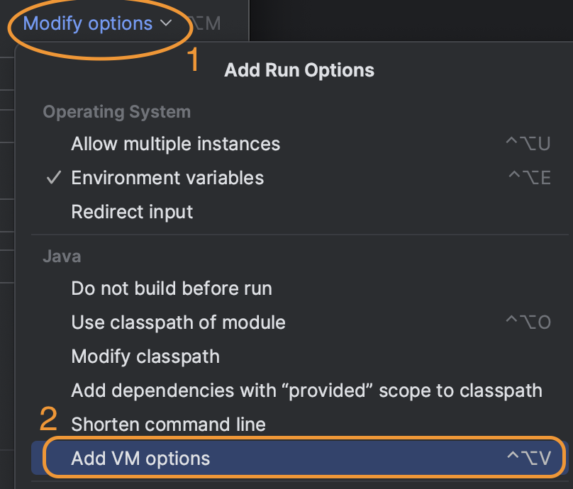

# Lab 8

## Objectives

* Run SQL queries using SparkSQL and work with more complex schema.
* Understand the performance gains of working with Parquet files.
* Run analytic queries on Parquet files.

## Prerequisites
* Setup the development environment as explained in [Lab 6](../Lab6/CS167-Lab6.md).
* Download the following sample file [Tweets_100k.json.bz2](https://drive.google.com/open?id=1Cn_E45y0kVXZZRlb7BE9n6F7pwhrcPvZ) and [Tweets_1m.json.bz2](https://drive.google.com/file/d/10yx3_8U-GEF3BzcwejxGlMse0_olnN7o/view?usp=drive_link) for experimental study. 

## Note
The instruction of Lab8 is based on `Scala`, but you are allowed to use Java if you prefer.
Templates for `Java` locate at the end of this page.
Whenever you implement an item, you can remove the word `TODO` but leave the comments to mamke it easier to refer to each part of the code.

## Lab Work

### I. Project Setup (10 minutes) - In Home
This part will be done in your `local laptop`.

1. Setup a new Scala project similar to [Lab 6](../Lab6/CS167-Lab6.md). You can use the following command:
  ```shell
  mvn archetype:generate "-DarchetypeGroupId=net.alchim31.maven" "-DarchetypeArtifactId=scala-archetype-simple" "-DgroupId=edu.ucr.cs.cs167.[UCRNetID]" "-DartifactId=[UCRNetID]_lab8" -B
  ```

2. Modify your `pom.xml` by replacing the `properties` and `dependencies` with the following contents:

```xml
  <properties>
    <spark.version>3.5.0</spark.version>
    <scala.compat.version>2.12</scala.compat.version>
    <maven.compiler.source>1.8</maven.compiler.source>
    <maven.compiler.target>1.8</maven.compiler.target>   
    <encoding>UTF-8</encoding>
    <scala.version>2.12.18</scala.version>
    <spec2.version>4.20.5</spec2.version>
  </properties>
 <dependencies>
   <dependency>
       <groupId>org.apache.spark</groupId>
       <artifactId>spark-core_${scala.compat.version}</artifactId>
       <version>${spark.version}</version>
       <scope>compile</scope>
     </dependency>
     <dependency>
      <groupId>org.apache.spark</groupId>
      <artifactId>spark-sql_${scala.compat.version}</artifactId>
      <version>${spark.version}</version>
    </dependency>
   <!-- new dependency for lab 8, required for code to run in IntelliJ -->
   <dependency>
     <groupId>com.fasterxml.jackson.core</groupId>
     <artifactId>jackson-core</artifactId>
     <version>2.16.1</version>
   </dependency>
    <dependency>
      <groupId>org.scala-lang</groupId>
      <artifactId>scala-library</artifactId>
      <version>${scala.version}</version>
    </dependency>
    <!-- Test -->
    <dependency>
      <groupId>junit</groupId>
      <artifactId>junit</artifactId>
      <version>4.12</version>
      <scope>test</scope>
    </dependency>
    <dependency>
      <groupId>org.scalatest</groupId>
      <artifactId>scalatest_${scala.compat.version}</artifactId>
      <version>3.0.8</version>
      <scope>test</scope>
    </dependency>
    <dependency>
      <groupId>org.specs2</groupId>
      <artifactId>specs2-core_${scala.compat.version}</artifactId>
      <version>${spec2.version}</version>
      <scope>test</scope>
    </dependency>
    <dependency>
      <groupId>org.specs2</groupId>
      <artifactId>specs2-junit_${scala.compat.version}</artifactId>
      <version>${spec2.version}</version>
      <scope>test</scope>
    </dependency>
  </dependencies>

```

### II. Initialize Spark Session (10 minutes) - In Home
This part will be done in your `local laptop`.

In this Lab, you will accomplish two tasks: `Preprocess Tweets Dataset` and `Analyze Tweets Dataset`. For each of the them, you will write a `scala object class` to handle the corresponding task. Before starting this part, make sure you have downloaded [Tweets_1m.json.bz2](https://drive.google.com/file/d/10yx3_8U-GEF3BzcwejxGlMse0_olnN7o/view?usp=drive_link), and decompress it in your Lab 8 directory.  

1. Create a new scala object class file named `PreprocessTweets.scala` (you can refer to [Lab6](../Lab6/CS167-Lab6.md)) with the following code:

    ```scala
    package edu.ucr.cs.cs167.[UCRNetID] // Do not miss this line

    import org.apache.spark.SparkConf
    import org.apache.spark.sql.SparkSession
    import org.apache.spark.sql.catalyst.expressions.GenericRowWithSchema
    import org.apache.spark.sql.expressions.UserDefinedFunction
    import org.apache.spark.sql.functions.udf

    import scala.collection.mutable


    object PreprocessTweets {
      def main(args: Array[String]): Unit = {
        val inputfile: String = args(0) //  input file name
        val outputfile: String = "tweets" //  output file name

        val getHashtagTexts: UserDefinedFunction = udf((x: mutable.WrappedArray[GenericRowWithSchema]) => {
          x match {
            case x: mutable.WrappedArray[GenericRowWithSchema] => x.map(_.getAs[String]("text"))
            case _ => null
          }
        })

        val conf = new SparkConf
        if (!conf.contains("spark.master"))
          conf.setMaster("local[*]")
        println(s"Using Spark master '${conf.get("spark.master")}'")

        val spark = SparkSession
          .builder()
          .appName("CS167 Lab8 - Preprocessor")
          .config(conf)
          .getOrCreate()
        spark.udf.register("getHashtagTexts", getHashtagTexts)

        try {
          import spark.implicits._
          // TODO: A.1 read file and print schema

          // TODO: A.2 use SQL to select relevant columns
          //           A.2.1 createOrReplaceTempView
          //           A.2.2 use Spark SQL select query
          //           A.2.3 print schema of new dataframe

          // TODO: A.3 apply functions to some columns, by modifying the previous SQL command as follows:
          //           A.3.1 drop some nested columns from `place`
          //           A.3.2 drop some nested columns `user`
          //           A.3.3 transform `timestamp` to the appropriate datatype
          //           A.3.4 simplify the structure of the `hashtags` column
          //           A.3.5 print schema of new dataframe

          // TODO: A.5 show the dataframe
          // TODO: A.6 save the dataframe in JSON format
          // TODO: A.7 save the file in Parquet format
          // TODO: A.8 save the file in CSV format
        } finally {
          spark.stop
        }
      }
    }
    ```

2. Similarly, create a new scala object class file named `AnalyzeTweets.scala` with the following code:
    ```scala
    package edu.ucr.cs.cs167.[UCRNetID] // Do not miss this line

    import org.apache.spark.SparkConf
    import org.apache.spark.sql.expressions.UserDefinedFunction
    import org.apache.spark.sql.functions.{explode, udf}
    import org.apache.spark.sql.{DataFrame, SparkSession}

    import scala.collection.mutable

    object AnalyzeTweets {

      def main(args: Array[String]) {
        val operation: String = args(0) //  command to be run
        val inputfile: String = args(1) //  input file name

        val conf = new SparkConf
        if (!conf.contains("spark.master"))
          conf.setMaster("local[*]")

        println(s"Using Spark master '${conf.get("spark.master")}'")

        val spark = SparkSession
          .builder()
          .appName("CS167 Lab8 - SQL")
          .config(conf)
          .getOrCreate()

        val getTopLangs : UserDefinedFunction = udf((x: mutable.WrappedArray[String]) => {
          val orderedLangCount = x.groupBy(identity).map { case (x, y) => x -> y.size }.toArray.sortBy(-1 * _._2)
          orderedLangCount.take(5.min(orderedLangCount.length))
        })
        spark.udf.register("getTopLangs", getTopLangs)

        if (!(inputfile.endsWith(".json") || inputfile.endsWith(".parquet"))) {
          Console.err.println(s"Unexpected input format. Expected file name to end with either '.json' or '.parquet'.")
        }
        var df : DataFrame = if (inputfile.endsWith(".json")) {
          spark.read.json(inputfile)
        } else {
          spark.read.parquet(inputfile)
        }
        df.createOrReplaceTempView("tweets")

        try {
          import spark.implicits._
          var valid_operation = true
          val t1 = System.nanoTime
          operation match {
            case "top-country" =>
              // TODO: B.1 print out the top 5 countries by count
              df = spark.sql("SELECT <YOUR_SELECTED_COLUMNS> FROM tweets GROUP BY <YOUR_GROUP_BY_COLUMN> ORDER BY <YOUR_ORDER_COLUMN> DESC LIMIT 5")
              df.show()
            case "top-lang" =>
              // TODO: B.2 print out the top 5 languages by count
              df = spark.sql("SELECT <YOUR_SELECTED_COLUMNS> FROM tweets GROUP BY <YOUR_GROUP_BY_COLUMN> ORDER BY <YOUR_ORDER_COLUMN> LIMIT 5")
              df.show()
            case "top-country-with-lang" =>
              // TODO: B.3 print out the top 5 countries by count, and the top five languages in each of them by percentage

              // TODO: B.3.1 start by copying the same query from part B.1, but add `, getTopLangs(collect_list(lang))` before the `FROM` keyword.
              df = spark.sql(s"SELECT ..., getTopLangs(collect_list(lang)) AS top_langs FROM tweets ... LIMIT 5")

              println("Schema after step B.3.1:")
              df.printSchema()

              // TODO B.3.2 Use the `explode` function on the `top_lang` column

              println("\nSchema after step B.3.2:")
              df.printSchema()
              // Create a view for the new dataframe
              df.createOrReplaceTempView("tweets")

              // TODO B.3.3 update this command to get the table in the expected output
              df = spark.sql(s"SELECT <YOUR_SELECTED_COLUMNS> FROM tweets ORDER BY <YOUR_ORDER_COLUMNS>")

              println("\nSchema after step B.3.3:")
              df.printSchema()
              df.show(25)
            case "corr" =>
              // TODO: B.4 compute the correlation between the `user_followers_count` and `retweet_count`
            case "top-hashtags" =>
              // TODO: B.5 Get the hashtags with the most tweets 
              // B.5.1 explode the hashtags columns
              // B.5.2 create a view for the new dataframe
              // B.5.3 use a sql query to get the top 10 hashtags with the most tweets.
              // B.5.4 show the final result
            case _ => valid_operation = false
          }
          val t2 = System.nanoTime
          if (valid_operation)
            println(s"Operation $operation on file '$inputfile' finished in ${(t2 - t1) * 1E-9} seconds")
          else
            Console.err.println(s"Invalid operation '$operation'")
        } finally {
          spark.stop
        }
      }
    }
    ``` 

### III. Data Pre-processing (20 minutes) - In Home

This part will be done on your `local laptop`.


In this part, you will complete the implementation of the `PreprocessTweets.scala` class. It takes an `original json file` as input, and produces a `cleaned` version in both `json` and `parquet` formats. 
In this part, all codes snips are provided, and you just need to follow the instructions to fill corresponding `TODO` parts. You can take some time to understand the logic and answer the questions.

Download and decompress [Tweets_100k.json.bz2](https://drive.google.com/open?id=1Cn_E45y0kVXZZRlb7BE9n6F7pwhrcPvZ) to your lab8 project folder.
To run your code in `IntelliJ IDEA`, remember to add `VM Options` (you can refer to [here](#common-issues)).
Also, in this part, run `PreprocessTweets.scala` with input parameter: `Tweets_100k.json` 

<!-- To run this file, you can use the following command after you create a JAR file for your project:
```bash
spark-submit --master "local[*]" --class edu.ucr.cs.cs167.[UCRNetID].PreprocessTweets ./target/[UCRNetID]_lab7-1.0-SNAPSHOT.jar ./Tweets_1m.json
``` -->
1. First, use the following code to read the input data file in JSON format, and print its schema(`TODO A.1`):
    ```scala
    var df = spark.read.json(inputfile)
    df.printSchema()
    ```

    Did you notice how large the schema of this data is? Take some time to explore this schema, and think about its nesting levels.

* ***Q1: What is the nesting level of this column `root.entities.hashtags.element.text`?***
Note: You may consider `root` to be at nesting level 0, and `element` represents an element in an array and doesn't add to the nesting levels.

* ***Q2: In Parquet, would this field be stored as a repeated column? Explain your answer.***

2. You may notice that some colums are not useful for performing analysis. Let's now select a smaller subset of these columns which are interesting:
    ```text
    `id`, `text`, `retweet_count`, `reply_count`, `lang`, `place`, `user`, `timestamp_ms`, `entities.hashtags`
    ```
    We can use a SQL query to select these columns. To do so, first create a view (so that we can apply SQL queries on top of the view) (`TODO A.2.1`):
    ```scala
    df.createOrReplaceTempView("tweets")
    ```

    Now, use the following SQL query to select those interesting columns (`TODO A.2.2`):

    ```scala
    df = spark.sql(
            """SELECT
          id,
          text,
          place,
          user,
          timestamp_ms AS time,
          entities.hashtags AS hashtags,
          lang
          FROM tweets""")
    ```

    Finally, print the schema of the updated dataframe (`TODO A.2.3`):
    ```scala
    df.printSchema()
    ```

    The schema is now much smaller than the original one.

* ***Q3: Based on this schema answer the following questions:***
  - *How many fields does the `place` column contain?*
  - *How many fields does the `user` column contain?*
  - *What is the datatype of the `time` column?*
  - *What is the datatype of the `hashtags` column?*

3. Then, we will apply some transformations to these columns. Keep the SQL query in `A.2`, copy it to `A.3` and apply the following modifications:

    For `TODO A.3.[1-4]`, you can use the previous SQL query and replace these lines:

      ```SQL
      place,
      user,
      timestamp_ms,
      entities.hashtags AS hashtags,
      ```

    With the following lines:

      ```SQL
      (place.country_code AS country_code, place.name AS name, place.place_type AS place_type) AS place,
      (user.followers_count AS followers_count, user.statuses_count AS statuses_count, user.id AS id) AS user,
      timestamp(cast(timestamp_ms as long) / 1000) AS time,
      getHashtagTexts(entities.hashtags) AS hashtags,
      ```

    This first two lines will select only the nested columns that we want from the `place` and `user`, respectively. 
    The third line converts the `timestamp_ms` column. 
    The last line extracts only the `hashtag text` from the hashtags structure. 
    We are using a custom function to do this transformation, you can check function `In the previous SQL query` for details.

4. Now, print the schema of this dataframe (`TODO A.3.5`).

* ***Q4: Based on this new schema answer the following:***
  - *How many fields does the `place` column contain?*
  - *How many fields does the `user` column contain?*
  - *What is the datatype of the `time` column?*
  - *What is the datatype of the `hashtags` column?*

5. You can use the following to see a sample of rows (`TODO A.5`):
    ```scala
    df.show()
    ```

6. After performing the transformations, we are ready to save this dataframe in both `json` and `parquet` formats (`TODO A.6` and `TODO A.7`).

    ```scala
    df.write.mode("overwrite").json(outputfile + ".json")
    df.write.mode("overwrite").parquet(outputfile + ".parquet")
    ```
    These two commands will create `two folders`, one for `json` and the other for `parquet`.

* ***Q5: What is the size of each folder? Explain the difference in size, knowing that the two folders `tweets.json` and `tweets.parquet` contain the exact same dataframe?***

7. Now, try to save the dataframe in `CSV` format using the following code (`TODO A.8`):
    ```scala
    df.write.mode("overwrite").csv(outputfile + ".csv")
    ```
    You will see an error when running this code.

* ***Q6: What is the error that you see? Why isn't Spark able to write this dataframe in the CSV format?***

8. Finally, **comment that last line** (save to `csv` file) to avoid the error.
  This is the end of this part. Now, we have three different input files: `Tweets_100k.json` (original input), `tweets.json` (cleaned json folder) and `tweets.parquet` (cleaned column format). We will use all three in the next section to compare their performances.

### III. Analyzing Data (40 minutes) - In Lab
This part will be done in your `local laptop`.

In this part, you will work on completing `AnalyzeTweets.scala` class. You will implement different SQL queries to support different analytical tasks.
There are two input parameters: 
- *Task-Name* (`top-country`, `top-lang`, `top-country-with-lang`, `corr`, and `top-hashtags`)
- *Input-Path*

Remember to add `VM Options` (refer to [here](#common-issues)) and put corresponding parameters when you run `AnalyzeTweets.scala` in `IntelliJ IDEA`. 

#### B.1. Print the top 5 countries by number of tweets

1. Run a SQL query on the tweets table, that first groups by the country_code and counts the rows for each country.
You may use the following SQL template:
    ```Scala
    df = spark.sql("""
      SELECT <YOUR_SELECTED_COLUMNS> FROM tweets GROUP BY <YOUR_GROUP_BY_COLUMN> ORDER BY <YOUR_ORDER_COLUMN> DESC LIMIT 5")
    ```
    *Note*: Replace <YOUR_SELECTED_COLUMNS>, <YOUR_GROUP_BY_COLUMN>, and <YOUR_ORDER_COLUMN> based on the description.

2. Run you code in `IntellJ IDEA` for task `top-country` with the three input files (original json, cleaned json, and parquet).
<!-- 2. Compile your code using `mvn package` and then run the following commands:
```bash
spark-submit --master "local[*]" --class edu.ucr.cs.cs167.[UCRNetID].AnalyzeTweets ./target/[UCRNetID]_lab7-1.0-SNAPSHOT.jar top-country ./Tweets_1m.json
spark-submit --master "local[*]" --class edu.ucr.cs.cs167.[UCRNetID].AnalyzeTweets ./target/[UCRNetID]_lab7-1.0-SNAPSHOT.jar top-country ./tweets.json
spark-submit --master "local[*]" --class edu.ucr.cs.cs167.[UCRNetID].AnalyzeTweets ./target/[UCRNetID]_lab7-1.0-SNAPSHOT.jar top-country ./tweets.parquet
``` -->

* ***Q7.1: What do you see in the output? Copy the output w.r.t. three input files here.***
*Note*: to get the score for this question both your output must be correct and your implementation must also be correct.

* ***Q7.2: What do you observe in terms of running time for each file? Which file is slowest and which is the fastest? Explain your observation?.***


#### B.2. Print the top 5 languages by number of tweets
<!-- 
1. Run a SQL query on the tweets table, that first groups by the `lang` and counts the rows for each language. Simply modify `<YOUR_SELECTED_COLUMNS>`, `<YOUR_GROUP_BY_COLUMN>`,  and `<YOUR_ORDER_COLUMN>` with the appropriate values, and make sure that the final result is in descending order.
    ```bash
    spark-submit --master "local[*]" --class edu.ucr.cs.cs167.[UCRNetID].AnalyzeTweets ./target/[UCRNetID]_lab7-1.0-SNAPSHOT.jar top-lang ./Tweets_1m.json
    spark-submit --master "local[*]" --class edu.ucr.cs.cs167.[UCRNetID].AnalyzeTweets ./target/[UCRNetID]_lab7-1.0-SNAPSHOT.jar top-lang ./tweets.json
    spark-submit --master "local[*]" --class edu.ucr.cs.cs167.[UCRNetID].AnalyzeTweets ./target/[UCRNetID]_lab7-1.0-SNAPSHOT.jar top-lang ./tweets.parquet
    ``` -->
1. Similar to the previous task, write a SQL query which return the top 5 `lang` and count the number of rows for each language. Run your code for all three input files.  
  *Note*: Remember to run your code with `top-lang` parameter. 

* ***Q8.1: What are the top languages that you see? Copy the output here.***
Note: to get the score for this question both your output must be correct and your implementation must also be correct.

* ***Q8.2: Do you observe the same perfroamnce for the different file formats?***


#### B.3. Print the top 5 countries, and the percentage of tweets posted in their top languages.

In this task, you need to output the top-5 countries by number of tweets, and also calculate top-5 language percentages for each country.
E.g., consider the following output:

  ```text
  +-------+------+----+--------------------+
  |country| count|lang|        lang_percent|
  +-------+------+----+--------------------+
  |     US|123456|  en|                0.99|
  |     US|123456|  ja|                0.01|
  +-------+------+----+--------------------+
  ```
It means that in all tweets posted in the US, 99% of them are in English and 1% are in Japanese.
<!-- For this operation, we want to run a little more complex query. You will also use this command for this operation:

```bash
spark-submit --master "local[*]" --class edu.ucr.cs.cs167.[UCRNetID].AnalyzeTweets ./target/[UCRNetID]_lab7-1.0-SNAPSHOT.jar top-country-with-lang ./Tweets_1m.json
spark-submit --master "local[*]" --class edu.ucr.cs.cs167.[UCRNetID].AnalyzeTweets ./target/[UCRNetID]_lab7-1.0-SNAPSHOT.jar top-country-with-lang ./tweets.json
spark-submit --master "local[*]" --class edu.ucr.cs.cs167.[UCRNetID].AnalyzeTweets ./target/[UCRNetID]_lab7-1.0-SNAPSHOT.jar top-country-with-lang ./tweets.parquet
``` -->


1. `TODO B.3.1`: To begin with, copy the same query from part B.1, but add `, getTopLangs(collect_list(lang))` before the `FROM` keyword. We made this custom function to make it easier to get the expected output. It collects the language code for all records for a country and converts to an array with (language, count) pair.

2. `TODO B.2.2`: Use the `explode` function on the `top_langs` column by using the following code:
    ```scala
    df = df.withColumn("top_langs", explode($"top_langs"))
    ```

* ***Q9: After step B.3.2, how did the schema change? What was the effect of the `explode` function?***


3. `TODO B.3.3`: Take some time to understand the return result of `getTopLangs()` function. Now, you need to use `top_langs` to calculate the percentage for each language. You can use the following template:
    ```scala
    df = spark.sql(s"SELECT <YOUR_SELECTED_COLUMNS> FROM tweets ORDER BY <YOUR_ORDER_COLUMNS>")
    ```
    *Note*: You can access the `language` and `language_count` attributes in `top_langs` by using `top_langs._1` and `top_langs._2`.  
    More specifically, you need to divide `language_count` by the total number of tweets to get the percentage, and give it the name `lang_percent`.  
    In addition, you need to sort by two columns: `count` and `lang_percent`, both in descending order.  
    The expected schema after running this query is provided here:
    ```shell
    root
    |-- country: string (nullable = true)
    |-- tweets_count: long (nullable = false)
    |-- lang: string (nullable = true)
    |-- lang_percent: double (nullable = true)
    ```

* ***Q10: For the country with the most tweets, what is the fifth most used language? Also, copy the entire output table here.***


#### B.4. For this part, we want to find if there is any correlation between a user's `statuses_count` and their `follower_count`.

  You can use the following code to compute the correlation:
  ```scala
  println(df.stat.corr("user.statuses_count", "user.followers_count"))
  ```
  Remember to run your code with parameter `corr`.

<!-- You can run it using these commands:
```bash
spark-submit --master "local[*]" --class edu.ucr.cs.cs167.[UCRNetID].AnalyzeTweets ./target/[UCRNetID]_lab7-1.0-SNAPSHOT.jar corr ./Tweets_1m.json
spark-submit --master "local[*]" --class edu.ucr.cs.cs167.[UCRNetID].AnalyzeTweets ./target/[UCRNetID]_lab7-1.0-SNAPSHOT.jar corr ./tweets.json
spark-submit --master "local[*]" --class edu.ucr.cs.cs167.[UCRNetID].AnalyzeTweets ./target/[UCRNetID]_lab7-1.0-SNAPSHOT.jar corr ./tweets.parquet
``` -->

* ***Q11: Does the observed statistical value show a strong correlation between the two columns? Note: a value close to 1 or -1 means there is high correlation, but a value that is close to 0 means there is no correlation.***


#### B.5. Print top 10 hashtags by tweet count

In this part, we want to know the most used hashtags (tweets trend) in our dataset.

<!-- You can run this operation using these commands:
```bash
spark-submit --master "local[*]" --class edu.ucr.cs.cs167.[UCRNetID].AnalyzeTweets ./target/[UCRNetID]_lab7-1.0-SNAPSHOT.jar top-hashtags ./tweets.json
spark-submit --master "local[*]" --class edu.ucr.cs.cs167.[UCRNetID].AnalyzeTweets ./target/[UCRNetID]_lab7-1.0-SNAPSHOT.jar top-hashtags ./tweets.parquet
``` -->

1. `TODO B.5.1`: You need to explode the hashtags columns, similar to how you did in part B.3.2.

2. `TODO B.5.2`: Then, you'll need to create a new view for this new dataframe.

3. `TODO B.5.3`: Apply a SQL query on the new dataframe to get the top 10 hashtags with the most tweets.

4. Run your code with parameter `top-hashtags`.

* ***Q12.1: What are the top 10 hashtags? Copy and paste your output here.***  
*Note*: to get the score for this question both your output must be correct and your implementation must also be correct.

* ***Q12.2: For this operation, do you observe difference in performance when comparing the two different input files `tweets.json` and `tweets.parquet`? Explain the reason behind the difference.***

### IV. Test on Spark Cluster (60 minutes) - In Lab Group Activity

This part will be done on your `cs167 server`. 

1. Download and upload the large tweets file [Tweets_1m.json.bz2](https://drive.google.com/file/d/10yx3_8U-GEF3BzcwejxGlMse0_olnN7o/view?usp=drive_link) to your `cs167 server`. Then, use the following command to decompress it:
    ```shell
    bunzip2 Tweets_1m.json.bz2
    ```
    *Note*: the decompressed file is about `3GB` large. Remember to upload the orginial `.bz2` file and decompress it on the server.

2. Make sure your cluster are working by the following steps:
    - Start HDFS NameNode and DataNode (refer to [Lab3](../Lab3/CS167-Lab3.md) and [Lab4](../Lab4/CS167-Lab4.md))
    - Start Spark Master and Worker (refer to [Lab5](../Lab5/CS167-Lab5.md))
    - Check your spark cluster web UI
`
3. Put the large tweets file to HDFS:
    ```shell
    hdfs dfs -put Tweets_1m.json
    ```

4. Compile your Lab8 project, and upload your `jar` file to your `cs167 server`.  
  *Note*: every group member need to upload their own `jar` file. 

5. Select one person to run `PreprocessTweets` to generate `tweets.json` and `tweets.parquet`.

* ***Q13. What's the total size of `tweets.json` and `tweets.parquet` in HDFS?*** 

    *Note*: You can use the following command to evaluate the directory size in hdfs:
    ```shell
     hdfs dfs -du -s -h [directory name]
    ```
    You need to consider replication factor for this question since HDFS automatically duplicate your file.

6. For each group member, run `AnalyzeTweets` for `top-country` task on all three input files:
    ```shell
    spark-submit --class edu.ucr.cs.cs167.[UCRNetID].AnalyzeTweets [UCRNetID]_lab8-1.0-SNAPSHOT.jar top-country Tweets_1m.json 

    spark-submit --class edu.ucr.cs.cs167.[UCRNetID].AnalyzeTweets [UCRNetID]_lab8-1.0-SNAPSHOT.jar top-country tweets.json

    spark-submit --class edu.ucr.cs.cs167.[UCRNetID].AnalyzeTweets [UCRNetID]_lab8-1.0-SNAPSHOT.jar top-country tweets.parquet
    ```
* ***Q14. Copy the output to this question. Which one runs faster? Explain why.***

* ***Q15. Do you see clear gap of running time? Explain your answer based on your results.***

7. For each group member run `AnalyzeTweets` for the following tasks:

    | Command               | Tweets_1m.json | tweets.json | tweets.parquet  |
    |-----------------------|----------------|-------------|-----------------|
    | top-country           |                |             |                 |
    | top-lang              |                |             |                 |
    | top-country-with-lang |                |             |                 |
    | corr                  |                |             |                 |
    | top-hashtags          |       N/A      |             |                 |

* ***Q16. Fill-in the table with the running of your code in your spark cluster.*** 

* ***Q17. Does parquet provided you with the lowest running time for all tasks on 1M Tweets dataset? Explain why based on your results.***

    

### V. Submission (10 minutes)
1. Add a `README` file with all your answers.
2. Add a `run.sh` script that compiles your code and then runs the following set of operations in order.
* Run the preprocessor on the `Tweets_1m.json` file.
* Run the `top-country` operation on the three files.
* Run the `top-lang` operation on the three files.
* Run the `top-country-with-lang` operation on the three files.
* Run the `corr` operation on the three files.
* Run the `top-hashtags` operation on the two files: `tweets.json` and `tweets.parquet`.

## Rubric

Q1-12: +12 points (+1 point for each question; a point is counted only if the corresponding part is correctly implemented)

Code compiles correctly: +1 point

Full table of run-time by input format: +1 point

Following submission instructions: +1 point

## Java templates
If you prefer to use Java, you can find the following templates helpful.

###  PreprocessTweets.java

```java
package edu.ucr.cs.cs167.[UCRNetID];

import org.apache.spark.SparkConf;
import org.apache.spark.sql.*;
import org.apache.spark.sql.functions;
import org.apache.spark.sql.types.DataTypes;

import org.apache.spark.sql.api.java.UDF1;

import java.util.ArrayList;
import java.util.List;

public class PreprocessTweets {
  public static void main(String[] args) {
    String inputfile = args[0];
    String outputfile = "tweets";

    SparkConf conf = new SparkConf();
    if (!conf.contains("spark.master")) {
      conf.setMaster("local[*]");
    }
    System.out.println("Using Spark master '" + conf.get("spark.master") + "'");

    SparkSession spark = SparkSession.builder()
        .appName("CS167 Lab8 - Preprocessor")
        .config(conf)
        .getOrCreate();
    spark.udf().register("getHashtagTexts", (UDF1<Object, List<String>>) PreprocessTweets::getHashtagTexts, DataTypes.createArrayType(DataTypes.StringType));

    try {
      // TODO: A.1. read file and print schema
      //          A.1.1 read json file
      //          A.1.2 print dataframe schema

      // TODO: A.2. use SQL to select relevant columns
      //          A.2.1 createOrReplaceTempView
      //          A.2.2 use Spark SQL select query
      //          A.2.3 print schema of new dataframe

      // TODO: A.3. apply functions to some columns
      //           A.3.1 drop some nested columns from `place`
      //           A.3.2 drop some nested columns `user`
      //           A.3.3 transform `timestamp` to the appropriate datatype
      //           A.3.4 simplify the structure of the `hashtags` column
      //           A.3.5 print schema of new dataframe

      // TODO: A.5. show the dataframe
      // TODO: A.6. save the dataframe in JSON format
      // TODO: A.7. save the file in Parquet format
      // TODO: A.8. save the file in CSV format

    } finally {
      spark.stop();
    }
  }

  public static List<String> getHashtagTexts(Object obj) {
    if (obj == null) {
      return null;
    }

    List<String> hashtags = new ArrayList<>();
    try {
      WrappedArray<Row> rows = (WrappedArray<Row>) obj;
      rows.foreach(row -> hashtags.add(row.getAs("text")));
    } catch (ClassCastException e) {
      // Handle the case where obj is not of type List<Row>
      e.printStackTrace();
      return null;
    }
    return hashtags;
  }
}
```

### AnalayzeTweets.java

```java
package edu.ucr.cs.cs167.[UCRNetID];

import org.apache.spark.SparkConf;
import org.apache.spark.sql.*;
import org.apache.spark.sql.api.java.UDF1;
import org.apache.spark.sql.types.DataTypes;

import java.util.ArrayList;
import java.util.List;
import java.util.Map;
import java.util.stream.Collectors;

import static org.apache.spark.sql.functions.col;
import static org.apache.spark.sql.functions.explode;

public class AnalayzeTweets {

  public static void main(String[] args) {
    String operation = args[0];
    String inputfile = args[1];

    SparkConf conf = new SparkConf();
    if (!conf.contains("spark.master"))
      conf.setMaster("local[*]");

    System.out.println("Using Spark master '" + conf.get("spark.master") + "'");

    SparkSession spark = SparkSession
        .builder()
        .appName("CS167 Lab8 - SQL")
        .config(conf)
        .getOrCreate();

    // Register UDF
    spark.udf().register("getTopLangs", (UDF1<Object, List<Tuple2<String, Integer>>>) AnalayzeTweets2::getTopLangs, DataTypes.createArrayType(DataTypes.createStructType(new org.apache.spark.sql.types.StructField[]{
        DataTypes.createStructField("_1", DataTypes.StringType, false),
        DataTypes.createStructField("_2", DataTypes.IntegerType, false)
    })));

    DataFrameReader reader = spark.read();
    Dataset<Row> df;
    if (inputfile.endsWith(".json")) {
      df = reader.json(inputfile);
    } else if (inputfile.endsWith(".parquet")) {
      df = reader.parquet(inputfile);
    } else {
      System.err.println("Unexpected input format. Expected file name to end with either '.json' or '.parquet'.");
      return;
    }
    df.createOrReplaceTempView("tweets");

    try {
      boolean valid_operation = true;
      long t1 = System.nanoTime();
      switch (operation) {
        case "top-country":
          // TODO: B.1. print out the top 5 countries by count
          df = spark.sql("SELECT <YOUR_SELECTED_COLUMNS> FROM tweets GROUP BY <YOUR_GROUP_BY_COLUMN> ORDER BY <YOUR_ORDER_COLUMN> DESC LIMIT 5");
          df.show();
          break;
        case "top-lang":
          // TODO: B.2. print out the top 5 languages by count
          df = spark.sql("SELECT <YOUR_SELECTED_COLUMNS> FROM tweets GROUP BY <YOUR_GROUP_BY_COLUMN> ORDER BY <YOUR_ORDER_COLUMN> LIMIT 5");
          df.show();
          break;
        case "top-country-with-lang":
          // TODO: B.3. print out the top 5 countries by count, and the top five languages in each of them by percentage

          // TODO: B.3.1. start by copying the same query from part B.1, but add `, getTopLangs(collect_list(lang))` before the `FROM` keyword.
          df = spark.sql("SELECT ..., getTopLangs(collect_list(lang)) AS top_langs FROM tweets ... LIMIT 5");

          System.out.println("Schema after step B.3.1:");
          df.printSchema();
          
          // TODO B.3.2. Use the `explode` function on the `top_lang` column
          System.out.println("\nSchema after step B.3.2:");
          df.printSchema();
          // Create a view for the new dataframe
          df.createOrReplaceTempView("tweets");

          // TODO B.3.3. update this command to get the table in the expected output
          df = spark.sql("SELECT <YOUR_SELECTED_COLUMNS> FROM tweets ORDER BY <YOUR_ORDER_COLUMNS>");
          System.out.println("\nSchema after step B.3.3:");
          df.printSchema();
          df.show(25);
          break;
        case "corr":
          // TODO: B.4. compute the correlation between the `user_followers_count` and `retweet_count`
          break;
        case "top-hashtags":
          // TODO: B.5. Get the hashtags with the most tweets 
          // B.5.1. explode the hashtags columns
          // B.5.2. create a view for the new dataframe
          // B.5.3. use a sql query to get the top 10 hashtags with the most tweets.
          // B.5.4. show the final result
          break;
        default:
          valid_operation = false;
      }
      long t2 = System.nanoTime();
      if (valid_operation)
        System.out.println("Operation " + operation + " on file '" + inputfile + "' finished in " + (t2 - t1) * 1E-9 + " seconds");
      else
        System.err.println("Invalid operation '" + operation + "'");
    } finally {
      spark.stop();
    }
  }

   public static List<Tuple2<String, Integer>> getTopLangs(Object obj) {
    if (obj == null) {
      return null;
    }

    List<Tuple2<String, Integer>> langs = new ArrayList<>();
    try {
      WrappedArray<String> langList = (WrappedArray<String>) obj;

      // Count occurrences of each language
      scala.collection.immutable.Map<String, Integer> langCounts = langList
          .groupBy(s -> s)
          .mapValues(TraversableOnce::size);

      // Sort by count in descending order
      scala.collection.immutable.List<Tuple2<String, Integer>> sortedLangCounts = langCounts.toList();
      sortedLangCounts.sortWith((Tuple2<String, Integer> e1, Tuple2<String, Integer> e2) -> e1._2() < e2._2());

      // Take top 5 languages or all if less than 5
      int limit = Math.min(sortedLangCounts.size(), 5);
      for (int i = 0; i < limit; i++) {
        langs.add(new Tuple2(sortedLangCounts.apply(i)._1(), sortedLangCounts.apply(i)._2()));
      }
    } catch (ClassCastException e) {
      // Handle the case where obj is not of type List<String>
      return null;
    }
    return langs;
  }
}

```

## Common Issues

- *Problem*: When I run my program in IntelliJ, I get the following error:
```Exception in thread "main" java. lang.IllegalAccessError Create breakpoint: class org.apache.spark.torage.StorageUtils$```

- *Solution*: Edit your run configuration and add the following to VM Options:
```text
--add-opens java.base/java.nio=ALL-UNNAMED
--add-opens java.base/java.util=ALL-UNNAMED
--add-opens java.base/java.lang=ALL-UNNAMED
--add-opens java.base/sun.nio.ch=ALL-UNNAMED
--add-opens java.base/java.lang.invoke=ALL-UNNAMED
```

Below is how to add VM options to run configuration.



