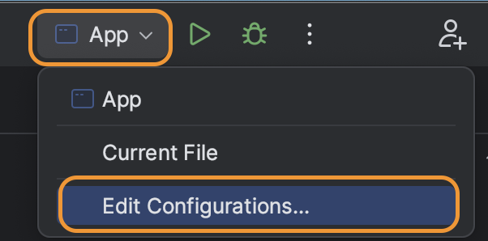
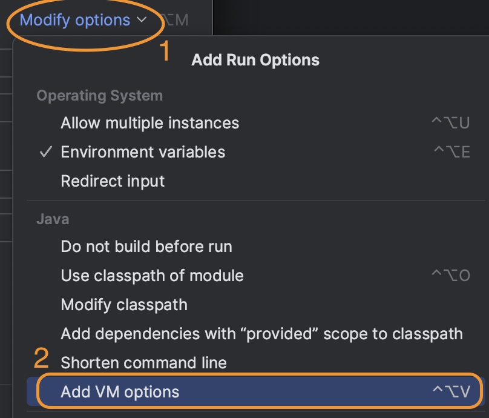

# Lab 9

---

## Objectives

* Run machine learning algorithms on big data using MLlib.
* Try out the different components of MLlib, i.e., transformers, estimators, evaluators, and validators.
* Build a machine learning Pipeline that describes the entire ML model creation process.

---

## Prerequisites

* Download the following file made available by [Kaggle](https://www.kaggle.com), [Sentiment data](sentiment.csv.zip).

---

## Lab Work

### I. Project Setup (20 minutes) (In-home)

In this lab, we will use Scala as a programming language.

1. Follow the project setup part in [Lab 6](../Lab6/CS167-Lab6.md) with the same Spark version.
2. Add the following dependency to your `pom.xml` file.

    ```xml
    <dependency>
        <groupId>org.apache.spark</groupId>
        <artifactId>spark-mllib_${scala.compat.version}</artifactId>
        <version>${spark.version}</version>
    </dependency>
    ```
    Your pom.xml file must include <spark.version>3.5.0</spark.version> in the properties. It must also include `spark-core` and `spark-sql` similar to Lab 6.
---

### II. Load Input (30 minutes) (In-home)

First, we will load the input file that we will use throughout the lab.
The input file name is passed as the first command line argument `args(0)`.

1. Add the following code stub and make sure it compiles.

    ```scala
    import org.apache.spark.SparkConf
    import org.apache.spark.ml.classification.{LinearSVC, LinearSVCModel}
    import org.apache.spark.ml.evaluation.BinaryClassificationEvaluator
    import org.apache.spark.ml.feature.{HashingTF, StringIndexer, Tokenizer}
    import org.apache.spark.ml.param.ParamMap
    import org.apache.spark.ml.tuning.{ParamGridBuilder, TrainValidationSplit, TrainValidationSplitModel}
    import org.apache.spark.ml.{Pipeline, PipelineModel}
    import org.apache.spark.sql.{DataFrame, Dataset, Row, SparkSession}

    object App {

      def main(args : Array[String]) {
        if (args.length != 1) {
          println("Usage <input file>")
          println("  - <input file> path to a CSV file input")
          sys.exit(0)
        }
        val inputfile = args(0)
        val conf = new SparkConf
        if (!conf.contains("spark.master"))
          conf.setMaster("local[*]")
        println(s"Using Spark master '${conf.get("spark.master")}'")

        val spark = SparkSession
          .builder()
          .appName("CS167 Lab9")
          .config(conf)
          .getOrCreate()

        val t1 = System.nanoTime
        try {
          // process the sentiment data
          // TDOO A: read CSV file as a DataFrame
          val sentimentData: DataFrame = // ...

          // TODO B: tokenize text (sentences) to array of words
          val tokenzier = // ...

          // TODO C: transform words to numeric features using HashingTF
          val hashingTF = // ...

          // TODO D: transform labels to numbers
          val stringIndexer = // ...

          // TODO E: create an object for the Linear Support Vector Machine classifier
          val svc = // ...

          // TODO F: create a pipeline that includes all the previous transofrmaitons and the model
          val pipeline = // ...

          // TODO G: create a parameter grid to corss validate the model on different hyper parameters
          val paramGrid: Array[ParamMap] = new ParamGridBuilder()
            .addGrid(/* ... */)
            .addGrid(/* ... */)
            .build()

          // TDOO H: create a corss validation job that will process the pipeline using all possible combinations in the parameter grid

          // TODO I: split the data into 80% train and 20% test

          // TODO J: Run cross-validation, and choose the best set of parameters.

          // TODO K: get the parameters of the best model and print them

          // TODO L: apply the model to your test set and show sample of the result

          // TODO M: evaluate the test results

          val t2 = System.nanoTime
          println(s"Applied sentiment analysis algorithm on input $inputfile in ${(t2 - t1) * 1E-9} seconds")
        } finally {
          spark.stop
        }
      }
    }
    ```

2. Decompress the file you downloaded, and open the file `sentiment.csv` in a text editor and go through it to see some examples of the data. For your reference, the first few lines are included below.

    |                text|sentiment|
    |--------------------|---------|
    |My daughter liked it but I was aghast, that a character in this movie smokes. ...|      neg|
    |I... No words. No words can describe this. I will try for the sake of those  ... |      neg|
    |this film is basically a poor take on the old urban legend of the babysitter ... |      neg|
    |This is a terrible movie, and I'm not even sure why it's so terrible. It's ugly, ...|   neg|
    |First of all this movie is a piece of reality very well realized artistically. ...|     pos|

3. (`TODO A`) Load the file input file `sentiment.csv` as a CSV file using the following options.

    | option     | value    |
    | ---------- | -------- |
    | `"header"` | `"true"` |
    | `"quote"`  | `"\""`   |
    | `"escape"` | `"\""`   |

    Code

    ```scala
    ...
      .option("header", "true")
      .option("quote", "\"")
      .option("escape", "\"")
    ...
    ```

    Hint: See [Lab 6](../Lab6/CS167-Lab6.md#iv-query-the-dataframe-using-dataframe-operators-45-minutes)

    Print the schema and the first few lines to double-check that the file was loaded correctly. It should look like the following.

    ```text
    root
    |-- text: string (nullable = true)
    |-- sentiment: string (nullable = true)

    +--------------------+---------+
    |                text|sentiment|
    +--------------------+---------+
    |My daughter liked...|      neg|
    |I... No words. No...|      neg|
    |this film is basi...|      neg|
    |This is a terribl...|      neg|
    |First of all this...|      pos|
    +--------------------+---------+
    ```

---

### III. Support Vector Machines model on sentiment data (90 minutes) (In-Lab)

In this part, we will build a model that estimates the sentiment (positive/negative) of textual data based on labeled data. To activate this part of the code, set the command line arguments to: `sentiment.csv`

1. We will build a pipeline that consists of three transformations and one estimator described below.
2. (`TODO B`) First, we use a [`Tokenizer`](http://spark.apache.org/docs/latest/ml-features.html#tokenizer), which splits the text into words, and configure it as below.

    | method | parameter |
    | - | - |
    | [`setInputCol`](https://spark.apache.org/docs/latest/api/scala/org/apache/spark/ml/feature/Tokenizer.html#setInputCol(value:String):T) | `"text"` |
    | [`setOutputCol`](https://spark.apache.org/docs/latest/api/scala/org/apache/spark/ml/feature/Tokenizer.html#setOutputCol(value:String):T) | `"words"` |

3. (`TODO C`) Second, we use a [`HashingTF`](http://spark.apache.org/docs/latest/ml-features.html#tf-idf), which maps the words in each review to a vector of TF-IDF, and configure it as below.

    | method | parameter |
    | - | - |
    | [`setInputCol`](https://spark.apache.org/docs/latest/api/scala/org/apache/spark/ml/feature/HashingTF#setInputCol(value:String):HashingTF.this.type) | `"words"` |
    | [`setOutputCol`](https://spark.apache.org/docs/latest/api/scala/org/apache/spark/ml/feature/HashingTF#setOutputCol(value:String):HashingTF.this.type) | `"features"` |

4. (`TODO D`) Third, we use a [`StringIndexer`](http://spark.apache.org/docs/latest/ml-features.html#stringindexer), which maps the two sentiments `pos` and `neg` to integer values, and configure it as below.

    | method | parameter |
    | - | - |
    | [`setInputCol`](https://spark.apache.org/docs/latest/api/scala/org/apache/spark/ml/feature/StringIndexer.html#setInputCol(value:String):StringIndexer.this.type) | `"sentiment"` |
    | [`setOutputCol`](https://spark.apache.org/docs/latest/api/scala/org/apache/spark/ml/feature/StringIndexer.html#setOutputCol(value:String):StringIndexer.this.type) | `"label"` |
    | [`setHandleInvalid`](https://spark.apache.org/docs/latest/api/scala/org/apache/spark/ml/feature/StringIndexer.html#setHandleInvalid(value:String):StringIndexer.this.type) | `"skip"` |

5. (`TODO E`) Fourth, we run the data through a [`LinearSVC`](https://spark.apache.org/docs/latest/ml-classification-regression.html#linear-support-vector-machine) model. The default configuration is fine, we will set the parameters of interest using a parameter grid.

6. (`TODO F`) Create a pipeline that combines the four stages in the above order.
  
    See [`Pipeline.setStages`](https://spark.apache.org/docs/latest/api/scala/org/apache/spark/ml/Pipeline.html#setStages(value:Array[_%3C:org.apache.spark.ml.PipelineStage]):Pipeline.this.type)

9. (`TODO G`) Create a [parameter grid](https://spark.apache.org/docs/latest/api/scala/org/apache/spark/ml/tuning/ParamGridBuilder.html) that tries the following parameters.

    | parameter                     | values                       |
    | ----------------------------- | ---------------------------- |
    | `hashingTF.numFeatures`       | `Array(1024, 2048)`          |
    | `svc.fitIntercept`            | `Array(true,false)`          |
    | `svc.regParam`                | `Array(0.01, 0.0001)`        |
    | `svc.maxIter`                 | `Array(10, 15)`              |
    | `svc.threshold`               | `Array(0, 0.25)`             |
    | `svc.threshold`               | `Array(0.0001, 0.01)`        |


7. (`TODO H`) Working with this dataset will take more time because it is bigger and more complex. To speed up the training process, we will use a [`TrainValidationSplit`](http://spark.apache.org/docs/latest/ml-tuning.html#train-validation-split) validator. We will create and configure it as below:

    ```scala
    val cv = new TrainValidationSplit()
      .setEstimator(pipeline)
      .setEvaluator(new BinaryClassificationEvaluator())
      .setEstimatorParamMaps(paramGrid)
      .setTrainRatio(0.8)
      .setParallelism(2)
    ```

8. (`TODO I`) Split the input data into training and test sets as below.

    ```scala
    val Array(trainingData: Dataset[Row], testData: Dataset[Row]) = sentimentData.randomSplit(Array(0.8, 0.2))
    ```

9. (`TODO J`) Run through the data and get the best model as follows.

    ```scala
    val model: TrainValidationSplitModel = cv.fit(trainingData)
    ```

    Note: If you want to get the parameters used by the best model, run the following code snippet.

    (`TODO K`) Make sure to print those vlaues.
    
    ```scala
    val numFeatures: Int = model.bestModel.asInstanceOf[PipelineModel].stages(1).asInstanceOf[HashingTF].getNumFeatures
    val fitIntercept: Boolean = model.bestModel.asInstanceOf[PipelineModel].stages(3).asInstanceOf[LinearSVCModel].getFitIntercept
    val regParam: Double = model.bestModel.asInstanceOf[PipelineModel].stages(3).asInstanceOf[LinearSVCModel].getRegParam
    val maxIter: Double = model.bestModel.asInstanceOf[PipelineModel].stages(3).asInstanceOf[LinearSVCModel].getMaxIter
    val threshold: Double = model.bestModel.asInstanceOf[PipelineModel].stages(3).asInstanceOf[LinearSVCModel].getThreshold
    val tol: Double = model.bestModel.asInstanceOf[PipelineModel].stages(3).asInstanceOf[LinearSVCModel].getTol
    ```

10. (`TODO L`) Now, apply the the model on the test set and print out a few cases for demonstration.

    ```scala
    val predictions: DataFrame = model.transform(testData)
    predictions.select("text", "sentiment", "label", "prediction").show()
    ```

    The output should look similar to the following:
    
    ```text
    +--------------------+---------+-----+----------+
    |                text|sentiment|label|prediction|
    +--------------------+---------+-----+----------+
    |"200l: A Space Od...|      pos|  0.0|       0.0|
    |"Atoll K" aka "Ut...|      neg|  1.0|       1.0|
    |"Dead Man Walking...|      pos|  0.0|       0.0|
    |"Death Machines" ...|      neg|  1.0|       1.0|
    |"Four Daughters" ...|      pos|  0.0|       1.0|
    |"Goodbye, Mr. Chi...|      pos|  0.0|       0.0|
    |"House of Dracula...|      pos|  0.0|       1.0|
    |"I haven't laughe...|      neg|  1.0|       1.0|
    |"Jaded" offers a ...|      neg|  1.0|       1.0|
    |"Just before dawn...|      pos|  0.0|       0.0|
    |"Problem Child" w...|      neg|  1.0|       1.0|
    |"Quit while your ...|      neg|  1.0|       1.0|
    |"The Next Karate ...|      neg|  1.0|       0.0|
    +--------------------+---------+-----+----------+
    ```

11. (`TODO M`) Let us also calculate the accuracy of the result.

    ```scala
    val binaryClassificationEvaluator = new BinaryClassificationEvaluator()
      .setLabelCol("label")
      .setRawPredictionCol("prediction")

    val accuracy: Double = binaryClassificationEvaluator.evaluate(predictions)
    println(s"Accuracy of the test set is $accuracy")
    ```
    
    ***(Q1) Fill the following table.***
    
    The parameter values and the accuracy are based on the best model you obtained. The run time is the total run time printed by the program.
    
    | Parameter       | Value |
    |-----------------|------------|
    | numFeatures     |            |
    | fitIntercept    |            |
    | regParam        |            |
    | maxIter         |            |
    | threshold       |            |
    | tol             |            |
    | Test accuracy   |            |
    | Run time        |            |
    

---

### IV. Distributed Mode (20 minutes)

In this part, you will run the same pipeline on a cluster with your group.

1. Start a Spark cluster and an HDFS cluster on your CS167 machine similar to how you did in [Lab 05](../Lab5/CS167-Lab5.md#iv-run-in-distributed-mode-30-minutes), electing one master node.

2. Upload your JAR file and the dataset `sentiment.csv` to your CS167 machine, and upload the dataset to HDFS.

3. You can run your program using this command:

```bash
spark-submit --conf spark.default.parallelism=[CORES] --class edu.ucr.cs.cs167.[UCRNetID].App --master spark://[MASTER_NODE_HOSTNAME]:[PORT] [UCRNetID]_lab9-1.0-SNAPSHOT.jar hdfs:///sentiment.csv
```
Make sure to edit the command as defined in the table:

| Value                    | Definition                                                                                                                        |
|--------------------------|-----------------------------------------------------------------------------------------------------------------------------------|
| `[UCRNetID]`             | Your UCR Net ID as you set it in your package name.                                                                               |
| `[CORES]`                | The number of cores in your cluster. Each machine has 4 cores, replace this value with 4 multipled by the number of worker nodes. |
| `[MASTER_NODE_HOSTNAME]` | The name of the master node you elected, e.g. `class-253`                                                                         |
| `[PORT]`                 | The port of the Spark cluster in the master node, which is `7077` if you followed lab 05.                                         |

***(Q2) Fill the following table.***

The parameter values and the accuracy are based on the best model you obtained. The run time is the total run time printed by the program.

| Parameter                                 | Value      |
|-------------------------------------------|------------|
| Number of worker nodes in your cluster    |            |
| Total number of cores in your cluster     |            |
| numFeatures                               |            |
| fitIntercept                              |            |
| regParam                                  |            |
| maxIter                                   |            |
| threshold                                 |            |
| tol                                       |            |
| Test accuracy                             |            |
| Run time                                  |            |

***(Q3) What difference do you notice in terms of the best parameters selected, the accuracy, and the run time between running the program locally and on your Spark cluster having multiple nodes?***


### IV. Submission (10 minutes)

1. Add a `README` file with all your information. Use this [template](CS167-Lab9-README.md).
2. No need to add a run script this time. However, make sure that your code compiles with `mvn clean package` before submission. To double-check, download your submission and compile it again to make sure no files are missing.
3. Similar to all labs, do not include any additional files such as the compiled code, input, or output files.

Submission file format:

```console
<UCRNetID>_lab9.{tar.gz | zip}
  - src/
  - pom.xml
  - README.md
```

Requirements:

* The archive file must be either `.tar.gz` or `.zip` format.
* The archive file name must be all lower case letters. It must be underscore '\_', not hyphen '-'.
* The folder `src` and two files, `pom.xml` and `README.md`, must be the exact names.
* The folder `src` and two filesm `pom.xml` and `README.md`, must be directly in the root of the archive, do not put them inside any folder.
* Do not include any other files/folders, otherwise points will be deducted.

See how to create the archive file for submission at [here](../MakeArchive.md).

---

## Hints

Spark tends to be very chatty on the console. If you would like to reduce the amount of logs written by Spark, create a file named `log4j.properties` under `src/main/resources` and include the following configuration in it.

```properties
# Set root logger level to INFO and its only appender to A1.
log4j.rootLogger=ERROR, A1

# A1 is set to be a ConsoleAppender.
log4j.appender.A1=org.apache.log4j.ConsoleAppender

# A1 uses PatternLayout.
log4j.appender.A1.layout=org.apache.log4j.PatternLayout
log4j.appender.A1.layout.ConversionPattern=%-4r [%t] %-5p %c %x - %m%n
```

## Common Issues

- *Problem*: When I run my program in IntelliJ, I get the following error:
```Exception in thread "main" java. lang.IllegalAccessError Create breakpoint: class org.apache.spark.torage.StorageUtils$```

- *Solution*: Edit your run configuration and add the following to VM Options:
```text
--add-opens java.base/java.nio=ALL-UNNAMED
--add-opens java.base/java.util=ALL-UNNAMED
--add-opens java.base/java.lang=ALL-UNNAMED
--add-opens java.base/sun.nio.ch=ALL-UNNAMED
--add-opens java.base/java.lang.invoke=ALL-UNNAMED
```

Below is how to add VM options to run configuration.




