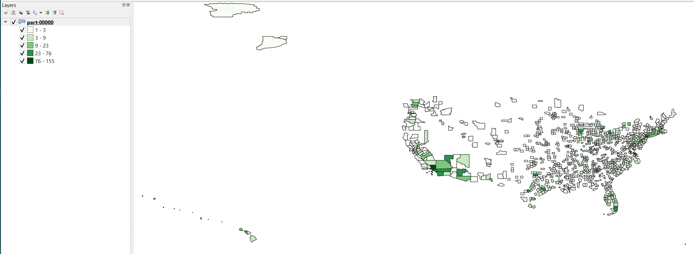
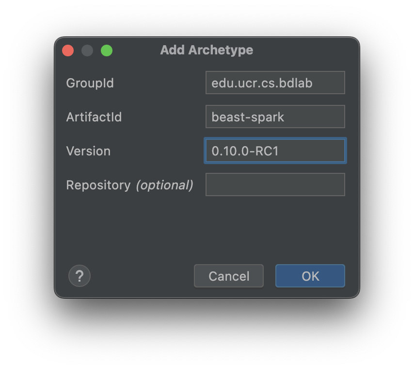

# Lab 9

## Objectives

* Browse and download datasets from [UCR-Star](https://star.cs.ucr.edu/).
* Use Beast to process big spatial data.
* Combine SparkRDD and SparkSQL in one program.
* Visualize big spatial data.

---

## Prerequisites

* Make sure that your JAVA_HOME environment variable points to JDK 17.0.9 to use Spark and Beast. Refer the development environment as explained in [Lab 1](../Lab1/CS167-Lab1.md).
* Download the datasets from this [Google Drive](https://drive.google.com/drive/folders/1PtEygIb0BGKe_jzJkraQ7dqefrjhBHd8?usp=sharing) shared folder. You need to be logged in with a UCR Google account. The folder includes the following two datasets.
  * Tweets: Each tweet has a geographic location, a timestamp, and text. You will find samples of 10K and 100K records to be able to test on small data before trying the bigger ones. You can explore this dataset on [UCR Star](https://star.cs.ucr.edu/?Tweets#center=33.9574,-117.1997&zoom=11). Click on a few points to see samples of the tweets.
  * Counties: The boundaries of all counties in the US with information about each county. You can also explore the [county dataset on UCR-Star](https://star.cs.ucr.edu/?TIGER2018/COUNTY#center=37.16,-117.48&zoom=7). Can you find Riverside county on the map?
* Note: If Google Drive shows that the above links are not accessible, make sure you are logged in with your UCR Google account.
* Download and install [QGIS](https://www.qgis.org/en/site/forusers/download.html) for free. Make sure to choose the version suitable for your system. QGIS is available for Windows, Ubuntu, and MacOS.
* (Optional but highly recommended :wink: ) Like and follow UCR-Star social media pages on [Facebook](https://www.facebook.com/ucrstar), [Twitter](https://twitter.com/ucrstar/), and [Instagram](https://www.instagram.com/theucrstar), to encourage the team to continue working on this project.

---

## Lab Work

### I. Project Setup (20 minutes) (In-home)

This part will be done on your `local laptop`.

1. Create a new Beast project based on Maven Beast template by the following command:

    ```shell
    mvn archetype:generate "-DgroupId=edu.ucr.cs.cs167.[UCRNetID]" "-DartifactId=[UCRNetID]_lab9" "-DarchetypeGroupId=edu.ucr.cs.bdlab" "-DarchetypeArtifactId=beast-spark" "-DarchetypeVersion=0.10.1-RC1" -B
    ```

2. Import the project into IntelliJ IDEA as a Maven project.

3. **Remove** the following dependency from the `pom.xml` file:
    ```shell
    <!-- Delete the following lines in pom.xml -->
    <dependency>
        <groupId>edu.ucr.cs.bdlab</groupId>
        <artifactId>commontest</artifactId>
        <version>${beast.version}</version>
        <scope>test</scope>
    </dependency>
    ```
    Click the floating ***m*** icon to load all dependencies.

    *Note*: If you are using `Windows`, make sure to open IntelliJ IDEA as Administrator. If IDEA can not download the dependencies, `reload your project` from disk.

4. To make sure that it works correctly, run `mvn package` from command line to make sure that it compiles correctly.

    *Note*: An alternative way of creating the project is shown [here](#frequenty-asked-questions).

---

### II. Main Class Preparation (10 minutes) (In-home)

This part will be done on your `local laptop`.

Similar to previous Labs, The `BeastScala` class will take several arguments the first two are: 
* The first argument `operation` is the type of task;
* The second argument `inputFile` is the path to input.

Remember to [add VM options](#add-vm-options) to run your code.

1. Unarchive **Tweets_1k.tsv.bz2**, **Tweets_10k.tsv.bz2**, **Tweets_100k.tsv.bz2** and **Tweets.tsv.bz2**, copy the following files to your project directory:

    * tl_2018_us_county.zip (Don't unzip it)
    * Tweets_1k.tsv
    * Tweets_10k.tsv
    * Tweets_100k.tsv
    * Tweets.tsv

2. Use the following code in your `BeastScala` class. Do not forget to replace [UCRNetID] with your own netid.

    ```scala
    package edu.ucr.cs.cs167.[UCRNetID]

    import edu.ucr.cs.bdlab.beast.geolite.{Feature, IFeature}
    import org.apache.spark.SparkConf
    import org.apache.spark.beast.SparkSQLRegistration
    import org.apache.spark.rdd.RDD
    import org.apache.spark.sql.{DataFrame, SaveMode, SparkSession}

    import scala.collection.Map

    /**
    * Scala examples for Beast
    */
    object BeastScala {
      def main(args: Array[String]): Unit = {
        // Initialize Spark context

        val conf = new SparkConf().setAppName("Beast Example")
        // Set Spark master to local if not already set
        if (!conf.contains("spark.master"))
          conf.setMaster("local[*]")

        val spark: SparkSession.Builder = SparkSession.builder().config(conf)

        val sparkSession: SparkSession = spark.getOrCreate()
        val sparkContext = sparkSession.sparkContext
        SparkSQLRegistration.registerUDT
        SparkSQLRegistration.registerUDF(sparkSession)

        val operation: String = args(0)
        val inputFile: String = args(1)
        try {
          // Import Beast features
          import edu.ucr.cs.bdlab.beast._
          val t1 = System.nanoTime()
          var validOperation = true

          operation match {
            case "count-by-county" =>
              // Sample program arguments: count-by-county Tweets_1k.tsv
              // TODO count the total number of tweets for each county and display on the screen
            case "convert" =>
              val outputFile = args(2)
              // TODO add a CountyID column to the tweets, parse the text into keywords, and write back as a Parquet file
            case "count-by-keyword" =>
              val keyword: String = args(2)
              // TODO count the number of occurrences of each keyword per county and display on the screen
            case "choropleth-map" =>
              val keyword: String = args(2)
              val outputFile: String = args(3)
              // TODO write a Shapefile that contains the count of the given keyword by county
            case _ => validOperation = false
          }
          val t2 = System.nanoTime()
          if (validOperation)
            println(s"Operation '$operation' on file '$inputFile' took ${(t2 - t1) * 1E-9} seconds")
          else
            Console.err.println(s"Invalid operation '$operation'")
        } finally {
          sparkSession.stop()
        }
      }
    }
    ```

---

### III. Count total number of tweets per county

This part will be done on your `local laptop`.

In this part, we will calculate the total number of tweets for each county and display the result on the screen in the following format:

  ```text
  County    Count
  Butts     5
  Whitman   31
  Andrews   1
  Putnam    94
  Calumet   5
  Clayton   250
  ...
  ```


1. Navigate to the first TODO item under the operation `count-by-county`.

2. Load the tweets as a Dataframe named `tweetsDF`. The tweets file we just downloaded is `tab-separated` with `a header` (the first row). You can display the first a few rows by:
    ```scala
    tweetsDF.show()
    ```
    Below is a sample output:
    ```text
    |           Timestamp |                 Text |    Latitude |     Longitude |
    | ------------------- | -------------------- | ----------- | ------------- |
    | 2012-10-12 11:34:31 | nickname,day,Law,... | 38.97214035 |  -76.96019938 |
    | 2012-09-18 07:48:02 | game,imma,expert,... | 40.73615385 |  -74.19313808 |
    | 2012-10-07 01:32:06 | nun,stranger,spea... | 40.68520613 |  -89.60430686 |
    | 2012-08-24 05:40:12 | RETWEET,Check,vlo... |  32.9973956 |   -96.8666182 |
    ```
    *Note*: If your code can not run, you can `reload` your project from disk.

* ***(Q1) What is the schema of the file after loading it as a Dataframe***

    *Note*: Use `tweetsDF.printSchema()` to print the schema.

4. Comment the two lines about printing sample rows and schema after answering Q1.

5. To run spatial operations, we need to combine the two columns related to spatial properties: `Longitude` and `Latitude`. Create a new column with type `geometry` by using `Longitude` and `Latitude`. You can use the following code:

    ```scala
    tweetsDF.selectExpr("*", "ST_CreatePoint(Longitude, Latitude) AS geometry")
    ```

6. Now, we can use `Beast` to convert this new Dataframe to a spatial RDD:

    ```scala
    val tweetsRDD: SpatialRDD = tweetsDF.selectExpr("*", "ST_CreatePoint(Longitude, Latitude) AS geometry").toSpatialRDD
    ```

7. Next, we want to `join` this dataset with counties based on the location. Let us first load the counties dataset by using the following command:

    ```scala
    val countiesRDD: SpatialRDD = sparkContext.shapefile("tl_2018_us_county.zip")
    ```

8. After that, we use the `spatial join` operation to combine both RDDs together based on their geospatial location.

    ```scala
    val countyTweet: RDD[(IFeature, IFeature)] = countiesRDD.spatialJoin(tweetsRDD)
    ```

9. Then, we will select the county name and count by name.

    ```scala
    val tweetsByCounty: Map[String, Long] = countyTweet
      .map({ case (county, tweet) => (county.getAs[String]("NAME"), 1) })
      .countByKey()
    ```

10. Finally, let us print the output using the following code.

    ```scala
    println("County\tCount")
    for ((county, count) <- tweetsByCounty)
      println(s"$county\t$count")
    ```

11. Run your code with the following parameters:
      ```text
      count-by-county Tweets_1k.tsv
      ```

    A sample output is shown below.

    ```text
    County    Count
    Butts     5
    Whitman   31
    Andrews   1
    Putnam    94
    Calumet   5
    Clayton   250
    ...
    Operation 'count-by-county' on file '...' took ... seconds
    ```
    *Note*: you may notice the cost of spatial join operation.
<!-- 11. To run your code from the terminal, open the terminal in your `[UCRNetID]_lab10` directory and run the following command:
```shell
bin/beast target/[UCRNetID]_lab10-1.0-SNAPSHOT.jar count-by-county Tweets_1k.tsv
```
**Note:** If you get the permission denied ``bin/beast: permission denied``, run the command ``chmod +x bin/beast`` and then run your jar file.  -->

---

### IV. Data conversion

In this part, we will convert the data into a format easier to analyze, instead of loading two datasets and running the costly spatial join operation for each query. This includes the following steps:

* Add a new column `CountyID` to each tweet.
* Parse the text into an array of keywords.
* Write back the output in `Parquet` format.

1. Navigate to the second operation `convert` in the code.
2. Load the Tweets dataset as a CSV directly as SpatialRDD this time. The following will do that
    ```scala
    val tweetsRDD: SpatialRDD = sparkContext.readCSVPoint(inputFile,"Longitude","Latitude",'\t')
    ```
3. Load the counties dataset as done in the previous part. **Alternatively, you can also load it as a DataFrame and then convert it into SpatialRDD as follows**
    ```scala
    val countiesDF = sparkSession.read.format("shapefile").load("tl_2018_us_county.zip")
    val countiesRDD: SpatialRDD = countiesDF.toSpatialRDD
    ```
5. Now, let us join the two RDDs together as follows.

    ```scala
    val tweetCountyRDD: RDD[(IFeature, IFeature)] = tweetsRDD.spatialJoin(countiesRDD)
    ```

6. Next, we will add a new column named `CountyID` to each tweet that is equal to the `GEOID` column in the corresponding county. You can use the following code:

    ```scala
    val tweetCounty: DataFrame = tweetCountyRDD.map({ case (tweet, county) => Feature.append(tweet, county.getAs[String]("GEOID"), "CountyID") })
      .toDataFrame(sparkSession)
    ```

<!-- * ***(Q2) Why in the `convert` operation, the order of the objects in the  tweetCounty RDD is (tweet, county) while in the `count-by-county` operation, the order of the objects in the spatial join result was (county, tweet)?***  -->
* ***(Q2) Why the order of tweetCounty RDD are diferent in `count-by-county` and `convert` operations (one is (county, tweet), and the other is (tweet, county))?***

* ***(Q3) What is the schema of the tweetCounty Dataframe?***
  
      Hint: Use `tweetCounty.printSchema()`.

7. Remember to comment `tweetCounty.printScheme()` after you finish answering Q3.   
Now we can parse the tweet `Text` into an array of `keywords` to make it easier to analyze:

    ```scala
    val convertedDF: DataFrame = tweetCounty.selectExpr("CountyID", "split(lower(text), ',') AS keywords", "Timestamp")
    ```
    *Note*: `geometry`, `Latitude`, and `Longitude` columns are dropped since we have already wrap the spatial property.

  * ***(Q4) What is the schema of the convertedDF Dataframe?***

      *Note*: Remember to comment your code for printing schema after answering Q4.

8. Finally, we can write the converted Dataframe in Parquet format:

    ```scala
    convertedDF.write.mode(SaveMode.Overwrite).parquet(outputFile)
    ```
9. Run your code with the following parameters:

    ```text
    convert Tweets_1k.tsv convert_output
    ```
<!-- 
9. To run your code from the terminal, open the terminal in your `[UCRNetID]_lab10` directory and run the following command:
```shell
bin/beast target/[UCRNetID]_lab10-1.0-SNAPSHOT.jar convert Tweets_1k.tsv convert_output
``` -->
* ***(Q5) For the tweets_10k dataset, copy the file size before and after conversion, respectively.***

---

### V. Count by keyword

In this part, we count the number of tweets containing a given keyword in each county. We will work on the converted dataset not the original dataset.

1. Navigate to `count-by-keyword` part.

2. Read the parquet file and create a view with name `tweets` by the following command:

    ```scala
    sparkSession.read.parquet(inputFile)
      .createOrReplaceTempView("tweets")
    ```

<!-- 3. Run the following SQL query to count the number of tweets for each county containing the given keyword. Do not forget to replace the `$keyword` with the keyword given from command line.

    ```SQL
    SELECT CountyID, count(*) AS count
    FROM tweets
    WHERE array_contains(keywords, "$keyword")
    GROUP BY CountyID
    ``` -->

3. Run a SQL query to count the number of tweets for each county containing a user-provided keyword. You can use the following command:

    ```scala
    println("CountyID\tCount")
    sparkSession.sql(
      s"""
          SELECT CountyID, count(*) AS count
          FROM tweets
          WHERE array_contains(keywords, "$keyword")
          GROUP BY CountyID
        """).foreach(row => println(s"${row.get(0)}\t${row.get(1)}"))
    ```
4. Run your code with the following parameters:
    ```text
    count-by-keyword convert_output love
    ```

    Here is an sample output:

    ```text
    CountyID    Count
    32003       1
    37025       1
    41051       1
    13215       1
    ...
    Operation 'count-by-keyword' on file 'convert_output' took ... seconds
    ```

    *Note*: You may notice that the CountyID is not very informative. The next part will show how to visualize the query result.
---

### VI. Choropleth map

In this last part, we will create a Choropleth map that visualizes the number of tweets for each county for a given keyword.

1. Navigate to the `choropleth-map` TODO part in the code.

2. Copy the code about creating `tweets` views from the previous part .

3. Copy the code about getting `keyword_counts` from the previous part.

4. Now, to build the choropleth map, we need to bring back the `geometry` of each county. We can join to the result of the previous SQL query with countries. Notice that we will join on the condidtion `CountyID=GEOID` which is a numeric equality condition and not a spatial condition. We call this equi-join and not spatial join.

5. Load the county dataset as a Dataframe:

    ```scala
      sparkSession.read.format("shapefile").load("tl_2018_us_county.zip")
        .createOrReplaceTempView("counties")
    ```

6. Run the following SQL query to join the two datasets and bring back the county name and geometry. Notice that the geometry attribute is named `geometry` when loaded from the county Shapefile.

    ```SQL
    SELECT CountyID, NAME, geometry, count
    FROM keyword_counts, counties
    WHERE CountyID = GEOID
    ```

7. Now, we will visualize the result by an external tool. To do that, we need to store the result in `shapfile` format. You can simply add the following options for `sparkSession.sql`:

    ```scala
    .coalesce(1).saveAsShapefile(outputFile)
    ```

    Note: The operation `coalesce(1)` merges all the partitions into one partition to ensure that only one output file is written.
    
8. Run your code with the following parameters:
  ```text
  choropleth-map convert_output love choropleth-map_output
  ```

9. To produce the choropleth map, follow [these instructions](../../Projects/Choropleth.md).

    The output should look something like the following. This specific figure is for the keyword `love` on the 100k dataset.

    

---

### VII. Normalize by number of tweets

The visualization made in the previous part might not be very informative. It shows the *number of tweets* with the keyword. However, most of the tweets came from *Los Angeles* and *New York*. 
Therefore, if you choose the keyword *hate* you will probably get a similar map.

Instead, we can normalize the counts by the total number of tweets in each county. In other words, instead of counting the *number* of tweets that contain a given keyword, we will compute the *ratio* of tweets that contain a given keyword among all tweets in that location.

* ***(Q6)[3pts] Write down the SQL query(ies) that you can use to compute the ratios as described above. Briefly explain how your proposed solution works.***

---
### VIII. Run in Distributed Mode 

This part will be done in your `cs167 server`.
You will setup `Bease` in your virtual machine, and test your code in distributed mode to see its performance.

1. Login to your CS167 machine.

2. On your CS167 machine, download and extract Beast package to your `$HOME/cs167` directory using the command below.
    ```shell
    curl -L https://bitbucket.org/bdlabucr/beast/downloads/beast-0.10.1-RC1-bin.tar.gz | tar -xvz -C $HOME/cs167
    ```

3. Configure Environment Variables: Set the environment variables $PATH as follows:
    ```shell
    echo 'export PATH=$PATH:'$HOME/cs167/beast-0.10.1-RC1/bin >> .bashrc
    ```

4. Reload the configuration by running `source ~/.bashrc` 

5. Start a Spark cluster and an HDFS cluster on your CS167 machine similar to how you did in Lab 05, electing one master node.

6. Upload your JAR file and the datasets to your CS167 machine, and then upload the dataset to HDFS.

7. You can use the command similar to the following to test your program.
    ```shell
    beast [UCRNetID]_lab10-1.0-SNAPSHOT.jar <arguments>
    ```
    For example: if you want to test your code for the arguments: `count-by-county hdfs:///Tweets_1k.tsv`, you can run the following command:
    ```shell
    beast [UCRNetID]_lab10-1.0-SNAPSHOT.jar count-by-county hdfs:///Tweets_1k.tsv
    ```
    *Note*: Remember to put the tweets files into your HDFS to run beast. If you have issues with downloading dependencies when running beast, you can try the following command to download mannually:
    ```shell
    mvn dependency:get -Dartifact=commons-io:commons-io:2.10.0                   
    mvn dependency:get -Dartifact=jakarta.annotation:jakarta.annotation-api:1.3.4
    mvn dependency:get -Dartifact=io.airlift:aircompressor:0.20
    ```

8. Run your code with the following parameters:
    ```text
    convert Tweets_10k.tsv out_parquet
    ```
  
* ***(Q7) When you run the application, open the spark WebUI and find your task. What's the Job name and its corresponding description?***

9. Run your code with the following parameters:
    ```text
    choropleth-map out_parquet happy choropleth-map_output
    ```
    
* ***(Q8) When you run the application, open the spark WebUI and find your task. Can you verify your code is prcessing with parquet format? Explain why.***


### IX. Submission

1. ***Remove any `.show()` or `.printSchema()` functions in your code.***
2. Create a README file and add all your answers to it. Do not forget to add your information similar to previous labs. Use this [template `README.md`](CS167-Lab10-README.md) file.
3. **No need to add a run script this time. However, make sure that your code compiles with `mvn clean package` prior to submission.**
4. Similar to all labs, do not include any additional files such as the compiled code, input, or output files.

Submission file format:

```console
[UCRNetID]_lab10.{tar.gz | zip}
  - src/
  - pom.xml
  - README.md
```

Requirements:

* The archive file must be either `.tar.gz` or `.zip` format.
* The archive file name must be all lower case letters. It must be underscore '\_', not hyphen '-'.
* The folder `src` and two files, `pom.xml` and `README.md`, must be the exact names.
* The folder `src` and two files `pom.xml` and `README.md`, must be directly in the root of the archive, do not put them inside any folder.
* Do not include any other files/folders, otherwise points will be deducted.

See how to create the archive file for submission at [here](../MakeArchive.md).

---

## Frequently Asked Questions

* Q: How to directly create project in IntelliJ IDEA?

    You can directly create the project from IntelliJ to avoid using command line by following the [instructions on Lab6](../Lab6/CS167-Lab6.md#create-lab-6-project-from-intellij).
    Use the following archetype information when needed.

    | Info       | Value             |
    | ---------- | ----------------- |
    | GroupId    | edu.ucr.cs.bdlab  |
    | ArtifactId | beast-spark       |
    | Version    | 0.10.1-RC1        |

     -->

* Q: When I run the `mvn archetype:generate` command, I get the following error:

    ```text
    [ERROR] The goal you specified requires a project to execute but there is no POM in this directory (C:\Users\aseld\Workspace\IdeaProjects). Please verif
    y you invoked Maven from the correct directory. -> [Help 1]
    ```

    A: If you run this command from Windows PowerShell, you need to wrap each argument within double quotes.

* Q: When I run `mvn package`, I get the following error:

    ```text
    [ERROR] Failed to execute goal net.alchim31.maven:scala-maven-plugin:4.4.0:compile (scala-compile-first) on project xxxx_lab10: Execution scala-compile-first of goal net.alchim31.maven:scala-maven-plugin:4.4.0:compile failed: An API incompatibility was encountered while executing net.alchim31.maven:scala-maven-plugin:4.4.0:compile: java.lang.NoSuchMethodError: org.fusesource.jansi.AnsiConsole.wrapOutputStream(Ljava/io/OutputStream;)Ljava/io/OutputStream;
    ...
    ```

    A: Try changing `scala.maven.plugin.version` in **pom.xml** from `4.4.0` to `4.6.1`.

    ```xml
    <scala.maven.plugin.version>4.6.1</scala.maven.plugin.version>
    ```

* Q: When I run the program, I get the following error:

    ```
    Exception in thread "main" java.lang.ClassNotFoundException: scala.math.Ordering$Reverse
    ```

    A: Remove the following dependency from your pom.xml file.

    ```xml
    <dependency>
      <groupId>edu.ucr.cs.bdlab</groupId>
      <artifactId>commontest</artifactId>
      <version>${beast.version}</version>
      <scope>test</scope>
    </dependency>
    ```

## Add VM Options
Rememer to add VM options when you run your code:

  ```text
  --add-opens java.base/java.nio=ALL-UNNAMED
  --add-opens java.base/java.util=ALL-UNNAMED
  --add-opens java.base/java.lang=ALL-UNNAMED
  --add-opens java.base/sun.nio.ch=ALL-UNNAMED
  --add-opens java.base/java.lang.invoke=ALL-UNNAMED
  ```

Below is how to add VM options to run configuration.


