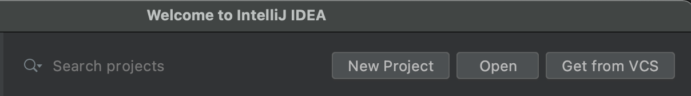
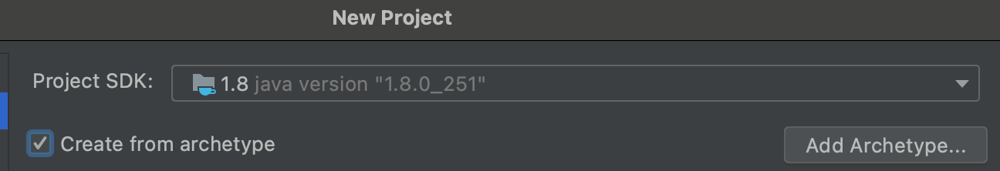
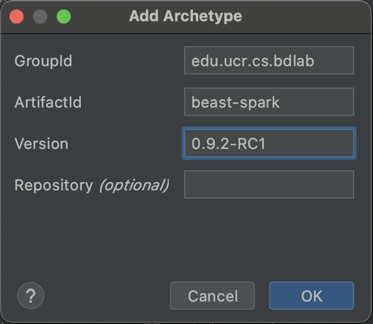
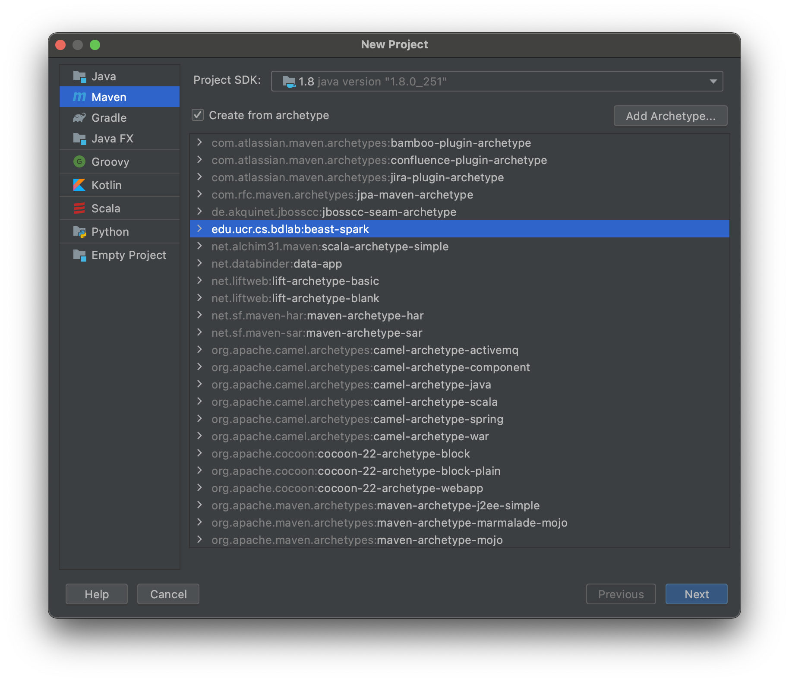
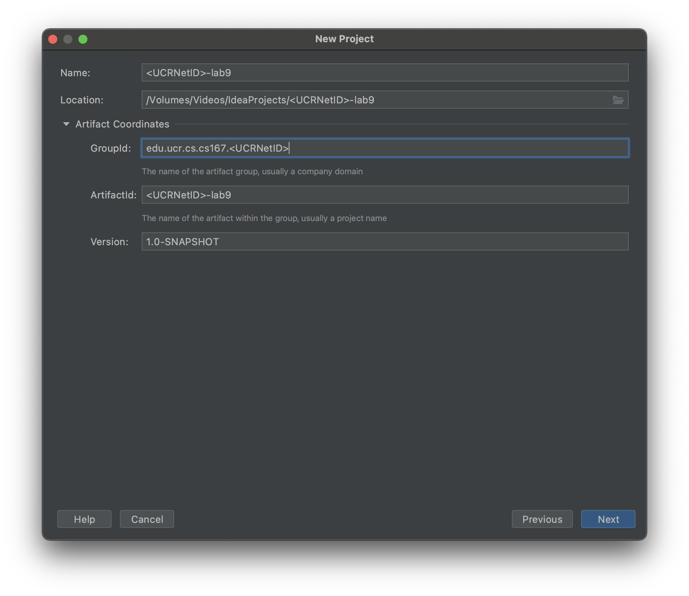
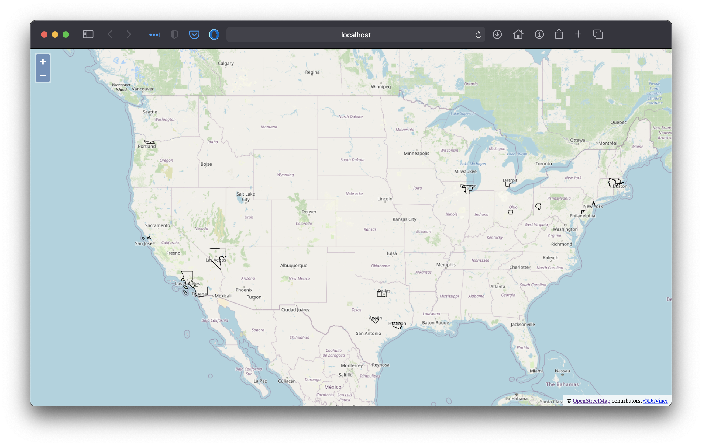

# Labs 9

## Objectives

* Browse and download datasets from [UCR-Star](https://star.cs.ucr.edu/).
* Use Beast to process big spatial data.
* Visualize big spatial data.

## Prerequisites
* Download the following files.
  - [Twitter dataset in SoCal](https://star.cs.ucr.edu/dynamic/download.cgi/Tweets/data_index.csv.gz?mbr=-117.31836,32.56185,-116.88818,32.86345&point) (Hosted by UCR-Star). Download in CSV format. Rename the file to `tweets_ca.csv`.
  - [All Twitter Dataset](https://star.cs.ucr.edu/dynamic/download.cgi/Tweets/data_index.csv.gz?point) (Hosted by UCR-Star). Download in CSV format. Rename the file to `tweets.csv`.
  - You can browse the [Tweets dataset](https://star.cs.ucr.edu/?Tweets) on UCR-Star on a map
  - [Timezone Dataset](https://www.naturalearthdata.com/http//www.naturalearthdata.com/download/10m/cultural/ne_10m_time_zones.zip) (Shapefile format hosted by naturalearthdata.com)
  - [US County Dataset](ftp://ftp2.census.gov/geo/tiger/TIGER2018/COUNTY/tl_2018_us_county.zip) (Shapefile format hosted by the US Census Bureau - ftp://ftp2.census.gov/geo/tiger/TIGER2018/COUNTY/tl_2018_us_county.zip)
* (Optional but highly recommended :wink: ) Like and follow UCR-Star social media pages on [Faceboook](https://www.facebook.com/ucrstar), [Twitter](https://twitter.com/ucrstar/), and [Instagram](https://www.instagram.com/theucrstar), to encourage the team to continue working on this project.

Note: If you had troubles downloading the files, you can download a cached version of these files from this [Google Drive](https://drive.google.com/drive/folders/1s-fmpYBp5usmzOaO3EhiluqTOZmhmhzi?usp=sharing) shared folder.

## Lab Work

### I. Project Setup (20 minutes)
The instructions below are all given using Scala. However, you are allowed to use Java if you prefer. Feel free to ask how to translate these functions from Scala to Java.
1. Create a new Beast project using Maven Beast template. Use the following command line and replace `<UCRNetID>` with your UCR Net ID.
```shell
mvn archetype:generate -DgroupId=edu.ucr.cs.cs167.<UCRNetID> -DartifactId=<UCRNetID>-lab9 -DarchetypeGroupId=edu.ucr.cs.bdlab -DarchetypeArtifactId=beast-spark -DarchetypeVersion=0.9.2-RC1
```
2. Import the project into IntelliJ as a Maven project.
3. To make sure that it works correctly, run `mvn package` from command line to make sure that it compiles correctly.
4. Take a look into the main function in class `BeastScala` that comes with the template to see an example of how it works.
5. Remove the code inside the try-catch block except for the import line at the beginning.

Note: You can directly create the project from IntelliJ to avoid using command line by following these alternative instructions.
1. In IntelliJ welcome screen, choose New Project.

2. The first time you do this, you need to choose "Create from archetype" and press "Add Archetype...".

3. Enter the following archetype information and press "OK".

| Info   | Value |
| ------- | ----------------- |
| GroupId | edu.ucr.cs.bdlab |
| ArtifactId | beast-spark |
| Version | 0.9.2-RC1 |



4. Choose the newly added archetype and press "Next".

5. Enter the GroupId and ArtifactId after replacing `<UCRNetID>` with yours.

6. Finish creating the project


### II. Load and Insepct the Input (20 minutes)
First, we will load the input files that we will use throughout the lab. Since the input files have different file formats, the loading function would look different for each file.
1. Move all the downloaded files to your project directory. (Note: Do not include these files in your submission)
2. Use the following code to load the three datasets that we will use. Note that we will initially load the small Twitter dataset to get the results quickly and at the end we will run on the entire Twitter dataset by changing the filename.
```scala
val tweets = sparkContext.readCSVPoint("tweets_ca.csv", delimiter = '\t', skipHeader = true)
val counties = sparkContext.shapefile("tl_2018_us_county.zip")
val timezones = sparkContext.shapefile("ne_10m_time_zones.zip")
```
3. (Optional) To make sure that the files were downloaded correctly, add the following lines.

```scala
println(s"Number of tweets is ${tweets.count()}")
println(s"Number of counties ${counties.count()}")
println(s"Number of timezones is ${timezones.count()}")
```
The output should look like the following.
```text
Number of tweets is 104213
Number of counties 3233
Number of timezones is 120
```
Note: Do not include these lines in your final submission.

### III. Study the relationship between Coffee and time (15 minutes)
In this first task, we would like to study the relationship between the tweets the contain the keyword "Coffee" and the time (hour of day). We expect to see more tweets about coffee in the morning hours, e.g., 6:00-9:00 AM, and may be a little more in the afternoon after lunch, e.g., 1:00-2:00 PM. To verify this, we will count the number of tweets for every hour in the 24 hours.

1. Filter the tweets that have the word "coffee" in them. Use a regular `filter` operation with a filter function that looks like the following.
```scala
feature.getAs[String](2).contains("coffee")
```
2. Use the `map` operation to create key-value pairs where the key is the hour-of-day and the value is the constant 1. This requires parsing the string date into a date object. The following code snippet shows how to parse the string of one feature and extract the hour-of-day from it.
```scala
val dateParser = new SimpleDateFormat("yyyy-MM-dd HH:mm:ss")
val cal: Calendar = Calendar.getInstance()
val time: Date = dateParser.parse(feature.getAs[String](1))
cal.setTime(time)
val hour = cal.get(Calendar.HOUR_OF_DAY)
```
3. Add a `countByKey` action to get the number of tweets per hour.
4. Print the result using the following code stub.
```scala
for (h <- 0 to 23) {
  print(coffeeTweetsByHour.getOrElse(h, 0))
  if (h != 23)
    print(", ")
}
println
```
If you run the above code for the sample dataset, you would get an output similar to the following.

```
14, 22, 24, 9, 11, 10, 15, 13, 8, 4, 7, 4, 7, 6, 10, 1, 2, 0, 1, 1, 1, 8, 8, 21
```

(Q1) Does the result of part III conform to our initial expectations? Why or why not?

(Q2) Return the above code for the entire dataset `tweets.csv` and include the result in your README file.

Note: The above method is not very accurate. We can make it more accureate by computing the ratio of tweets that mention "coffee" to all tweets in the same hour. This way we can make sure that the numbers are not driven by the natural distribution of all tweets in these hours. However, for simplicity, we will stick to this method in this lab.

### IV. Study the relationship between Coffee and time with timezone consideration (30 minutes)
In this part, we will improve our previous code to take into account the timezone of each tweet. For accuracy, we will use the timezone dataset. You can take a look [here](https://star.cs.ucr.edu/?NE/time_zones#center=23.2,-60.3&zoom=2) on how it looks like.

1. Perform a spatial join between the tweets that mention coffee and the timezone dataset to associate each tweet to the timezone that it contains.
```scala
val coffeeTweetsTimeZone: RDD[(IFeature, IFeature)] = coffeeTweets.spatialJoin(timezones)
```
Note: The order of the result of the spatial join operation conform with the order of the input. In other words, for each resulting tuple, the first feature represents the left dataset (tweet) and the second feature represents the right dataset (timezone).

2. Modify your `map` function to take the timezone into account based on the following code snippet.
```scala
val time: Date = dateParser.parse(tweet.getAs[String](1))
val cal: Calendar = Calendar.getInstance(TimeZone.getTimeZone(timezone.getAs[String]("time_zone")))
cal.setTime(time)
val hour = cal.get(Calendar.HOUR_OF_DAY)
```
3. If you run your new code on the smaller dataset, the output would look similar to the following.
```
0, 1, 1, 1, 8, 8, 21, 14, 22, 24, 9, 11, 10, 14, 14, 8, 4, 7, 4, 7, 6, 10, 1, 2
```
(Q3) Does this output conform to what we expected earlier?

(Q4) How does the output look for the entire tweets dataset?

Note: Spatial join is known to be a complex operation. It might take a couple of minutes to run on the entire dataset on a single machine. This is why we have a smaller dataset to test the query pipeline and make sure it works correctly.

### V. Visualize types of food by county (30 minutes)
In this part, we would like to study and visualize the types of food mentioned in tweets in different counties. For example, we can compare "Bagel" to "Donut". Our method is to find top 20 counties that mention each type of food.

Note: Only run this part on the entire tweets dataset since it include many counties to aggregate.

1. Filter tweets by the word "donut".
2. Spatial join the filtered tweets with counties. (Hint: Make county as the left dataset to be treated as the key)
3. Count number of tweets per county.
4. Sort the result in descending order by number of tweets and select top 20.
5. Convert the result to a spatial RDD using `sparkContext.parallelize` and visualize the result using the following code.
```scala
top_counties.plotImage(2000, 2000, "counties_donut.png")
```
6. Repeat steps 1-5 with the keyword "bagel".
7. Choose a third keyword of your choice and repeat steps 1-5. (Q5) What is the third keyword that you chose?

You would get a result similar to the following.


(S1) In your submission, include the two images you got for the two keywords "donut", "bagel", and the third keyword that you chose. Name the files as `"counties_<keyword>.png"`

## VI. Use multilevel visualization (20 minutes)
Add an additional line that produces a multilevel visualization that you can further interact with.
1. Use the following code snippet to produce a multilevel visualization with 12 levels.
```scala
top_counties.plotPyramid("counties_donut", 12, opts = "mercator" -> true)
```
2. It might take a longer time to produce all tile images. Once done, open the file `counties_donut/index.html` in your browser.
3. You would get something similar to the following.

4. Repeat steps 1-3 with the three keywords you chose in Part V.

(S) Take three screenshots similar to the one above and include them in your submission. Name the files as `"counties_<keyword>_multilevelpng"`.


### VII. Submission (15 minutes)
1. Add a README that contains your information and answers to questions above.
2. Add a run script file that compiles your code and runs the analysis tasks above with the keyword "donut" for the visualization task.
3. Include six screenshots as described above.
4. Package your `README` file, run script, and code (without test files or binary files) and submit as one compressed file.
