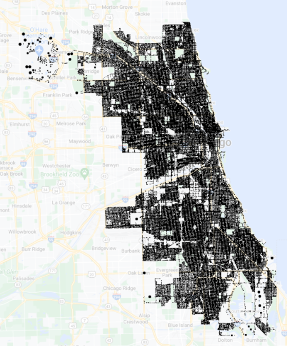
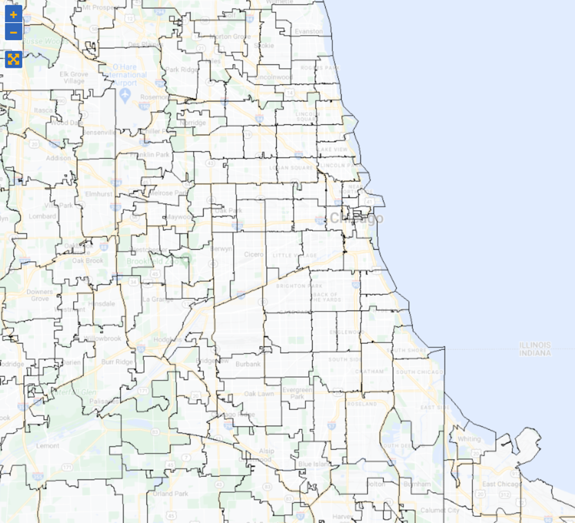
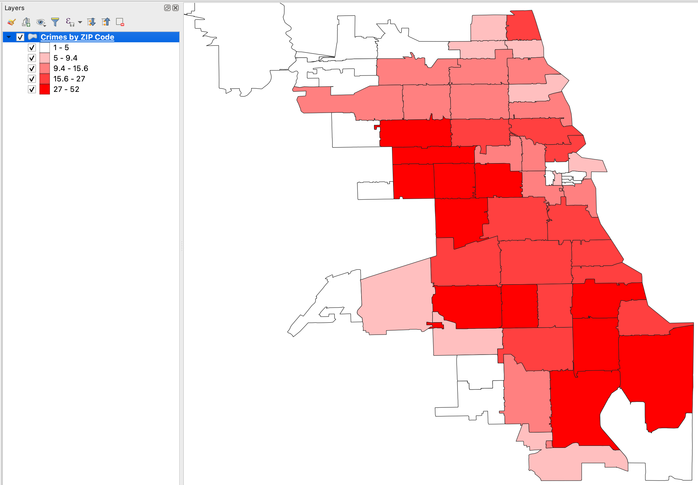
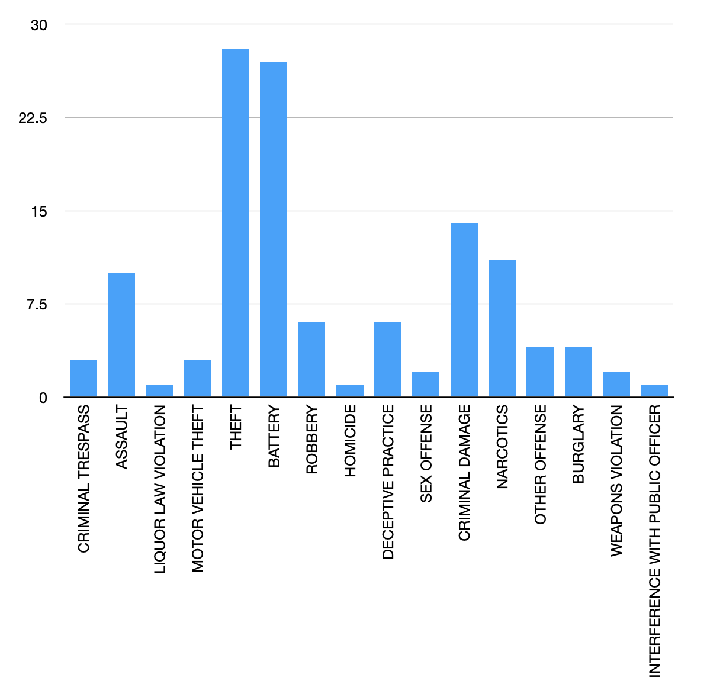

# Project A: Crime Data Analysis

## Objectives
- Apply the techniques we learned on a real big-data application.
- Translate high-level requirements into a big-data processing pipeline.
- Break down a big problem into smaller parts that can be solved separately.

## Overview
This project analyzes the Chicago Crime dataset made available by the city of Chicago.
You can explore this dataset on [UCR-Star](https://star.cs.ucr.edu/?Chicago%20Crimes#center=41.8226,-87.6925&zoom=11).
Click on a few points to see sample data records and their attribute values.
The dataset contains a total of 14 million points. However, we can run on smaller samples of it while developing
and apply on the full dataset after the entire query pipeline is ready.

## Prerequisites
1. Download samples of the data with different sizes to test your program while developing.
There are samples of
[1,000 points](https://drive.google.com/open?id=1CcH8PreRRVr35SmocC5CoBTnWgKn7jnn),
[10,000 points](https://drive.google.com/open?id=1CgzwCs0mze1LuXjH3eR93BMexErOKMbj),
and [100,000 points](https://drive.google.com/open?id=1CiPMIIXXBvU0WOxb6xkRVTvsGbRV_-Zw).
You do not have to decompress these files before processing.



2. Download the [ZIP Code Boundaries](https://drive.google.com/open?id=1CSTOR0FYrlA-hKM9CbhaDZV7zaU9saIL) 
dataset made available by the US Census Bureau. You can also explore this dataset on
[UCR-Star](https://star.cs.ucr.edu/?TIGER2018/ZCTA5#center=41.8226,-87.6925&zoom=11)
to understand how it is represented.



## Task 1: Data preparation
The first step is to prepare the data for processing. This includes two major steps.
First, introduce a new attribute `ZIPCode` that indicates the ZIP code at which each crime happened.
Second, convert the file into a column-oriented Parquet format to speed up the analysis.

- Parse and load the CSV file using the Dataframe API.
- Introduce a geometry attribute that represents the location of each crime. Use the `ST_CreatePoint` function.
- Rename all attributes that include a space to make them easier to deal with and compatible with the Parquet format.
    To do that, use the function `withColumnRenamed` on the Dataframe.
- Convert the resulting Dataframe to a SpatialRDD to prepare for the next step.
- Load the ZIP Code dataset using Beast.
- Run a spatial join query to find the ZIP code of each crime.
- Use the attribute `ZCTA5CE10` from the ZIP code to introduce a new attribute `ZIPCode` in the crime.
- Convert the result back to a Dataframe.
- Drop the geometry column and any other unnecessary columns. Use the function `dropColumn` on the Dataframe.
- Write the output as a Parquet file named `Chicago_Crimes_ZIP`.

The final output will have a schema that looks like the following. Notice the last attribute that indicates the ZIP Code.
```
root
 |-- x: double (nullable = true)
 |-- y: double (nullable = true)
 |-- ID: integer (nullable = true)
 |-- CaseNumber: string (nullable = true)
 |-- Date: string (nullable = true)
 |-- Block: string (nullable = true)
 |-- IUCR: string (nullable = true)
 |-- PrimaryType: string (nullable = true)
 |-- Description: string (nullable = true)
 |-- LocationDescription: string (nullable = true)
 |-- Arrest: string (nullable = true)
 |-- Domestic: string (nullable = true)
 |-- Beat: string (nullable = true)
 |-- District: string (nullable = true)
 |-- Ward: string (nullable = true)
 |-- CommunityArea: integer (nullable = true)
 |-- FBICode: string (nullable = true)
 |-- XCoordinate: integer (nullable = true)
 |-- YCoordinate: string (nullable = true)
 |-- Year: string (nullable = true)
 |-- UpdatedOn: string (nullable = true)
 |-- ZIPCode: string (nullable = true)
```

You can download this [sample output file](https://drive.google.com/open?id=1D5R0DGueW-JS18z6tz6ZkIP6clpveock) to double-check your result.

A few sample records are shown below for your reference.

|            x|           y|      ID|CaseNumber|                Date|               Block|IUCR|        PrimaryType|         Description| LocationDescription| Arrest| Domestic| Beat|District|Ward|CommunityArea|FBICode|XCoordinate|YCoordinate|   Year|           UpdatedOn|ZIPCode|
|-------------|------------|--------|----------|--------------------|--------------------|----|-------------------|--------------------|--------------------|-------|---------|-----|--------|----|-------------|-------|-----------|-----------|-------|--------------------|-------|
|-87.677483468|41.955113932|10773691|  HZ539008|12/02/2016 06:15:...|  019XX W CUYLER AVE|1310|    CRIMINAL DAMAGE|         TO PROPERTY|           RESIDENCE|  false|    false| 1912|     019|  47|            5|     14|    1162644|    1926916|   2016|02/10/2018 03:50:...|  60613|
|-87.660452276|41.949724539| 4461123|  HL759783|11/28/2005 01:00:...|037XX N MAGNOLIA AVE|1320|    CRIMINAL DAMAGE|          TO VEHICLE|              STREET|  false|    false| 1923|     019|  44|            6|     14|    1167292|    1924988|   2005|02/10/2018 03:50:...|  60613|
|-87.656165518|41.955670737| 6784685|  HR198706|03/04/2009 03:30:...| 040XX N KENMORE AVE|1320|    CRIMINAL DAMAGE|          TO VEHICLE|              STREET|  false|    false| 2322|     019|  46|            3|     14|    1168441|    1927164|   2009|02/28/2018 03:56:...|  60613|
|-87.654464178|41.951780377| 7423406|  HS225492|03/25/2010 04:10:...|038XX N SHEFFIELD...|4650|      OTHER OFFENSE|SEX OFFENDER: FAI...|           APARTMENT|   true|    false| 2324|     019|  44|            6|     26|    1168915|    1925750|   2010|02/10/2018 03:50:...|  60613|

In the report, include one paragraph, in your own words, on why the Parquet format will be helpful for this project.
Include a table that indicates the size of the original (decompressed) data and the Parquet format similar to the following.

| Dataset | CSV size | Parquet size |
|---------|----------|--------------|
| 1,000   |          |              |
| 10,000  |          |              |
| 100,000 |          |              |

## Task 2: Spatial analysis

In this task, you need to count the total number of crimes for each ZIP code and plot the results as a choropleth map (see below).



Here is an overview of what you are expected to do.
- Load the dataset in the Parquet format.
You can test on [this sample file](https://drive.google.com/open?id=1D5R0DGueW-JS18z6tz6ZkIP6clpveock) until the first task is complete.
- Run a grouped-aggregate SQL query that computes the total number of crimes per ZIP code.
- While this query has the result we need, it is still missing the geometry of the ZIP code which is needed to draw the choropleth map.
- To put the geometry back, we will join with the original ZIP Code dataset.
- Load the ZIP Code dataset using Beast and convert it to an RDD.
- Join the two datasets using an equi-join query on the attributes `ZIPCode` and `ZCTA5CE10`.
- To ensure that a single file is written to the output, you might want to use the function `coalesce(1)`.
- Store the output as a Shapefile named `ZIPCodeCrimeCount`.
- Import the file into QGIS and follow [these directions](Choropleth.md) to plot the choropleth map.
The output should look like the image shown above.

You can also find [this sample result file](https://drive.google.com/open?id=1D6fKY1t6ibogWqG0KegOTdS3dxOC8ud-&authuser=eldawy%40ucr.edu&usp=drive_fs) to get an idea of what is expected.

In the report, include your own visualization of the result for the 10k file that you get from Task A.

## Task 3: Temporal analysis
Given start and end dates, count the number of crimes for each crime type and plot as a bar chart (see below).



Here is an overview of what you are expected to do.
- Load the dataset in the Parquet format.
  You can test on [this sample file](https://drive.google.com/open?id=1D5R0DGueW-JS18z6tz6ZkIP6clpveock) until the first task is complete.
- The start and end dates will be provided as command-line arguments in the format `MM/DD/YYYY`, e.g., `03/15/2018`.
- Run an SQL query that does the following:                                                  
  - Parse the `Date` attribute into a proper timestamp attribute. 
    For that use the SQL function `to_timestamp` with the format `MM/dd/yyyy hh:mm:ss a`.
  - Parse the user-provided start and end dates using the function `to_date` with the format `MM/dd/yyyy`
  - Include a `WHERE` clause that tests if the crime date is `BETWEEN` start `AND` end dates.
  - Include a grouped aggregate statement to count the number of crimes for each `PrimaryType`.
- Write the output as a CSV file named `CrimeTypeCount`. You might want to first `coalesce(1)` the Dataframe to produce a single file.
  A sample output is provided below for your reference.

| PrimaryType            | count |
|------------------------|-------|
| PUBLIC PEACE VIOLATION | 2     |
| CRIMINAL TRESPASS      | 3     |
| ASSAULT                | 10    |
| LIQUOR LAW VIOLATION   | 1     |

- Load the file into a spreadsheet program, e.g., Excel, and draw the desired bar chart.
- The output should look like the image above.

In the report, include your own visualization of the 10k dataset.

