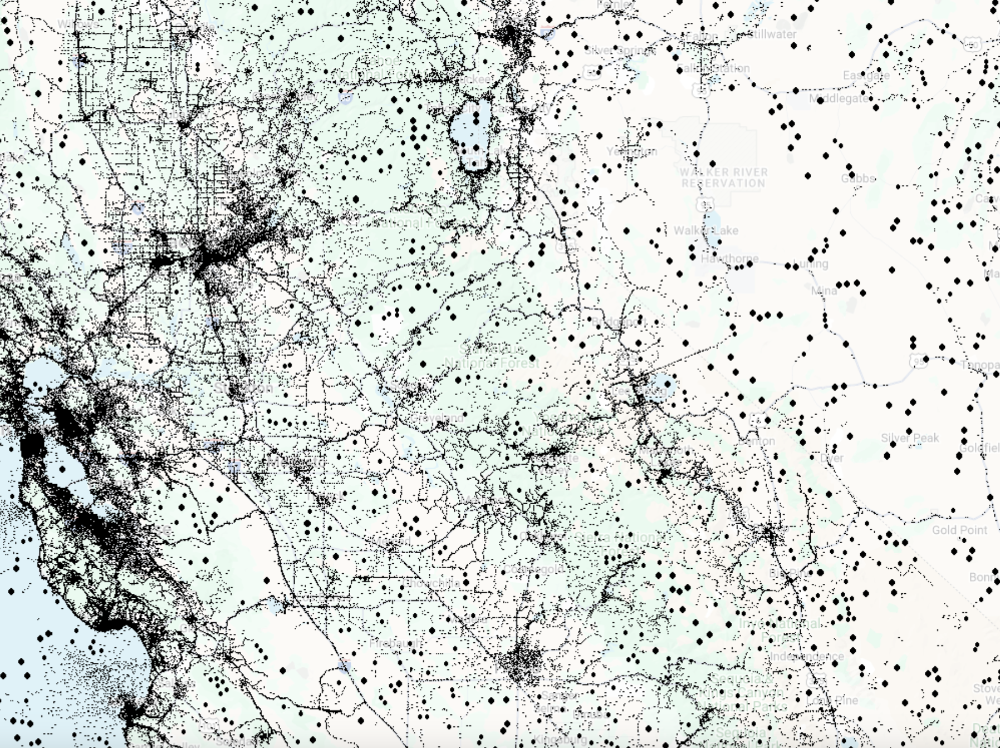
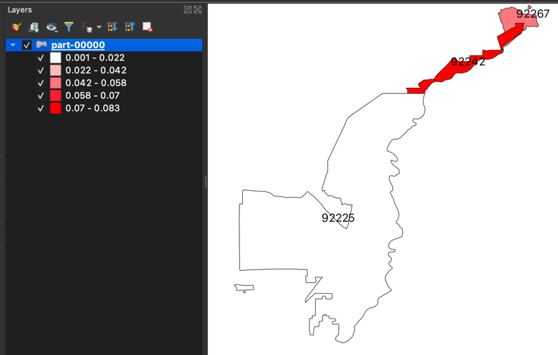
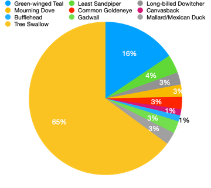

# Project B: eBird Data Analysis

## Objectives
- Apply the techniques we learned on a real big-data application.
- Translate high-level requirements into a big-data processing pipeline.
- Break down a big problem into smaller parts that can be solved separately.

## Overview
This project analyzes a dataset that represents bird observations made by volunteers all over the world.
This dataset is made available by the Cornell Lab of Ornithology.
You can explore this dataset on [UCR-Star](https://star.cs.ucr.edu/?eBird#center=38.060,-119.295&zoom=8).
Click on a few points to see sample data records and their attribute values.
The dataset contains a total of 800 million points. However, we will only work with a subset of the data in California.
Furthermore, we will have several subsets of the data of sizes, 1K, 10K, and 100K, to expedite the development.

## Prerequisites
1. Download samples of the data with different sizes to test your program while developing.
There are samples of
[1,000 points](https://drive.google.com/open?id=1D2mJxhxK7VAZoj_tUfKm9ByDinYHmxLy),
[10,000 points](https://drive.google.com/open?id=1D1h_44j2wjS2VjOOwBTJSHxeU71swsQE),
and [100,000 points](https://drive.google.com/open?id=1D1q3uA_SFCJrVv8k5BYcOm099LklKcbq).
You do not have to decompress these files before processing.

2. Download the [ZIP Code Boundaries](https://drive.google.com/open?id=1CSTOR0FYrlA-hKM9CbhaDZV7zaU9saIL) 
dataset made available by the US Census Bureau. You can also explore this dataset on
[UCR-Star](https://star.cs.ucr.edu/?eBird#center=38.060,-119.295&zoom=8)
to understand how it is represented.



## Task 1: Data preparation
The first step is to prepare the data for processing. This includes two major steps.
First, introduce a new attribute `ZIPCode` that indicates the ZIP code at which each observation happened.
Second, convert the file into a column-oriented Parquet format to speed up the analysis.

- Parse and load the CSV file using the Dataframe API.
- Introduce a geometry attribute that represents the location of each observation. Use the `ST_CreatePoint` function.
- Keep only the following columns to reduce the size of the dataset: {"x", "y", "GLOBAL UNIQUE IDENTIFIER", "CATEGORY", "COMMON NAME", "SCIENTIFIC NAME", "OBSERVATION COUNT", "OBSERVATION DATE"}
- Rename all attributes that include a space to make them easier to process and compatible with the Parquet format.
    To do that, use the function `withColumnRenamed` on the Dataframe.
- Convert the resulting Dataframe to a SpatialRDD to prepare for the next step.
- Load the ZIP Code dataset using Beast.
- Run a spatial join query to find the ZIP code of each observation.
- Use the attribute `ZCTA5CE10` from the ZIP code to introduce a new attribute `ZIPCode` in the observations.
- Convert the result back to a Dataframe.
- Drop the geometry column using the function `dropColumn` on the Dataframe.
- Write the output as a Parquet file named `eBird_ZIP`.

The final output will have a schema that looks like the following.
Notice the fewer attributes and the last attribute that indicates the ZIP Code.
```
root
 |-- x: double (nullable = true)
 |-- y: double (nullable = true)
 |-- GLOBAL_UNIQUE_IDENTIFIER: string (nullable = true)
 |-- CATEGORY: string (nullable = true)
 |-- COMMON_NAME: string (nullable = true)
 |-- SCIENTIFIC_NAME: string (nullable = true)
 |-- OBSERVATION_COUNT: string (nullable = true)
 |-- OBSERVATION_DATE: string (nullable = true)
 |-- ZIPCode: string (nullable = true)
```

You can download this [sample output file](https://drive.google.com/open?id=1D7mCYyXjIV3kdQyg_G9zyIrSmQugvBwQ) to double-check your result.

A few sample records are shown below for your reference.

|           x|         y|GLOBAL_UNIQUE_IDENTIFIER|CATEGORY|         COMMON_NAME|     SCIENTIFIC_NAME|OBSERVATION_COUNT|OBSERVATION_DATE|ZIPCode|
|------------|----------|------------------------|--------|--------------------|--------------------|-----------------|----------------|-------|
| -114.480893| 34.089516|    URN:CornellLabOfO...| species|   White-winged Dove|    Zenaida asiatica|                1|       L11350034|  92242|
| -114.462663| 34.087028|    URN:CornellLabOfO...| species|Pacific-slope Fly...|Empidonax difficilis|                1|       L11361130|  92242|
| -114.462663| 34.087028|    URN:CornellLabOfO...| species|    Lesser Nighthawk|Chordeiles acutip...|                8|       L11361130|  92242|
|-114.4384861|34.0838722|    URN:CornellLabOfO...| species|        Black Phoebe|  Sayornis nigricans|                1|      2020-02-26|  92242|


In the report, include one paragraph, in your own words, on why the Parquet format will be helpful for this project.
Include a table that indicates the size of the original (decompressed) data and the Parquet format similar to the following.

| Dataset | CSV size | Parquet size |
|---------|----------|--------------|
| 1,000   |          |              |
| 10,000  |          |              |
| 100,000 |          |              |

## Task 2: Spatial analysis

Given a specific bird species, count the percentage of observations for this species among
all observations per ZIP Code and visualize the result as a choropleth map.



Here is an overview of what you are expected to do.
- Load the dataset in the Parquet format.
You can test on [this sample file](https://drive.google.com/open?id=1D7mCYyXjIV3kdQyg_G9zyIrSmQugvBwQ) until the first task is complete.
- Run a grouped-aggregate SQL query that computes the total number of observations per ZIP code. 
  This means the sum of the column "OBSERVATION_COUNT".
- Run a second grouped-aggregate SQL query that is very similar to the previous one but adds a filter for the given species.
  The species is given as a command-line argument.
- Join the results of the two queries by ZIP Code and compute the ratio of the observations per ZIP Code.
- While this query has the result we need, it is still missing the geometry of the ZIP code which is needed to draw the choropleth map.
- To put the geometry back, we will join with the original ZIP Code dataset as shown below.
- Load the ZIP Code dataset using Beast and convert it to an RDD.
- Join the two datasets using an equi-join query on the attributes `ZIPCode` and `ZCTA5CE10`.
- To ensure that a single file is written to the output, you might want to use the function `coalesce(1)`.
- Store the output as a Shapefile named `eBirdZIPCodeRatio`.
- Import the file into QGIS and follow [these directions](Choropleth.md) to plot the choropleth map.
The output should look like the image shown above. That specific example is for the 1K dataset and the species `Mallard`.

You can also find [this sample result file](https://drive.google.com/open?id=1DkJ44MTBXAn4jO2T_0YB81Gn3r8iCvXn) to get an idea of what is expected.

The contents of this data should look similar to the following. The actual values depend on the selected species.

|ZIPCode|                   g| ratio               |
|-------|--------------------|---------------------|
|  92267|MULTIPOLYGON (((-...| 0.05235602094240838 |
|  92225|MULTIPOLYGON (((-...| 0.001034661148473   |
|  92242|POLYGON ((-114.48...| 0.08257127487896719 |

In the report, include your own visualization of the result for the 10k file that you get from Task A with any species of your choice.
Include which species you selected.

## Task 3: Temporal analysis
Given a date range `[start, end]`, find the number of observations of each species 
and plot the result as a pie chart.



Here is an overview of what you are expected to do.
- Load the dataset in the Parquet format.
  You can test on [this sample file](https://drive.google.com/open?id=1D7mCYyXjIV3kdQyg_G9zyIrSmQugvBwQ) until the first task is complete.
- The start and end dates will be provided as command-line arguments in the format `MM/DD/YYYY`, e.g., `03/15/2018`.
- Run an SQL query that does the following:                                                  
  - Parse the `OBSERVATION_DATE` attribute into a proper timestamp attribute. 
    For that use the SQL function `to_date` with the format `yyyy-MM-dd`.
  - Parse the user-provided start and end dates using the function `to_date` with the format `MM/dd/yyyy`
  - Include a `WHERE` clause that tests if the observation date is `BETWEEN` start `AND` end dates.
  - Include a grouped aggregate statement to sum the total number of observations for each `COMMON_NAME`.
- Write the output as a CSV file named `eBirdObservationsTime`. You might want to first `coalesce(1)` the Dataframe to produce a single file.
  A sample output is provided below for your reference. These results are for the date range `[02/21/2015, 05/22/2015]` and the 1k dataset.
  Your numbers might differ depending on your own parameters.

| COMMON_NAME           | num_observations |
|-----------------------|------------------|
| Green-winged Teal     | 12.0             |
| Least Sandpiper       | 3.0              |
| Long-billed Dowitcher | 2.0              |
| Mourning Dove         | 2.0              |
| Common Goldeneye      | 2.0              |
| Canvasback            | 1.0              |
| Bufflehead            | 1.0              |
| Gadwall               | 2.0              |
| Mallard/Mexican Duck  | 2.0              |
| Tree Swallow          | 50.0             |

- Load the file into a spreadsheet program, e.g., Excel, and draw the desired bar chart.
- The output should look like the image above.

In the report, include your own visualization of the 10k dataset and a date range of your choice.
Include the date range that you used.

## Task 4: Spatio-Temporal Analysis
Given a rectangle region and a time period, show all locations of observed birds within the given time and region. 

Here is an overview of what you are expected to do.
- Load the dataset in the Parquet format.
  You can test on [this sample file](https://drive.google.com/open?id=1D7mCYyXjIV3kdQyg_G9zyIrSmQugvBwQ) until the first task is complete.
- The start and end dates will be provided as command-line arguments in the format `MM/DD/YYYY`, e.g., `03/15/2018`.
- The region will be specified by four command-line floating points: `x_min`, `y_min`, `x_max` and `y_max`.
- Run an SQL query that does the following:                                                  
  - Parse the `OBSERVATION_DATE` attribute into a proper timestamp attribute. 
    For that use the SQL function `to_date` with the format `yyyy-MM-dd`.
  - Parse the user-provided start and end dates using the function `to_date` with the format `MM/dd/yyyy`
  - Include a `WHERE` clause that tests if the observation date is `BETWEEN` start `AND` end dates.
  - Include a *coordinate* check to filter all crime cases happened within the given rectangle region.
  - For each run, write the output as a single CSV file named `RangeReportResult`. 
  - Visualize your results by using python scripts.
  
- Write the output as a CSV file named `BirdRangeReport`. You might want to first `coalesce(1)` the Dataframe to produce a single file.

Your out should produce the following format:

| x       |        y |   GLOBAL_UNIQUE_IDENTIFIER | ObservationDate         |
|---------|----------|--------------|--------------|
|         |          |              |              |
|         |          |              |              |
|         |          |              |              |


In the report, you need to run your code for three different regions. Also include your own visualizations for each of them and have a short discussion about the results.

## Task 5: Bird's Category Prediction
Develop a predictive model to predict the `CATEGORY` of a bird sighting using features derived from the bird's common and scientific names. We will only consider the `COMMON_NAME` and `SCIENTIFIC_NAME` of the bird as input features of the predictive model. 
- Load the dataset in the Parquet format.
You can test on [this sample file](https://drive.google.com/open?id=1D7mCYyXjIV3kdQyg_G9zyIrSmQugvBwQ) until the first task is complete.
- Write a Spark SQL query to retrieve only those records from the dataset where the `CATEGORY` column values are species, form, issf, or slash.
- The machine learning pipeline should include the following.

  - A Tokenzier that finds all the tokens (words) from the bird's COMMON_NAME and SCIENTIFIC_NAME.
  - A HashingTF transformer that converts the tokens into a set of numeric features.
  - A StringIndexer that converts each category value to an index.
  - A LogisticRgression or another classifier that predicts the arrest value from the set of features.

- Then, You will do the regular training-test split to train on one set and test on the other. 

Here is a sample of how part of your result might look like. The actual results will probably differ depending on how the model worked.

|         COMMON_NAME|     SCIENTIFIC_NAME|CATEGORY|label|prediction|
|--------------------|--------------------|--------|-----|----------|
|Ruby-crowned Kinglet|   Regulus calendula| species|  0.0|       0.0|
|   Mountain Bluebird|  Sialia currucoides| species|  0.0|       0.0|
|    Lesser Nighthawk|Chordeiles acutip...| slash  |  3.0|       3.0|
|    Crissal Thrasher|  Toxostoma crissale| species|  0.0|       0.0|
|  Greater Roadrunner|Geococcyx califor...| issf   |  1.0|       2.0|

- Compute the total time, precision and recall of the result you found and include them in the report for the 100,000 points dataset.


