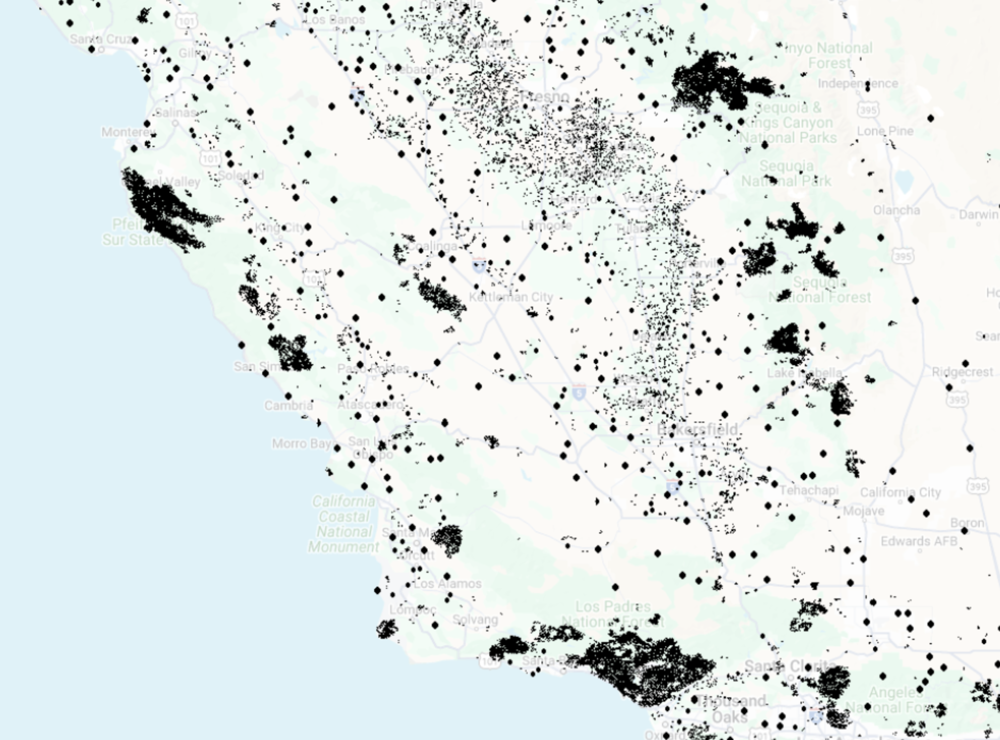
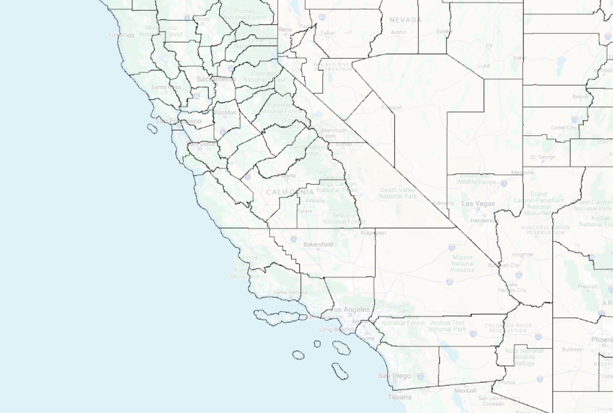
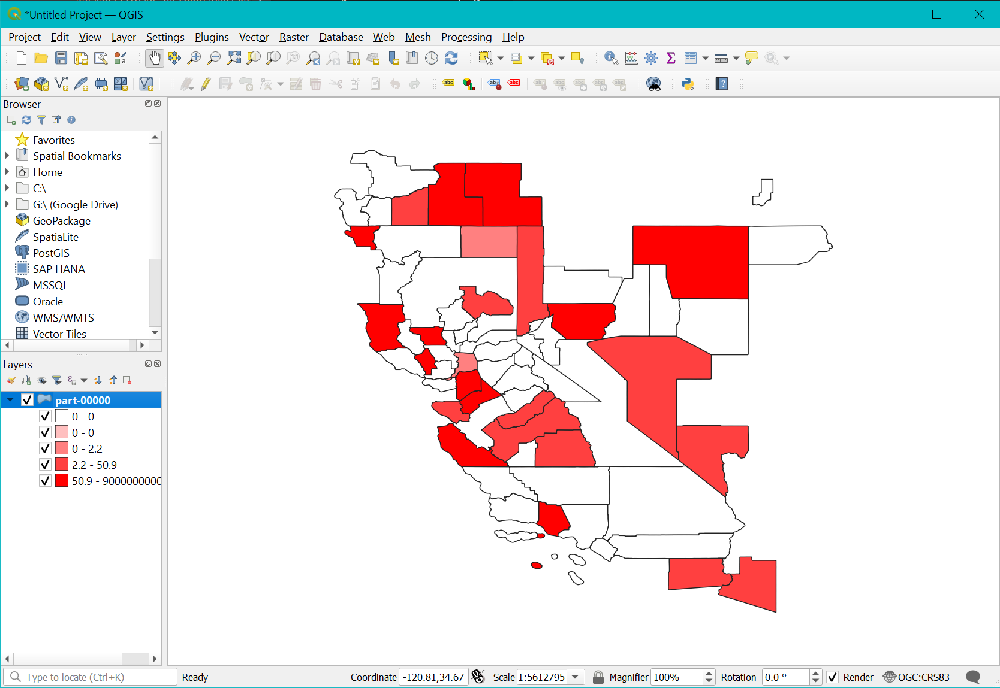
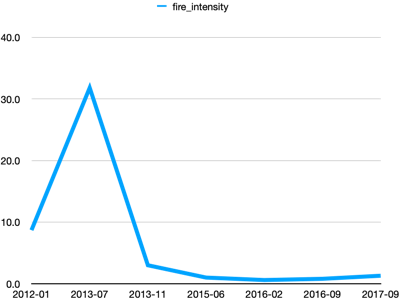
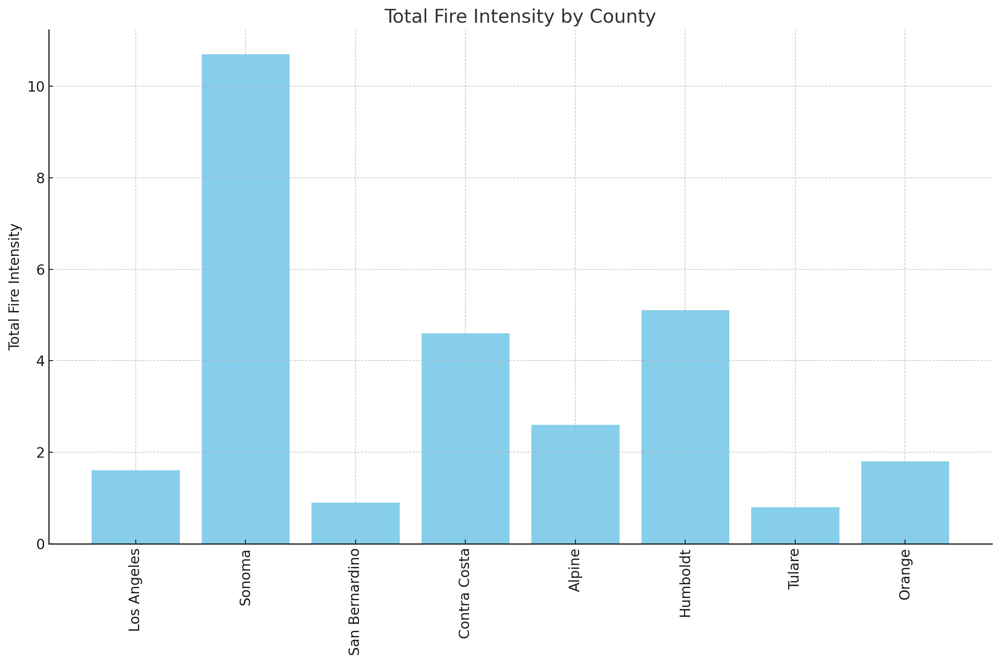

# Project C: Wildfire Data Analysis

## Objectives
- Apply the techniques we learned on a real big-data application.
- Translate high-level requirements into a big-data processing pipeline.
- Break down a big problem into smaller parts that can be solved separately.

## Overview
This project analyzes a dataset the represents the wildfire occurrences in the US.
This data is made available by UC Riverside.
You can explore the WildfireDB dataset on [UCR-Star](https://star.cs.ucr.edu/?wildfiredb#center=40.03,-116.90&zoom=5).
Click on a few points to see sample data records and their attribute values.
The dataset contains a total of 18 million points. However, we will only work with a subset of the data in California.
Furthermore, we will have several subsets of the data of sizes, 1K, 10K, and 100K, to expedite the development.



You can also explore the [county dataset on UCR-Star](https://star.cs.ucr.edu/?TIGER2018/COUNTY#center=40.03,-116.90&zoom=5).
Click on a few records to see all the attributes that we have available for this data.
Do you think that the county name is unique? Can you find two different counties with the same name?



## Prerequisites
1. Download samples of the data with different sizes to test your program while developing.
There are samples of
[1,000 points](https://drive.google.com/open?id=1D0pM0tZpPiLqLQvXdl7IItmWG_uZTnoQ),
[10,000 points](https://drive.google.com/open?id=1D0VZpgJCr9RBOXD0Wxsq03TP_r8WWGJd),
and [100,000 points](https://drive.google.com/open?id=1D-Xxcpc8_l0X-n_6jbdqF3no2TUqIpBb).
You do not have to decompress these files before processing.

2. Download the [County dataset](https://drive.google.com/open?id=1Cl5_lR4tHPTDSaez5u1vsr685fZ9MKYa) 
made available by the US Census Bureau. You do not need to decompress this dataset either.

## Task 1: Data preparation
The first task is to prepare the data for processing. This includes two major steps.
First, introduce a new attribute `County` that indicates the county at which each wildfire happened.
Second, convert the file into a column-oriented Parquet format to speed up the analysis.

- Parse and load the CSV file using the Dataframe API.
- Keep only the following columns to reduce the size of the dataset: "x", "y", "acq_date", "frp", "acq_time", "ELEV_mean", "SLP_mean", "EVT_mean", "EVH_mean", "CH_mean", "TEMP_ave", "TEMP_min", "TEMP_max".
- Introduce a geometry attribute that represents the location of each wildfire. Use the `ST_CreatePoint` function.
- The `frp` column, short for fire radiative power, requires some attention from you.
  This column sometimes stores a floating point value, and sometimes store two values separated by comma.
  In this step, you should convert all of them to float to prepare for the next step.
  To do that, use the `split` function to split the string around the comma and take only the first value.
  Then, cast this value to double using the syntax `double(...)` in SQL.
- Cast all the numerical columns to double: "ELEV_mean", "SLP_mean", "EVT_mean", "EVH_mean", "CH_mean", "TEMP_ave", "TEMP_min", "TEMP_max".
- Convert the resulting Dataframe to a SpatialRDD to prepare for the next step.
- Load the County dataset using Beast.
- Run a spatial join query to find the county of each wildfire.
- Use the attribute `GEOID` from the county to introduce a new attribute `County` in the wildfire.
  Notice that we cannot use the county name because it is not unique across the states.
- Convert the result back to a Dataframe.
- Drop the geometry column using the function `dropColumn` on the Dataframe.
- Write the output as a Parquet file named `wildfiredb_ZIP`.

The final output will have a schema that looks like the following.
Notice the fewer attributes and the last attribute that indicates the county.
```
root
 |-- x: double (nullable = true)
 |-- y: double (nullable = true)
 |-- acq_date: string (nullable = true)
 |-- frp: double (nullable = true)
 |-- acq_time: string (nullable = true)
 |-- ELEV_mean: double (nullable = true)
 |-- SLP_mean: double (nullable = true)
 |-- EVT_mean: double (nullable = true)
 |-- EVH_mean: double (nullable = true)
 |-- CH_mean: double (nullable = true)
 |-- TEMP_ave: double (nullable = true)
 |-- TEMP_min: double (nullable = true)
 |-- TEMP_max: double (nullable = true)
 |-- County: string (nullable = true)
```

You can download this [sample output file](https://drive.google.com/file/d/1KGt9fYa7aGfxHCA8NYH7i5vjFZhndpP4/view?usp=sharing) to double-check your result.

A few sample records are shown below for your reference.

|                  x|                 y|  acq_date| frp|acq_time| ELEV_mean|  SLP_mean|  EVT_mean|  EVH_mean|  CH_mean|TEMP_ave|TEMP_min|TEMP_max|County|
|-------------------|------------------|----------|----|--------|----------|----------|----------|----------|---------|--------|--------|--------|------|
|-117.41316845575105|42.366651969370714|2012-07-12| 4.0|     837|       0.0|       0.0|       0.0|     103.0|      0.0|    28.7|    13.9|    40.0| 41045|
|-121.49050227282443| 38.85103301438476|2013-02-18| 3.5|    2057|       0.0|       0.0|       0.0| 61.674557|2.0710058|     8.7|     2.0|    15.0| 06101|
|-118.52945376865702| 34.32721431731797|2013-07-12| 0.4|     937| 695.39105| 23.948717|       0.0| 101.80769|15.705129|    25.0|    18.9|    31.7| 06037|
|-118.52848927542246|34.323954009037365|2012-05-21| 0.7|     955|  627.9467| 28.674557|       0.0| 103.60355|50.739643|    23.5|    15.0|    33.3| 06037|
|-118.52848927542246|34.323954009037365|2017-12-10| 0.8|     913|  627.9467| 28.674557| 229.47337|  205.5858|31.005917|    21.4|    16.1|    25.6| 06037|


In the report, include one paragraph, in your own words, on why the Parquet format will be helpful for this project.
Include a table that indicates the size of the original (decompressed) data and the Parquet format similar to the following.

| Dataset | CSV size | Parquet size |
|---------|----------|--------------|
| 1,000   |          |              |
| 10,000  |          |              |
| 100,000 |          |              |

## Task 2: Spatial analysis

Given a date range, start and end, compute the total fire intensity for each county over that time.
Draw the result as a choropleth map.



Here is an overview of what you are expected to do.
- Load the dataset in the Parquet format.
You can test on [this sample file](https://drive.google.com/file/d/1KGt9fYa7aGfxHCA8NYH7i5vjFZhndpP4/view?usp=sharing) until the first task is complete.
- Run an SQL query that does the following:
  - Parse the `acq_date` attribute into a proper timestamp attribute.
    For that use the SQL function `to_date` with the format `yyyy-MM-dd`.
  - Parse the user-provided start and end dates using the function `to_date` with the format `MM/dd/yyyy`
  - Include a `WHERE` clause that tests if the observation date is `BETWEEN` start `AND` end dates.
  - Include a grouped aggregate statement to compute the `SUM` of the `frp` attribute for each `County`.
- The result of the query is still missing the county name and the geometry of the county. 
  To fix this problem we do the following.
- Load the county dataset using Beast and convert to a Dataframe.
- Run an equi-join SQL query to join with the results of the previous query on `GEOID=County`.
  Select the county name, the geometry, and the fire_intensity.
- Convert the result back to an RDD and write as a Shapefile named `wildfireIntensityCounty`.
  You might want to use `coalesce(1)` to ensure that only one output file is written.
- Import the file into QGIS and follow [these directions](Choropleth.md) to plot the choropleth map.
The output should look like the image shown above. That specific example was for the 1k dataset with date range
`[01/01/2016, 12/31/2017]`

You can also find [this sample result file](https://drive.google.com/open?id=1EC5oYQijky6Bjfs3ChiI-klM6-i09_V2) to get an idea of what is expected.

The contents of this data should look similar to the following. The actual values depend on the selected species.

|GEOID|         NAME|                   g|    fire_intensity|
|-----|-------------|--------------------|------------------|
|32001|    Churchill|POLYGON ((-119.08...|             112.0|
|32003|        Clark|POLYGON ((-115.89...|               9.9|
|41035|      Klamath|POLYGON ((-121.31...|             246.0|
|41029|      Jackson|POLYGON ((-122.95...|              14.0|
|06067|   Sacramento|POLYGON ((-121.18...|               2.0|
|06083|Santa Barbara|MULTIPOLYGON (((-...|             491.0|

with the following schema.

```
root
|-- GEOID: string (nullable = true)
|-- NAME: string (nullable = true)
|-- g: geometry (nullable = true)
|-- fire_intensity: double (nullable = true)
```

In the report, include your own visualization of the result for the 10k file that you get from Task A with any species of your choice.
Include which species you selected.

## Task 3: Temporal analysis
Given a specific county by name, compute the total fire intensity each month over all time
and plot the result as a line chart.



Here is an overview of what you are expected to do.
- Load the dataset in the Parquet format.
  You can test on [this sample file]([https://drive.google.com/open?id=1DlgXB3lA_sHIgcvaQQd_RBQPHqzK959x](https://drive.google.com/file/d/1KGt9fYa7aGfxHCA8NYH7i5vjFZhndpP4/view?usp=sharing))
  until the first task is complete.
- Since the name is not unique and is not present in the WildfireDB dataset, we cannot directly search by it.
- To solve this issue, we first search for the unique GEOID of the county with that name in California.
- Retrieve the county name as a command-line argument.
- First, load the county dataset and run a filter by the given county name and by `STATEFP="06"` which represents California.
  Retrieve the GEOID of the selected county.
- Now, back to the wildfire data, run a grouped aggregate query that select all wildfires related to that county. 
  Compute the total fire intensity, `SUM(frp)`, and group by the combination of year and month.
- Sort the results lexicographically by (year, month).
- Store the result in a CSV file named `wildfires<countyName>` and substitute the county name provided by the user.
- Here is part a sample output file for Riverside county.

| year_month | fire_intensity     |
|------------|--------------------|
| 2012-01    | 8.7                |
| 2013-07    | 31.799999999999997 |
| 2013-11    | 3.0                |
| 2015-06    | 1.0                |
| 2016-02    | 0.6                |
| 2016-09    | 0.8                |
| 2017-09    | 1.3                |

- Open the file in a spreadsheet program and plot the result as a line chart.
  The output should look similar to the figure above.

## Task 4: Fire Intensity Prediction
Develop a model that predicts the `fire_intensity` using as input these values: "ELEV_mean", "SLP_mean", "EVT_mean", "EVH_mean", "CH_mean", "TEMP_ave", "TEMP_min", "TEMP_max".

- Load the dataset in the Parquet format.
You can test on [this sample file](https://drive.google.com/file/d/1KGt9fYa7aGfxHCA8NYH7i5vjFZhndpP4/view?usp=sharing) until the first task is complete.
- Group the records by county, year and month, and aggregate "frp" using SUM and name it as "fire_intensity", for all other numerical values in the aggregation use the average (AVG). You will use this dataframe in your model.
- As input features, your model will take the aggregate values from these columns: "ELEV_mean", "SLP_mean", "EVT_mean", "EVH_mean", "CH_mean", "TEMP_ave", "TEMP_min", "TEMP_max".
- Your model will predict the "fire_intensity" value which is the sum of the "frp" column after the aggregation.
- The machine learning pipeline should include the following.
  - A normalization step, that transforms all columns to have normal distribution with 0 mean, and standard deviation of one.
  - A LogisticRgression or another classifier that predicts the fire_intensity value from the set of features.
- Then, You will do the regular training-test split to train on one set and test on the other. 
- Note, your predictions must be shown in the original scale not normalized values.

Here is a sample of how part of your result might look like. The actual results will probably differ depending on how the model worked.

| ELEV_mean|  SLP_mean|  EVT_mean|  EVH_mean|  CH_mean|TEMP_ave|TEMP_min|TEMP_max| fire_intensity| prediction|
|----------|----------|----------|----------|---------|--------|--------|--------|---------------|-----------|
|       0.0|       0.0|       0.0|     103.0|      0.0|    28.7|    13.9|    40.0|            4.0|        3.7|
|       0.0|       0.0|       0.0| 61.674557|2.0710058|     8.7|     2.0|    15.0|            3.5|        3.0|
| 695.39105| 23.948717|       0.0| 101.80769|15.705129|    25.0|    18.9|    31.7|            0.4|        0.0|
|  627.9467| 28.674557|       0.0| 103.60355|50.739643|    23.5|    15.0|    33.3|            0.7|        2.0|
|  627.9467| 28.674557| 229.47337|  205.5858|31.005917|    21.4|    16.1|    25.6|            0.8|       -0.5|
|  615.1603| 20.948717|       0.0| 104.54487|62.820515|    28.0|    18.9|    38.3|            0.3|        1.0|
| 608.19446|  24.88889| 210.36806| 192.38194| 51.59722|    19.2|    10.0|    30.6|            0.5|        0.1|
|  533.5128|  21.99359|101.621796|  96.01923|      0.0|    21.6|    16.1|    28.9|            0.8|       -0.9|


- Compute the total time and the Root Mean Square Error (RMSE) of the result you found and include them in the report for the 100,000 records dataset.

[Optional] You may attempt using different regression models, and scaling with MinMax instead of normalizaiton, and observe any differences. You can also attempt to use the County as a categorical input feature, and observe if it has any effect.

## Task 5: Temporal Analysis- 2
Given start and end dates, compute the total fire intensity for each county of California and plot the result in a bar chart (as shown below).


Here is an overview of what you are expected to do.
- Load the dataset in the Parquet format.
  You can test on [this sample file]([https://drive.google.com/open?id=1DlgXB3lA_sHIgcvaQQd_RBQPHqzK959x](https://drive.google.com/file/d/1KGt9fYa7aGfxHCA8NYH7i5vjFZhndpP4/view?usp=sharing))
  until the first task is complete.
- The start and end dates will be provided as command-line arguments in the format `MM-DD-YYYY`, e.g., `03-15-2018`.
- First, load the county dataset using Beast and run a filter query by `STATEFP="06"` which represents California. Retrieve the GEOID and NAME as county_name of all the counties of California.
- Now, back to the wildfire data, run an equi-join SQL query to join with the results of the previous query on GEOID=County. The query also includes the following:
  - Parse the `acq_date` attribute into a proper timestamp attribute. 
    For that use the SQL function `to_date` with the format `yyyy-MM-dd`.
  - Parse the user-provided start and end dates using the function `to_date` with the format `MM-dd-yyyy`
  - Include a `WHERE` clause that tests if the wildfire date is `BETWEEN` start `AND` end dates.
  - Include a grouped aggregate statement to group by county_name attribute and compute the total fire intensity, `SUM(frp)` for each group. 
- Store the result in a CSV file named `wildfires_California`.You might want to first coalesce(1) the Dataframe to produce a single file.
- Here is part a output file for the sample input data. These results are for the date range [01-01-2012, 12-01-2017].

|   county_name|total_fire_intensity|
|--------------|--------------------|
|   Los Angeles|                 1.6|
|        Sonoma|                10.7|
|San Bernardino|                 0.9|
|  Contra Costa|                 4.6|
|        Alpine|                 2.6|
|      Humboldt|                 5.1|
|        Tulare|                 0.8|
|        Orange|                 1.8|


- Load the file into a spreadsheet program, e.g., Excel, and draw the desired bar chart.
- The output should look like the image above.

In the report, include your own visualization of the 10k dataset and a date range of your choice.
Include the date range that you used.
