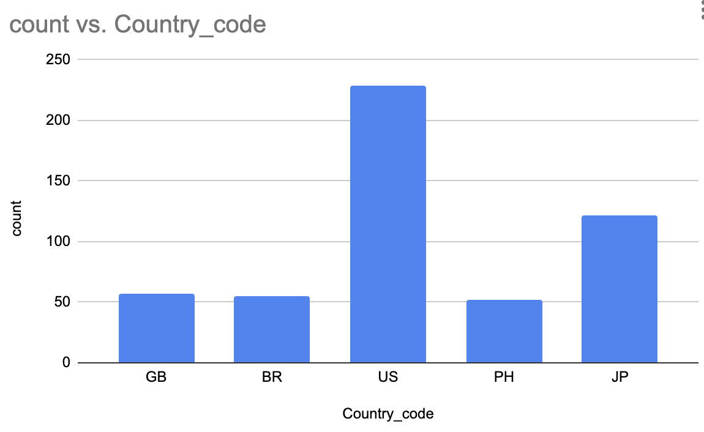

# Project D: Twitter Data Analysis

## Objectives
- Apply the techniques we learned on a real big-data application.
- Translate high-level requirements into a big-data processing pipeline.
- Break down a big problem into smaller parts that can be solved separately.
- Build a machine learning pipeline in Spark

## Overview
This project analyzes a Twitter dataset. Our goal is to predict the topic of each tweet from its text.
For simplicity, we will only consider the text of the tweet and the description of the user account that
created the tweet but in reality other factor could also be used such as the number of retweets and likes.

## Prerequisites
Download samples of the data with different sizes to test your program while developing.
There are samples of
[1,000 points](https://drive.google.com/open?id=1CoNIq2cymgr7sie8KcDU4HL7cEu-RAEb),
[10,000 points](https://drive.google.com/open?id=1CnmVPg8L3deF0EhCBy4Orh3GoSdjosJ4),
and [100,000 points](https://drive.google.com/open?id=1Cn_E45y0kVXZZRlb7BE9n6F7pwhrcPvZ).
You do not have to decompress these files before processing.

## Task 1: Data preparation 1
The first task performs some preprocessing to prepare the data for analysis.
This includes mainly two tasks.
First, keep only the relevant attributes to reduce the complexity and size of the data.
Second, extract the top 20 keywords. We will use them as our topics.

- Load the given input file using the `json` format.
- Keep only the following attributes {id, text, created_at, place.country_code, entities.hashtags.txt, user.description, retweet_count, reply_count, and quoted_status_id}
- Store the output in a new JSON file named `tweets_clean`.
- The output is supposed to be in the following schema.
```
root
 |-- id: long (nullable = true)
 |-- text: string (nullable = true)
 |-- created_at: string (nullable = true)
 |-- country_code: string (nullable = true)
 |-- hashtags: array (nullable = true)
 |    |-- element: string (containsNull = true)
 |-- user_description: string (nullable = true)
 |-- retweet_count: long (nullable = true)
 |-- reply_count: long (nullable = true)
 |-- quoted_status_id: long (nullable = true)
```
- A few sample records are shown below for your reference.
```json
{"id":921633443934433280,"text":"saya tahu dia tertidur sebab dia loser","created_at":"Sat Oct 21 07:05:10 +0000 2017","country_code":"MY","hashtags":[],"user_description":"I'm not here anymore","retweet_count":0,"reply_count":0}
{"id":921633444219596800,"text":"ふみとぉおおお🙈🙈🙈💓💓💓\n\nヤバイ、最高すぎへん？？ふみと大好きやわ〜😭❤️\n\n甲子園の試合前に流れる学校紹介？キャプテンが喋るやつやん、ハイクオリティ🤤w https://t.co/heX5eQbWIP","created_at":"Sat Oct 21 07:05:10 +0000 2017","country_code":"JP","hashtags":[],"user_description":"野球ガールの頭やってます🙋甲子園 ⚾️LARUS🐧は本拠地🇯🇵花咲徳栄のアイドルって言われてます(言わせてます)優勝おめで徳栄ぅぅう💙💓💙💓浪しゃま可愛いし史也男前やし、やっぱり阪神優勝するわ🏆","retweet_count":0,"reply_count":0,"quoted_status_id":921338657436459008}
{"id":921633444131680256,"text":"اللهم إني أعوذ بك من جهد البلاء،\nودرك الشقاء، وسوء القضاء، وشماتة الأعداء.\n\"\n(متفق عليه)","created_at":"Sat Oct 21 07:05:10 +0000 2017","country_code":"KW","hashtags":[],"user_description":"اللهم إجعلني خير خلف لـ خير سلف","retweet_count":0,"reply_count":0}
```
- Download [this sample output](https://drive.google.com/file/d/1HuwfP05nX_qFucACuUlHqi4_ro3EiolZ/view?usp=sharing)
  to double-check your result.
- On the clean data, run a top-k SQL query to select the top 20 most frequent hashtags as follows.
  - Use the function `explode` to produce one list of all hashtags from the column `hashtags`.
  - Run a count query for each hashtag.
  - `ORDER` the result `BY` counts in descending order.
  - `LIMIT` the number of results to 20.
- Collect the result in an array of keywords. Here is a comma-separated list of the top-20 keywords for the 1k dataset.
```text
ALDUBxEBLoveis, FurkanPalalı, no309, LalOn, sbhawks, DoktorlarDenklikistiyor, Benimisteğim, احتاج_بالوقت_هذا, art, CNIextravaganza2017, love, happy, السعودية, nowplaying, beautiful, türkiye, vegalta, KittyLive, 鯛, tossademar
```

In the report, include the top 20 keywords you found for the 10k dataset.

### Task 2: Data preparation 2
Add a new column for each tweet that indicates its topic.
The topic is any of the hashtags that appear in the most frequent list.
If a tweet contains more than one top hashtags, any of them can be used.

- If the result of Task 1 is not available to you yet,
  download [this sample file](https://drive.google.com/file/d/1HuwfP05nX_qFucACuUlHqi4_ro3EiolZ/view?usp=sharing) to start working.
- Load the file as a JSON file.
- Use the function `array_intersect` to compute the intersection between the list of hashtags and the list of topics.
- Since the result of `array_intersect` is an array, keep only the first entry of it.
- Keep only the records that have a topic, i.e., filter out the cases where the result of the `array_intersect` is empty.
- Store the output in a JSON file named `tweets_topic`.
- The result should have the following schema. Notice the additional attribute `topic` that replaces the hashtags.
```text
root
 |-- id: long (nullable = true)
 |-- text: string (nullable = true)
 |-- created_at: string (nullable = true)
 |-- country_code: string (nullable = true)
 |-- topic: string (nullable = true)
 |-- user_description: string (nullable = true)
 |-- retweet_count: long (nullable = true)
 |-- reply_count: long (nullable = true)
 |-- quoted_status_id: long (nullable = true)
```
And here are a few sample records.

```json
{"id":921633446644080641,"text":"#negramaroofficial #love #smile #pic #follow4follow #followme #finoallimbrunire #amorecheritorni… https://t.co/o3LPaMxBrj","created_at":"Sat Oct 21 07:05:11 +0000 2017","country_code":"IT","topic":"love","user_description":"Negramanteinside_romanainside\nSe non sei Giuliano Sangiorgi lasciami stare.","retweet_count":0,"reply_count":0}
{"id":921633445045866497,"text":"#CNIextravaganza2017 Testimoni dari Bpk. Agung Handaya sebagai Double Diamond mengenai CNI I-Plan 2017 #bisnisCNI https://t.co/6fEs7eQPWh","created_at":"Sat Oct 21 07:05:11 +0000 2017","country_code":"ID","topic":"CNIextravaganza2017","user_description":"Hebat Produknya Hebat Bisnisnya","retweet_count":0,"reply_count":0}
{"id":921633449882128384,"text":"#DoktorlarDenklikistiyor #Benimisteğim https://t.co/decAepZqMN","created_at":"Sat Oct 21 07:05:12 +0000 2017","country_code":"TR","topic":"DoktorlarDenklikistiyor","user_description":"emin ben","retweet_count":0,"reply_count":0}
{"id":921633451773648896,"text":"Na miss ko mag tweet na may ALDUB hashtag  #ALDUBxEBLoveis","created_at":"Sat Oct 21 07:05:12 +0000 2017","country_code":"PH","topic":"ALDUBxEBLoveis","user_description":"Resilient. Objective. Rational.\nLove is a grave mental disease. - Plato","retweet_count":0,"reply_count":0}
```

Finally, you can download
[this sample file](https://drive.google.com/file/d/1VcsXznJkmyBJjKnVN__Q0mjyV3v7WVJ2/view?usp=sharing)
to double-check your result.

In the report, include the total number of records in the `tweets_topic` dataset for the 10k dataset.

### Task 3: Topic prediction
Build a machine learning model that assigns a topic for each tweet based on the classified tweets.
The model should learn the relationship between all features and the topic.
Then, it applies this model to all data to predict one topic for each tweet. Load the dataset in the JSON format.
You can test on [this sample file](https://drive.google.com/file/d/1VcsXznJkmyBJjKnVN__Q0mjyV3v7WVJ2/view?usp=sharing) until the second task is complete.
The machine learning pipeline should include the following.

- A `Tokenzier` that finds all the tokens (words) from the tweets text and user description.
- A `HashingTF` transformer that converts the tokens into a set of numeric features.
- A `StringIndexer` that converts each topic to an index.
- A `LogisticRgression` or another classifier that predicts the topic from the set of features.

After that, you will do the regular training-test split to train on one set and test on the other.

Here is a sample of how part of your result might look like. The actual results will probably differ depending on how the model worked.

|id                | text                                                                                                                  |topic                  |user_description                                                                                                     |label|prediction|
|------------------|-----------------------------------------------------------------------------------------------------------------------|-----------------------|---------------------------------------------------------------------------------------------------------------------|-----|----------|
|921633452289642497| #FurkanPalalı Değil güzel bir mutluluk kaynağı olun #LalOn #no309 084                                                 |no309                  |null                                                                                                                 |1.0  |1.0       |
|921633507558002688| #happy #Saturday \n#cake #birthdaycake #weddingcake #bespokecake #celebrationcake #nakedcake… https://t.co/4nTkMMUJuj |happy                  |Pastry chef, personal cook, mum. Cakes + bakes from my little bakery in tooting market, London cakes@nuvolabakery.com|10.0 |6.0       |
|921633512825991169| #DoktorlarDenklikistiyor #Benimisteğim https://t.co/FLXcDHJLJl                                                        |DoktorlarDenklikistiyor|emin ben                                                                                                             |3.0  |3.0       |
|921633514587656192| Indigo Son #art #human #nature #figure #artofvisuals #color @ Los Angeles, California https://t.co/95DYGZOd1S         |art                    |I am an artist. So, there!                                                                                           |8.0  |6.0       |

- Compute the precision and recall of the result you found and include them in the report for the 10k dataset. 

## Task 4: Temporal Analysis
Given start and end dates, count the number of tweets for each country_code and plot as a bar chart (see below).



Here is an overview of what you are expected to do.
- Load the dataset named `tweets_clean` from the Task 1 in the Json format.
  You can test on [this sample file](https://drive.google.com/file/d/1HuwfP05nX_qFucACuUlHqi4_ro3EiolZ/view?usp=sharing) until the first task is complete.
- The start and end dates will be provided as command-line arguments in the format `MM/DD/YYYY`, e.g., `03/15/2018`.
- Run an SQL query to keep only those tweets in the dataframe whose country_code and created_at field values are NOT null. 
- Run an SQL query that does the following:                                                
  - Parse the `created_at` attribute into a proper timestamp attribute. 
    For that use the SQL function `to_timestamp` with the format `EEE MMM dd HH:mm:ss Z yyyy`. (*Note:* this pattern format is not supported in the latest version (3.5.0) of Spark. You would need to add `.config("spark.sql.legacy.timeParserPolicy", "LEGACY"))` to the SparkSession to make this pattern support in your spark version)
  - Parse the user-provided start and end dates using the function `to_date` with the format `MM/dd/yyyy`
  - Include a `WHERE` clause that tests if the tweets are is `BETWEEN` start `AND` end dates.
  - Include a grouped aggregate statement to count the number of tweets for each `country_code`.
  - Show only those country_codes and correspoding count values in the result whose count value is greater than 50. 
- Write the output as a CSV file named `CountryTweetsCount`. You might want to first `coalesce(1)` the Dataframe to produce a single file.
  A sample output is provided below for your reference. These results are for the date range `[02/21/2017, 12/22/2017]` and the 1k dataset.   Your numbers might differ depending on your own parameters.

|country_code|count|
|------------|-----|
|          GB|   57|
|          BR|   55|
|          US|  229|
|          PH|   52|
|          JP|  122|

- Load the file into a spreadsheet program, e.g., Excel, and draw the desired bar chart.
- The output should look like the image above.

In the report, include your own visualization of the 10k dataset and a date range of your choice.
Include the date range that you used.
