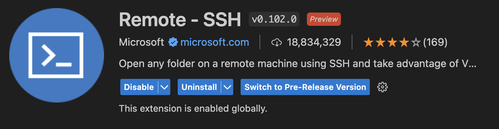
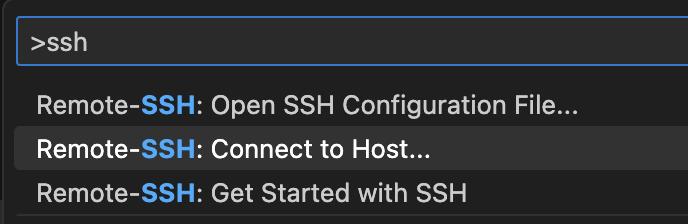
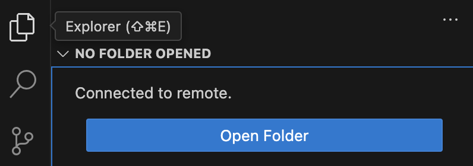
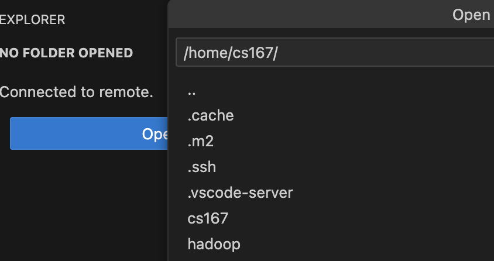

# Setup remote access to your machine
As part of this course, you will have access to a remote machine where you will be able to run a cluster for distributed processing. This page describes how to set up your remote access.

## Part I: Prerequisites
- Make sure that your OS has SSH installed. Recent operating systems come with SSH installed including Windows, Linux, and MacOS. If you run Windows and you do not have SSH installed, you can install it by navigating to Settings -> Apps & features -> Manage optional features -> Add a feature -> OpenSSH Client.
- Create an SSH key on your local machine. If you already have a key, you can use it. If you do not have a key, you can create one by running the command `ssh-keygen -t rsa -b 4096`. Accept all the defaults by pressing Enter.
- Have your CS Lab username and password handy. If you do not know your password, check [this page](https://www1.cs.ucr.edu/department-intranet) for instructions on how to reset your password.
- Install Visual Studio Code if you would like to use it to connect to your remote machine.

## Part II: Connect to your machine
The easiest way to connect to your machine is to first connect to `bolt.cs.ucr.edu` and then your machine.

1. Connect to bolt.cs.ucr.edu:
    ```shell
    ssh [csuername]@bolt.cs.ucr.edu
    ```
    Where `[csusername]` is your CS username. If it prompts for password, enter your CS password.
2. While you are at bolt, run the following commands to create a `.ssh` folder which we will need in the next part.
    ```shell
    mkdir -p .ssh
    chmod 700 .ssh
    ```
3. Connect to your CS 167 machine:
    ```shell
    cs167_login
    ```
4. You should be connected to your CS 167 machine. You will find the machine name written at the prompt. You can also find your machine name by running the comman `hostname`. Take a note of that machine name since we will use it later. It will have the format of `class-###`.

## Part III: Setup key access to bolt
To make it easier to access your machine, we will set up password-less access.
1. If you do not have an SSH key, generate one by running the command `ssh-keygen -t rsa -b 4096` on your local machine. Do **not** run this command on bolt or your CS167 machine.
2. Copy your *public* key to bolt so that you can access bolt without a password.
    ```shell
    cat ~/.ssh/id_rsa.pub | ssh [csusername]@bolt.cs.ucr.edu 'cat >> ~/.ssh/authorized_keys'
    ```
    If you run on Windows, run the following command in the command prompt:
    ```shell
    type %USERPROFILE%\.ssh\id_rsa.pub | ssh [csusername]@bolt.cs.ucr.edu 'cat >> ~/.ssh/authorized_keys'
    ```
    Make sure to replace `[csusername]` with your CS username.
    Enter your CS password when prompted.

3. To test that it works correctly, run the command `ssh [csusername]@bolt.cs.ucr.edu`. You should be logged in without a password.

## Part IV: Setup key access to CS167 machine
In this part, you will copy your *public* key to your CS167 machine. To do that, first connect to bolt and then to your CS167 machine as instructed in Part II. Next, follow this procedure.
1. Use Vim to open authorized_keys.
```shell
vim ~/.ssh/authorized_keys
```
2. If you make some mistakes in the following steps and don’t know how to fix them, press `ESC` several times, and then type `:q!` to force quit vim without saving.
3. Copy the contents of `id_rsa.pub` from your local machine into the clipboard.
4. On Vim, press `ESC` to get in the normal mode.
5. Use arrow keys to move the cursor to the place you want to paste (usually at the end of the current content).
6. Use Shift+Insert to paste.
7. Use `:wq` to save and quit Vim.
8. Test that key based access is working by running the following command on your computer:
    ```shell
    ssh -J [csusername]@bolt.cs.ucr.edu cs167@class-###.cs.ucr.edu
    ```
    Make sure to replace `[csusername]` with your CS username and `class-###` with your machine name. You should be able to log in to your CS167 machine without asking for a password.

## Part V: Provide shortcut to access your CS167 machine
On your local machine, edit the file `~/.ssh/config` (or create one if it does not exist), and add the following configuration to it.
```text
Host cs167
  HostName class-###.cs.ucr.edu
  User cs167
  ProxyJump [csusername]@bolt.cs.ucr.edu
```
Make sure to replace `class-###` with your machine name and `[csusername]` with your CS username. Save the file.

To test that it works, on your local machine run the command `ssh cs167`. You should log in to your CS167 machine without a password.

## Part VI: Use VS Code to copy files to your CS167 machine
If you have Visual Studio Code, you can use it to connect to your CS167 machine and upload files there. You will need that to upload your compiled code and run it on the cluster.

1. In Visual Studio Code, install the `Remote - SSH` extension from the extension menu.

2. To connect to your machine, hit `F1` on VS Code and select "Remote SSH: Connect to Host".

3. From the list of hosts, choose `cs167`. It will open a new VS Code window.
4. In the new VS Code window, choose `Explorer` from the left.

5. Click `Open Folder` and choose a folder that you would like to open on the remote machine.

6. You can now upload files to that remote directory by simply dragging it into Visual Studio Code Explorer window.

## Part VII: Run commands in a screen
When you run a command on the CS167 machine, this command will terminate if you lose your connection. This can be annoying if you want to keep the command running for a long time. A better way to do that is to run your commands in a screen. The screen will keep your commands running even if you close the SSH connection and reconnect. The following steps will guide you through screen setup.

1. Connect to your CS167 machine.
2. Type `vim .screenrc` to configure screen.
3. Copy and paste the following content into the `.screenrc` file.
```
termcapinfo xterm* ti@:te@
hardstatus alwayslastline
hardstatus string '%{= kG}[ %{G}%H %{g}][%= %{= kw}%?%-Lw%?%{r}(%{W}%n*%f%t%?(%u)%?%{r})%{w}%?%+Lw%?%?%= %{g}][%{B} %d/%m %{W}%c %{g}]'
```
4. Save and exit.
5. To start a new screen, type `screen`.
6. You can run any command you want in that screen similar to what you do in any SSH session.
7. To open a new screen without creating a new SSH connection, type `ctrl+a` then `c`. Now you have two screens running.
8. To move between screens, type `ctrl+a` then `n` to move to the next window and `ctrl+a` then `p` to move to the previous window.
9. To rename the current window, type `ctrl+a` then `A` (captial A). Type your new name and hit Enter.
10. To leave all screens running and detach, type `ctrl+a` then `d`.
11. If you reconnect to your CS167 machine, you can access your existing screen by running `screen -rd`.
